# (PART) Basic Tensor Operations {.unnumbered}

# Tensors

*Last update: Sun Oct 25 13:00:41 2020 -0500 (265c0b3c1)*

In this chapter, we describe the most important PyTorch methods.


```r
library(rTorch)
```

## Tensor data types


```r
# Default data type
torch$tensor(list(1.2, 3))$dtype  # default for floating point is torch.float32
```

```
#> torch.float32
```


```r
# change default data type to float64
torch$set_default_dtype(torch$float64)
torch$tensor(list(1.2, 3))$dtype         # a new floating point tensor
```

```
#> torch.float64
```

### Major tensor types

There are five major type of tensors in PyTorch: byte, float, double, long, and boolean.


```r
library(rTorch)

byte    <- torch$ByteTensor(3L, 3L)
float   <- torch$FloatTensor(3L, 3L)
double  <- torch$DoubleTensor(3L, 3L)
long    <- torch$LongTensor(3L, 3L)
boolean <- torch$BoolTensor(5L, 5L)
```


```r
message("byte tensor")
#> byte tensor
byte
#> tensor([[0, 0, 0],
#>         [0, 0, 0],
#>         [0, 0, 0]], dtype=torch.uint8)
```


```r
message("float tensor")
#> float tensor
float
#> tensor([[0., 0., 0.],
#>         [0., 0., 0.],
#>         [0., 0., 0.]], dtype=torch.float32)
```


```r
message("double")
#> double
double
#> tensor([[6.9461e-310, 6.9461e-310, 4.9407e-324],
#>         [4.6489e-310,  0.0000e+00,  0.0000e+00],
#>         [ 0.0000e+00,  0.0000e+00, 9.5490e-313]])
```


```r
message("long")
#> long
long
#> tensor([[0, 0, 0],
#>         [0, 0, 0],
#>         [0, 0, 0]])
```


```r
message("boolean")
#> boolean
boolean
#> tensor([[False, False, False, False, False],
#>         [False, False, False, False, False],
#>         [False, False, False, False, False],
#>         [False, False, False, False, False],
#>         [False, False, False, False, False]])
```

### Example: A 4D tensor

A 4D tensor like in MNIST hand-written digits recognition dataset:


```r
mnist_4d <- torch$FloatTensor(60000L, 3L, 28L, 28L)
```


```r
message("size")
#> size
mnist_4d$size()
#> torch.Size([60000, 3, 28, 28])

message("length")
#> length
length(mnist_4d)
#> [1] 141120000

message("shape, like in numpy")
#> shape, like in numpy
mnist_4d$shape
#> torch.Size([60000, 3, 28, 28])

message("number of elements")
#> number of elements
mnist_4d$numel()
#> [1] 141120000
```

### Example: A 3D tensor

Given a 3D tensor:


```r
ft3d <- torch$FloatTensor(4L, 3L, 2L)
ft3d
```

```
#> tensor([[[1.1390e+12, 3.0700e-41],
#>          [1.4555e+12, 3.0700e-41],
#>          [1.1344e+12, 3.0700e-41]],
#> 
#>         [[4.7256e+10, 3.0700e-41],
#>          [4.7258e+10, 3.0700e-41],
#>          [1.0075e+12, 3.0700e-41]],
#> 
#>         [[1.0075e+12, 3.0700e-41],
#>          [1.0075e+12, 3.0700e-41],
#>          [1.0075e+12, 3.0700e-41]],
#> 
#>         [[1.0075e+12, 3.0700e-41],
#>          [4.7259e+10, 3.0700e-41],
#>          [4.7263e+10, 3.0700e-41]]], dtype=torch.float32)
```


```r
ft3d$size()
#> torch.Size([4, 3, 2])
length(ft3d)
#> [1] 24
ft3d$shape
#> torch.Size([4, 3, 2])
ft3d$numel
#> <built-in method numel of Tensor>
```

## Arithmetic of tensors

### Add tensors


```r
# add a scalar to a tensor
# 3x5 matrix uniformly distributed between 0 and 1
mat0 <- torch$FloatTensor(3L, 5L)$uniform_(0L, 1L)
mat0 + 0.1
```

```
#> tensor([[0.9645, 0.6238, 0.9326, 0.3023, 0.1448],
#>         [0.2610, 0.1987, 0.5089, 0.9776, 0.5261],
#>         [0.2727, 0.5670, 0.8338, 0.4297, 0.7935]], dtype=torch.float32)
```

### Add tensor elements


```r
# fill a 3x5 matrix with 0.1
mat1 <- torch$FloatTensor(3L, 5L)$uniform_(0.1, 0.1)
print(mat1)
#> tensor([[0.1000, 0.1000, 0.1000, 0.1000, 0.1000],
#>         [0.1000, 0.1000, 0.1000, 0.1000, 0.1000],
#>         [0.1000, 0.1000, 0.1000, 0.1000, 0.1000]], dtype=torch.float32)

# a vector with all ones
mat2 <- torch$FloatTensor(5L)$uniform_(1, 1)
print(mat2)
#> tensor([1., 1., 1., 1., 1.], dtype=torch.float32)

# add element (1,1) to another tensor
mat1[1, 1] + mat2
#> tensor([1.1000, 1.1000, 1.1000, 1.1000, 1.1000], dtype=torch.float32)
```

Add two tensors using the function `add()`:


```r
# PyTorch add two tensors
x = torch$rand(5L, 4L)
y = torch$rand(5L, 4L)

print(x$add(y))
```

```
#> tensor([[0.4604, 0.8114, 0.9630, 0.8070],
#>         [0.6829, 0.4612, 0.1546, 1.1180],
#>         [0.3134, 0.9399, 1.1217, 1.2846],
#>         [1.9212, 1.3897, 0.5217, 0.3508],
#>         [0.5801, 1.1733, 0.6494, 0.6771]])
```

Add two tensors using the generic `+`:


```r
print(x + y)
```

```
#> tensor([[0.4604, 0.8114, 0.9630, 0.8070],
#>         [0.6829, 0.4612, 0.1546, 1.1180],
#>         [0.3134, 0.9399, 1.1217, 1.2846],
#>         [1.9212, 1.3897, 0.5217, 0.3508],
#>         [0.5801, 1.1733, 0.6494, 0.6771]])
```

### Multiply a tensor by a scalar


```r
# Multiply tensor by scalar
tensor = torch$ones(4L, dtype=torch$float64)
scalar = np$float64(4.321)
print(scalar)
print(torch$scalar_tensor(scalar))
```

```
#> [1] 4.32
#> tensor(4.3210)
```

> Notice that we used a NumPy function to create the scalar object `np$float64()`.

Multiply two tensors using the function `mul`:


```r
(prod = torch$mul(tensor, torch$scalar_tensor(scalar)))
```

```
#> tensor([4.3210, 4.3210, 4.3210, 4.3210])
```

Short version using R generics:


```r
(prod = tensor * scalar)
```

```
#> tensor([4.3210, 4.3210, 4.3210, 4.3210])
```

## NumPy and PyTorch

`numpy` has been made available as a module in `rTorch`, which means that as soon as rTorch is loaded, you also get all the `numpy` functions available to you. We can call functions from `numpy` referring to it as `np$_a_function`. Examples:


```r
# a 2D numpy array  
syn0 <- np$random$rand(3L, 5L)
print(syn0)
```

```
#>       [,1]  [,2]    [,3]  [,4]  [,5]
#> [1,] 0.303 0.475 0.00956 0.812 0.210
#> [2,] 0.546 0.607 0.19421 0.989 0.276
#> [3,] 0.240 0.158 0.53997 0.718 0.849
```


```r
# numpy arrays of zeros
syn1 <- np$zeros(c(5L, 10L))
print(syn1)
```

```
#>      [,1] [,2] [,3] [,4] [,5] [,6] [,7] [,8] [,9] [,10]
#> [1,]    0    0    0    0    0    0    0    0    0     0
#> [2,]    0    0    0    0    0    0    0    0    0     0
#> [3,]    0    0    0    0    0    0    0    0    0     0
#> [4,]    0    0    0    0    0    0    0    0    0     0
#> [5,]    0    0    0    0    0    0    0    0    0     0
```


```r
# add a scalar to a numpy array
syn1 = syn1 + 0.1
print(syn1)
```

```
#>      [,1] [,2] [,3] [,4] [,5] [,6] [,7] [,8] [,9] [,10]
#> [1,]  0.1  0.1  0.1  0.1  0.1  0.1  0.1  0.1  0.1   0.1
#> [2,]  0.1  0.1  0.1  0.1  0.1  0.1  0.1  0.1  0.1   0.1
#> [3,]  0.1  0.1  0.1  0.1  0.1  0.1  0.1  0.1  0.1   0.1
#> [4,]  0.1  0.1  0.1  0.1  0.1  0.1  0.1  0.1  0.1   0.1
#> [5,]  0.1  0.1  0.1  0.1  0.1  0.1  0.1  0.1  0.1   0.1
```

And the dot product of both:


```r
np$dot(syn0, syn1)
```

```
#>       [,1]  [,2]  [,3]  [,4]  [,5]  [,6]  [,7]  [,8]  [,9] [,10]
#> [1,] 0.181 0.181 0.181 0.181 0.181 0.181 0.181 0.181 0.181 0.181
#> [2,] 0.261 0.261 0.261 0.261 0.261 0.261 0.261 0.261 0.261 0.261
#> [3,] 0.250 0.250 0.250 0.250 0.250 0.250 0.250 0.250 0.250 0.250
```

### Python tuples and R vectors

In `numpy` the shape of a multidimensional array needs to be defined using a `tuple`. in R we do it instead with a `vector`. There are not tuples in R.

In Python, we use a tuple, `(5, 5)` to indicate the shape of the array:


```python
import numpy as np
print(np.ones((5, 5)))
```

```
#> [[1. 1. 1. 1. 1.]
#>  [1. 1. 1. 1. 1.]
#>  [1. 1. 1. 1. 1.]
#>  [1. 1. 1. 1. 1.]
#>  [1. 1. 1. 1. 1.]]
```

In R, we use a vector `c(5L, 5L)`. The `L` indicates an integer.


```r
l1 <- np$ones(c(5L, 5L))
print(l1)
```

```
#>      [,1] [,2] [,3] [,4] [,5]
#> [1,]    1    1    1    1    1
#> [2,]    1    1    1    1    1
#> [3,]    1    1    1    1    1
#> [4,]    1    1    1    1    1
#> [5,]    1    1    1    1    1
```

### A numpy array from R vectors

For this matrix, or 2D tensor, we use three R vectors:


```r
X <- np$array(rbind(c(1,2,3), c(4,5,6), c(7,8,9)))
print(X)
```

```
#>      [,1] [,2] [,3]
#> [1,]    1    2    3
#> [2,]    4    5    6
#> [3,]    7    8    9
```

And we could transpose the array using `numpy` as well:


```r
np$transpose(X)
```

```
#>      [,1] [,2] [,3]
#> [1,]    1    4    7
#> [2,]    2    5    8
#> [3,]    3    6    9
```

### numpy arrays to tensors


```r
a = np$array(list(1, 2, 3))   # a numpy array
t = torch$as_tensor(a)        # convert it to tensor
print(t)
```

```
#> tensor([1., 2., 3.])
```

### Create and fill a tensor

We can create the tensor directly from R using `tensor()`:


```r
torch$tensor(list( 1,  2,  3))   # create a tensor
t[1L]$fill_(-1)                  # fill element with -1
print(a)
```

```
#> tensor([1., 2., 3.])
#> tensor(-1.)
#> [1] -1  2  3
```

### Tensor to array, and viceversa

This is a very common operation in machine learning:


```r
# convert tensor to a numpy array
a = torch$rand(5L, 4L)
b = a$numpy()
print(b)
```

```
#>        [,1]   [,2]   [,3]  [,4]
#> [1,] 0.5596 0.1791 0.0149 0.568
#> [2,] 0.0946 0.0738 0.9916 0.685
#> [3,] 0.4065 0.1239 0.2190 0.905
#> [4,] 0.2055 0.0958 0.0788 0.193
#> [5,] 0.6578 0.8162 0.2609 0.097
```


```r
# convert a numpy array to a tensor
np_a = np$array(c(c(3, 4), c(3, 6)))
t_a = torch$from_numpy(np_a)
print(t_a)
```

```
#> tensor([3., 4., 3., 6.])
```

## Create tensors

A random 1D tensor:


```r
ft1 <- torch$FloatTensor(np$random$rand(5L))
print(ft1)
```

```
#> tensor([0.5074, 0.2779, 0.1923, 0.8058, 0.3472], dtype=torch.float32)
```

Force a tensor as a `float` of 64-bits:


```r
ft2 <- torch$as_tensor(np$random$rand(5L), dtype= torch$float64)
print(ft2)
```

```
#> tensor([0.0704, 0.9035, 0.6435, 0.5640, 0.0108])
```

Convert the tensor to a `float` of 16-bits:


```r
ft2_dbl <- torch$as_tensor(ft2, dtype = torch$float16)
ft2_dbl
```

```
#> tensor([0.0704, 0.9033, 0.6436, 0.5640, 0.0108], dtype=torch.float16)
```

Create a tensor of size (5 x 7) with uninitialized memory:


```r
a <- torch$FloatTensor(5L, 7L)
print(a)
```

```
#> tensor([[0.0000e+00, 0.0000e+00, 1.1811e+16, 3.0700e-41, 0.0000e+00, 0.0000e+00,
#>          1.4013e-45],
#>         [0.0000e+00, 0.0000e+00, 0.0000e+00, 0.0000e+00, 0.0000e+00, 0.0000e+00,
#>          0.0000e+00],
#>         [4.9982e+14, 3.0700e-41, 0.0000e+00, 0.0000e+00, 4.6368e+14, 3.0700e-41,
#>          0.0000e+00],
#>         [0.0000e+00, 1.4013e-45, 0.0000e+00, 0.0000e+00, 0.0000e+00, 0.0000e+00,
#>          0.0000e+00],
#>         [0.0000e+00, 0.0000e+00, 0.0000e+00, 0.0000e+00, 0.0000e+00, 0.0000e+00,
#>          0.0000e+00]], dtype=torch.float32)
```

Using arange to create a tensor. `arange` starts at 0.


```r
v = torch$arange(9L)
print(v)
```

```
#> tensor([0, 1, 2, 3, 4, 5, 6, 7, 8])
```


```r
# reshape
(v = v$view(3L, 3L))
```

```
#> tensor([[0, 1, 2],
#>         [3, 4, 5],
#>         [6, 7, 8]])
```

### Tensor fill

On this tensor:


```r
(v = torch$ones(3L, 3L))
```

```
#> tensor([[1., 1., 1.],
#>         [1., 1., 1.],
#>         [1., 1., 1.]])
```

Fill row 1 with 2s:


```r
invisible(v[1L, ]$fill_(2L))
print(v)
```

```
#> tensor([[2., 2., 2.],
#>         [1., 1., 1.],
#>         [1., 1., 1.]])
```

Fill row 2 with 3s:


```r
invisible(v[2L, ]$fill_(3L))
print(v)
```

```
#> tensor([[2., 2., 2.],
#>         [3., 3., 3.],
#>         [1., 1., 1.]])
```

Fill column 3 with fours (4):


```r
invisible(v[, 3]$fill_(4L))
print(v)
```

```
#> tensor([[2., 2., 4.],
#>         [3., 3., 4.],
#>         [1., 1., 4.]])
```

### Tensor with a range of values


```r
# Initialize Tensor with a range of value
v = torch$arange(10L)             # similar to range(5) but creating a Tensor
(v = torch$arange(0L, 10L, step = 1L))  # Size 5. Similar to range(0, 5, 1)
```

```
#> tensor([0, 1, 2, 3, 4, 5, 6, 7, 8, 9])
```

### Linear or log scale Tensor

Create a tensor with 10 linear points for (1, 10) inclusive:


```r
(v = torch$linspace(1L, 10L, steps = 10L)) 
```

```
#> tensor([ 1.,  2.,  3.,  4.,  5.,  6.,  7.,  8.,  9., 10.])
```

Create a tensor with 10 logarithmic points for (1, 10) inclusive:


```r
(v = torch$logspace(start=-10L, end = 10L, steps = 5L)) 
```

```
#> tensor([1.0000e-10, 1.0000e-05, 1.0000e+00, 1.0000e+05, 1.0000e+10])
```

### In-place / Out-of-place fill

On this uninitialized tensor:


```r
(a <- torch$FloatTensor(5L, 7L))
```

```
#> tensor([[0., 0., 0., 0., 0., 0., 0.],
#>         [0., 0., 0., 0., 0., 0., 0.],
#>         [0., 0., 0., 0., 0., 0., 0.],
#>         [0., 0., 0., 0., 0., 0., 0.],
#>         [0., 0., 0., 0., 0., 0., 0.]], dtype=torch.float32)
```

Fill the tensor with the value 3.5:


```r
a$fill_(3.5)
```

```
#> tensor([[3.5000, 3.5000, 3.5000, 3.5000, 3.5000, 3.5000, 3.5000],
#>         [3.5000, 3.5000, 3.5000, 3.5000, 3.5000, 3.5000, 3.5000],
#>         [3.5000, 3.5000, 3.5000, 3.5000, 3.5000, 3.5000, 3.5000],
#>         [3.5000, 3.5000, 3.5000, 3.5000, 3.5000, 3.5000, 3.5000],
#>         [3.5000, 3.5000, 3.5000, 3.5000, 3.5000, 3.5000, 3.5000]],
#>        dtype=torch.float32)
```

Add a scalar to the tensor:


```r
b <- a$add(4.0)
```

The tensor `a` is still filled with 3.5. A new tensor `b` is returned with values 3.5 + 4.0 = 7.5


```r
print(a)
print(b)
```

```
#> tensor([[3.5000, 3.5000, 3.5000, 3.5000, 3.5000, 3.5000, 3.5000],
#>         [3.5000, 3.5000, 3.5000, 3.5000, 3.5000, 3.5000, 3.5000],
#>         [3.5000, 3.5000, 3.5000, 3.5000, 3.5000, 3.5000, 3.5000],
#>         [3.5000, 3.5000, 3.5000, 3.5000, 3.5000, 3.5000, 3.5000],
#>         [3.5000, 3.5000, 3.5000, 3.5000, 3.5000, 3.5000, 3.5000]],
#>        dtype=torch.float32)
#> tensor([[7.5000, 7.5000, 7.5000, 7.5000, 7.5000, 7.5000, 7.5000],
#>         [7.5000, 7.5000, 7.5000, 7.5000, 7.5000, 7.5000, 7.5000],
#>         [7.5000, 7.5000, 7.5000, 7.5000, 7.5000, 7.5000, 7.5000],
#>         [7.5000, 7.5000, 7.5000, 7.5000, 7.5000, 7.5000, 7.5000],
#>         [7.5000, 7.5000, 7.5000, 7.5000, 7.5000, 7.5000, 7.5000]],
#>        dtype=torch.float32)
```

## Tensor resizing


```r
x = torch$randn(2L, 3L)            # Size 2x3
print(x)
#> tensor([[-0.4375,  1.2873, -0.5258],
#>         [ 0.7870, -0.8505, -1.2215]])

y = x$view(6L)                     # Resize x to size 6
print(y)
#> tensor([-0.4375,  1.2873, -0.5258,  0.7870, -0.8505, -1.2215])

z = x$view(-1L, 2L)                # Size 3x2
print(z)
#> tensor([[-0.4375,  1.2873],
#>         [-0.5258,  0.7870],
#>         [-0.8505, -1.2215]])
print(z$shape)
#> torch.Size([3, 2])
```

### Exercise

Reproduce this tensor:

     0 1 2
     3 4 5
     6 7 8


```r
# create a vector with the number of elements
v = torch$arange(9L)

# resize to a 3x3 tensor
(v = v$view(3L, 3L))
```

```
#> tensor([[0, 1, 2],
#>         [3, 4, 5],
#>         [6, 7, 8]])
```

## Concatenate tensors


```r
x = torch$randn(2L, 3L)
print(x)
print(x$shape)
```

```
#> tensor([[-0.3954,  1.4149,  0.2381],
#>         [-1.2126,  0.7869,  0.0826]])
#> torch.Size([2, 3])
```

### Concatenate by rows


```r
(x0 <- torch$cat(list(x, x, x), 0L))
print(x0$shape)
```

```
#> tensor([[-0.3954,  1.4149,  0.2381],
#>         [-1.2126,  0.7869,  0.0826],
#>         [-0.3954,  1.4149,  0.2381],
#>         [-1.2126,  0.7869,  0.0826],
#>         [-0.3954,  1.4149,  0.2381],
#>         [-1.2126,  0.7869,  0.0826]])
#> torch.Size([6, 3])
```

### Concatenate by columns


```r
(x1 <- torch$cat(list(x, x, x), 1L))
print(x1$shape)
```

```
#> tensor([[-0.3954,  1.4149,  0.2381, -0.3954,  1.4149,  0.2381, -0.3954,  1.4149,
#>           0.2381],
#>         [-1.2126,  0.7869,  0.0826, -1.2126,  0.7869,  0.0826, -1.2126,  0.7869,
#>           0.0826]])
#> torch.Size([2, 9])
```

## Reshape tensors

### With `chunk()`:

Let's say this is an image tensor with the 3-channels and 28x28 pixels


```r
# ----- Reshape tensors -----
img <- torch$ones(3L, 28L, 28L)  # Create the tensor of ones
print(img$size())
```

```
#> torch.Size([3, 28, 28])
```

On the first dimension `dim = 0L`, reshape the tensor:


```r
img_chunks <- torch$chunk(img, chunks = 3L, dim = 0L)
print(length(img_chunks))
print(class(img_chunks))
```

```
#> [1] 3
#> [1] "list"
```

`img_chunks` is a `list` of three members.

The first chunk member:


```r
# 1st chunk member
img_chunk <- img_chunks[[1]]
print(img_chunk$size())
print(img_chunk$sum())      # if the tensor had all ones, what is the sum?
```

```
#> torch.Size([1, 28, 28])
#> tensor(784.)
```

The second chunk member:


```r
# 2nd chunk member
img_chunk <- img_chunks[[2]]
print(img_chunk$size())
print(img_chunk$sum())        # if the tensor had all ones, what is the sum?
```

```
#> torch.Size([1, 28, 28])
#> tensor(784.)
```


```r
# 3rd chunk member
img_chunk <- img_chunks[[3]]
print(img_chunk$size())
print(img_chunk$sum())        # if the tensor had all ones, what is the sum?
```

```
#> torch.Size([1, 28, 28])
#> tensor(784.)
```

#### Exercise

1.  Create a tensor of shape 3x28x28 filled with values 0.25 on the first channel
2.  The second channel with 0.5
3.  The third chanel with 0.75
4.  Find the sum for ecah separate channel
5.  Find the sum of all channels

### With `index_select()`:


```r
img <- torch$ones(3L, 28L, 28L)  # Create the tensor of ones
img$size()
```

```
#> torch.Size([3, 28, 28])
```

This is the layer 1:


```r
# index_select. get layer 1
indices = torch$tensor(c(0L))
img_layer_1 <- torch$index_select(img, dim = 0L, index = indices)
```

The size of the layer:


```r
print(img_layer_1$size())
```

```
#> torch.Size([1, 28, 28])
```

The sum of all elements in that layer:


```r
print(img_layer_1$sum())
```

```
#> tensor(784.)
```

This is the layer 2:


```r
# index_select. get layer 2
indices = torch$tensor(c(1L))
img_layer_2 <- torch$index_select(img, dim = 0L, index = indices)
print(img_layer_2$size())
print(img_layer_2$sum())
```

```
#> torch.Size([1, 28, 28])
#> tensor(784.)
```

This is the layer 3:


```r
# index_select. get layer 3
indices = torch$tensor(c(2L))
img_layer_3 <- torch$index_select(img, dim = 0L, index = indices)
print(img_layer_3$size())
print(img_layer_3$sum())
```

```
#> torch.Size([1, 28, 28])
#> tensor(784.)
```

## Special tensors

### Identity matrix


```r
# identity matrix
eye = torch$eye(3L)              # Create an identity 3x3 tensor
print(eye)
```

```
#> tensor([[1., 0., 0.],
#>         [0., 1., 0.],
#>         [0., 0., 1.]])
```


```r
# a 5x5 identity or unit matrix
torch$eye(5L)
```

```
#> tensor([[1., 0., 0., 0., 0.],
#>         [0., 1., 0., 0., 0.],
#>         [0., 0., 1., 0., 0.],
#>         [0., 0., 0., 1., 0.],
#>         [0., 0., 0., 0., 1.]])
```

### Ones


```r
(v = torch$ones(10L))               # A tensor of size 10 containing all ones

# reshape
(v = torch$ones(2L, 1L, 2L, 1L))     # Size 2x1x2x1, a 4D tensor
```

```
#> tensor([1., 1., 1., 1., 1., 1., 1., 1., 1., 1.])
#> tensor([[[[1.],
#>           [1.]]],
#> 
#> 
#>         [[[1.],
#>           [1.]]]])
```

The *matrix of ones* is also called \``unitary matrix`. This is a `4x4` unitary matrix.


```r
torch$ones(c(4L, 4L))
```

```
#> tensor([[1., 1., 1., 1.],
#>         [1., 1., 1., 1.],
#>         [1., 1., 1., 1.],
#>         [1., 1., 1., 1.]])
```


```r
# eye tensor
eye = torch$eye(3L)
print(eye)
# like eye tensor
v = torch$ones_like(eye)     # A tensor with same shape as eye. Fill it with 1.
v
```

```
#> tensor([[1., 0., 0.],
#>         [0., 1., 0.],
#>         [0., 0., 1.]])
#> tensor([[1., 1., 1.],
#>         [1., 1., 1.],
#>         [1., 1., 1.]])
```

### Zeros


```r
(z = torch$zeros(10L))             # A tensor of size 10 containing all zeros
```

```
#> tensor([0., 0., 0., 0., 0., 0., 0., 0., 0., 0.])
```


```r
# matrix of zeros
torch$zeros(c(4L, 4L))
```

```
#> tensor([[0., 0., 0., 0.],
#>         [0., 0., 0., 0.],
#>         [0., 0., 0., 0.],
#>         [0., 0., 0., 0.]])
```


```r
# a 3D tensor of zeros
torch$zeros(c(3L, 4L, 2L))
```

```
#> tensor([[[0., 0.],
#>          [0., 0.],
#>          [0., 0.],
#>          [0., 0.]],
#> 
#>         [[0., 0.],
#>          [0., 0.],
#>          [0., 0.],
#>          [0., 0.]],
#> 
#>         [[0., 0.],
#>          [0., 0.],
#>          [0., 0.],
#>          [0., 0.]]])
```

### Diagonal operations

Given the 1D tensor


```r
a <- torch$tensor(c(1L, 2L, 3L))
a
```

```
#> tensor([1, 2, 3])
```

#### Diagonal matrix

We want to fill the main diagonal with the vector:


```r
torch$diag(a)
```

```
#> tensor([[1, 0, 0],
#>         [0, 2, 0],
#>         [0, 0, 3]])
```

What about filling the diagonal above the main:


```r
torch$diag(a, 1L)
```

```
#> tensor([[0, 1, 0, 0],
#>         [0, 0, 2, 0],
#>         [0, 0, 0, 3],
#>         [0, 0, 0, 0]])
```

Or the diagonal below the main:


```r
torch$diag(a, -1L)
```

```
#> tensor([[0, 0, 0, 0],
#>         [1, 0, 0, 0],
#>         [0, 2, 0, 0],
#>         [0, 0, 3, 0]])
```

## Access to tensor elements


```r
# replace an element at position 0, 0
(new_tensor = torch$Tensor(list(list(1, 2), list(3, 4))))
```

```
#> tensor([[1., 2.],
#>         [3., 4.]])
```

Print element at position `1,1`:


```r
print(new_tensor[1L, 1L])
```

```
#> tensor(1.)
```

Fill element at position `1,1` with 5:


```r
new_tensor[1L, 1L]$fill_(5)
```

```
#> tensor(5.)
```

Show the modified tensor:


```r
print(new_tensor)   # tensor([[ 5.,  2.],[ 3.,  4.]])
```

```
#> tensor([[5., 2.],
#>         [3., 4.]])
```

Access an element at position `1, 0`:


```r
print(new_tensor[2L, 1L])           # tensor([ 3.])
print(new_tensor[2L, 1L]$item())    # 3.
```

```
#> tensor(3.)
#> [1] 3
```

### Indices to tensor elements

On this tensor:


```r
x = torch$randn(3L, 4L)
print(x)
```

```
#> tensor([[ 0.7076,  0.0816, -0.0431,  2.0698],
#>         [ 0.6320,  0.5760,  0.1177, -1.9255],
#>         [ 0.1964, -0.1771, -2.2976, -0.1239]])
```

Select indices, `dim=0`:


```r
indices = torch$tensor(list(0L, 2L))
torch$index_select(x, 0L, indices)
```

```
#> tensor([[ 0.7076,  0.0816, -0.0431,  2.0698],
#>         [ 0.1964, -0.1771, -2.2976, -0.1239]])
```

Select indices, `dim=1`:


```r
torch$index_select(x, 1L, indices)
```

```
#> tensor([[ 0.7076, -0.0431],
#>         [ 0.6320,  0.1177],
#>         [ 0.1964, -2.2976]])
```

### Using the `take` function


```r
# Take by indices
src = torch$tensor(list(list(4, 3, 5),
                        list(6, 7, 8)) )
print(src)
print( torch$take(src, torch$tensor(list(0L, 2L, 5L))) )
```

```
#> tensor([[4., 3., 5.],
#>         [6., 7., 8.]])
#> tensor([4., 5., 8.])
```

## Other tensor operations

### Cross product


```r
m1 = torch$ones(3L, 5L)
m2 = torch$ones(3L, 5L)
v1 = torch$ones(3L)
# Cross product
# Size 3x5
(r = torch$cross(m1, m2))
```

```
#> tensor([[0., 0., 0., 0., 0.],
#>         [0., 0., 0., 0., 0.],
#>         [0., 0., 0., 0., 0.]])
```

### Dot product


```r
# Dot product of 2 tensors
# Dot product of 2 tensors

p <- torch$Tensor(list(4L, 2L))
q <- torch$Tensor(list(3L, 1L))                   

(r = torch$dot(p, q))  # 14
#> tensor(14.)
(r <- p %.*% q)        # 14
#> tensor(14.)
```

## Logical operations


```r
m0 = torch$zeros(3L, 5L)
m1 = torch$ones(3L, 5L)
m2 = torch$eye(3L, 5L)

print(m1 == m0)
#> tensor([[False, False, False, False, False],
#>         [False, False, False, False, False],
#>         [False, False, False, False, False]])
```


```r
print(m1 != m1)
#> tensor([[False, False, False, False, False],
#>         [False, False, False, False, False],
#>         [False, False, False, False, False]])
```


```r
print(m2 == m2)
#> tensor([[True, True, True, True, True],
#>         [True, True, True, True, True],
#>         [True, True, True, True, True]])
```


```r
# AND
m1 & m1
#> tensor([[1, 1, 1, 1, 1],
#>         [1, 1, 1, 1, 1],
#>         [1, 1, 1, 1, 1]], dtype=torch.uint8)
```


```r
# OR
m0 | m2
#> tensor([[1, 0, 0, 0, 0],
#>         [0, 1, 0, 0, 0],
#>         [0, 0, 1, 0, 0]], dtype=torch.uint8)
```


```r
# OR
m1 | m2
#> tensor([[1, 1, 1, 1, 1],
#>         [1, 1, 1, 1, 1],
#>         [1, 1, 1, 1, 1]], dtype=torch.uint8)
```

### Extract a unique logical result

With `all`:


```r
# tensor is less than
A <- torch$ones(60000L, 1L, 28L, 28L)
C <- A * 0.5

# is C < A
all(torch$lt(C, A))
#> tensor(1, dtype=torch.uint8)
all(C < A)
#> tensor(1, dtype=torch.uint8)
# is A < C
all(A < C)
#> tensor(0, dtype=torch.uint8)
```

With function `all_boolean`:


```r
all_boolean <- function(x) {
  # convert tensor of 1s and 0s to a unique boolean
  as.logical(torch$all(x)$numpy())
}

# is C < A
all_boolean(torch$lt(C, A))
#> [1] TRUE
all_boolean(C < A)
#> [1] TRUE

# is A < C
all_boolean(A < C)
#> [1] FALSE
```

### Greater than (`gt`)


```r
# tensor is greater than
A <- torch$ones(60000L, 1L, 28L, 28L)
D <- A * 2.0
all(torch$gt(D, A))
#> tensor(1, dtype=torch.uint8)
all(torch$gt(A, D))
#> tensor(0, dtype=torch.uint8)
```

### Less than or equal (`le`)


```r
# tensor is less than or equal
A1 <- torch$ones(60000L, 1L, 28L, 28L)
all(torch$le(A1, A1))
#> tensor(1, dtype=torch.uint8)
all(A1 <= A1)
#> tensor(1, dtype=torch.uint8)

# tensor is greater than or equal
A0 <- torch$zeros(60000L, 1L, 28L, 28L)
all(torch$ge(A0, A0))
#> tensor(1, dtype=torch.uint8)
all(A0 >= A0)
#> tensor(1, dtype=torch.uint8)

all(A1 >= A0)
#> tensor(1, dtype=torch.uint8)
all(A1 <= A0)
#> tensor(0, dtype=torch.uint8)
```

### Logical NOT (`!`)


```r
all_true <- torch$BoolTensor(list(TRUE, TRUE, TRUE, TRUE))
all_true
#> tensor([True, True, True, True])

# logical NOT
not_all_true <- !all_true
not_all_true
#> tensor([False, False, False, False])
```


```r
diag <- torch$eye(5L)
diag
#> tensor([[1., 0., 0., 0., 0.],
#>         [0., 1., 0., 0., 0.],
#>         [0., 0., 1., 0., 0.],
#>         [0., 0., 0., 1., 0.],
#>         [0., 0., 0., 0., 1.]])

# logical NOT
not_diag <- !diag

# convert to integer
not_diag$to(dtype=torch$uint8)
#> tensor([[0, 1, 1, 1, 1],
#>         [1, 0, 1, 1, 1],
#>         [1, 1, 0, 1, 1],
#>         [1, 1, 1, 0, 1],
#>         [1, 1, 1, 1, 0]], dtype=torch.uint8)
```

## Distributions

Initialize a tensor randomized with a normal distribution with `mean=0`, `var=1`:


```r
n <- torch$randn(3500L)
n
#> tensor([-0.2087,  0.6850, -0.8386,  ...,  1.2029, -0.1329, -0.0998])
plot(n$numpy())
hist(n$numpy())
```


```r
a  <- torch$randn(8L, 5L, 6L)
# print(a)
print(a$size())
#> torch.Size([8, 5, 6])

plot(a$flatten()$numpy())
hist(a$flatten()$numpy())
```

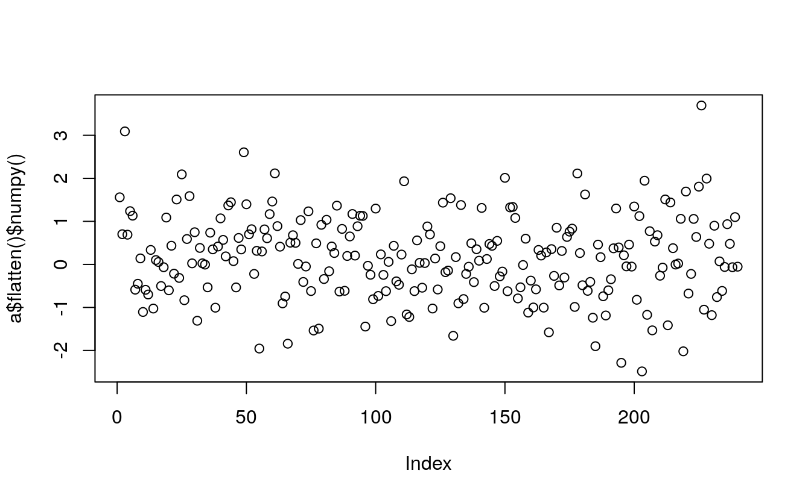

### Uniform matrix


```r
library(rTorch)

# 3x5 matrix uniformly distributed between 0 and 1
mat0 <- torch$FloatTensor(13L, 15L)$uniform_(0L, 1L)
plot(mat0$flatten()$numpy())
hist(mat0$flatten()$numpy())
```

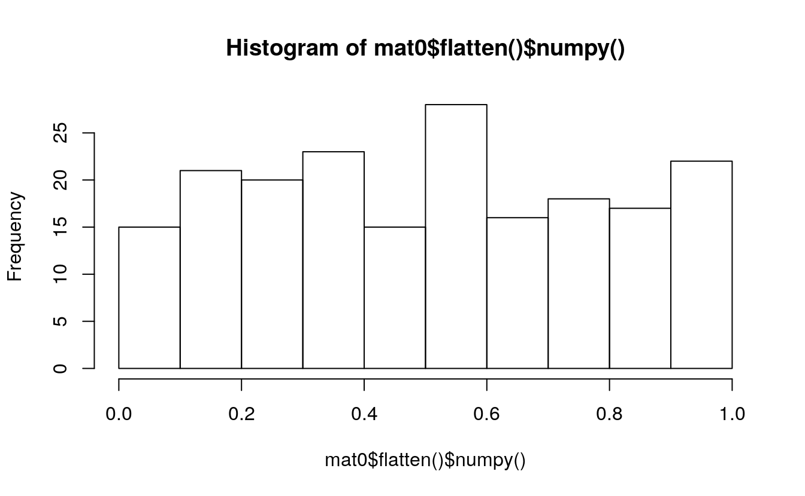


```r
# fill a 3x5 matrix with 0.1
mat1 <- torch$FloatTensor(30L, 50L)$uniform_(0.1, 0.2)
plot(mat1$flatten()$numpy())
hist(mat1$flatten()$numpy())
```

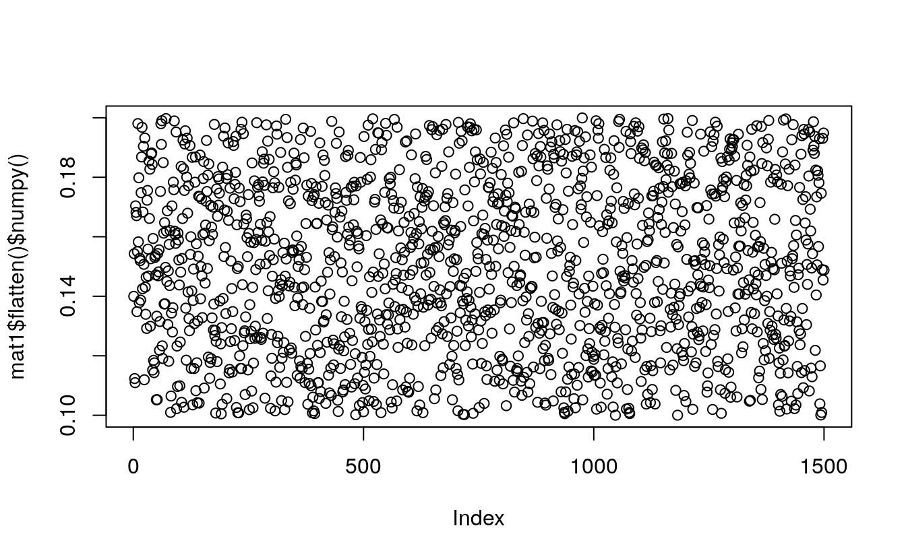


```r
# a vector with all ones
mat2 <- torch$FloatTensor(500L)$uniform_(1, 2)
plot(mat2$flatten()$numpy())
hist(mat2$flatten()$numpy())
```


### Binomial distribution


```r
Binomial <- torch$distributions$binomial$Binomial

m = Binomial(100, torch$tensor(list(0 , .2, .8, 1)))
(x = m$sample())
#> tensor([  0.,  23.,  78., 100.])
```


```r
m = Binomial(torch$tensor(list(list(5.), list(10.))), 
             torch$tensor(list(0.5, 0.8)))
(x = m$sample())
#> tensor([[3., 4.],
#>         [6., 8.]])
```


```r
binom <- Binomial(100, torch$FloatTensor(5L, 10L))
print(binom)
#> Binomial(total_count: torch.Size([5, 10]), probs: torch.Size([5, 10]), logits: torch.Size([5, 10]))
```


```r
print(binom$sample_n(100L)$shape)
#> torch.Size([100, 5, 10])
plot(binom$sample_n(100L)$flatten()$numpy())
hist(binom$sample_n(100L)$flatten()$numpy())
```

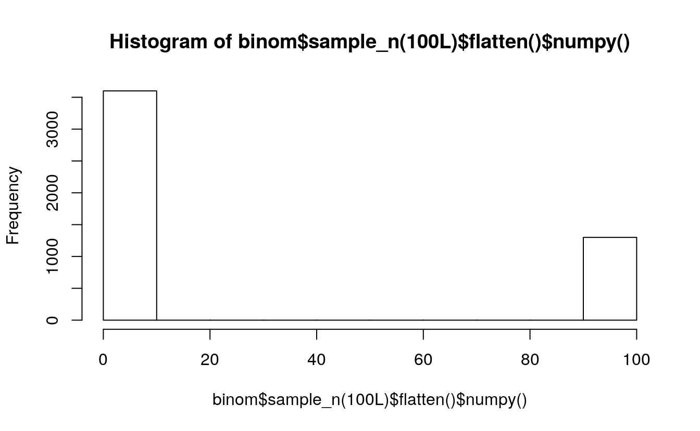

### Exponential distribution


```r
Exponential <- torch$distributions$exponential$Exponential

m = Exponential(torch$tensor(list(1.0)))
m
#> Exponential(rate: tensor([1.]))
m$sample()  # Exponential distributed with rate=1
#> tensor([0.4171])
```


```r
expo <- Exponential(rate=0.25)
expo_sample <- expo$sample_n(250L)   # generate 250 samples
print(expo_sample$shape)
#> torch.Size([250])
plot(expo_sample$flatten()$numpy())
hist(expo_sample$flatten()$numpy())
```

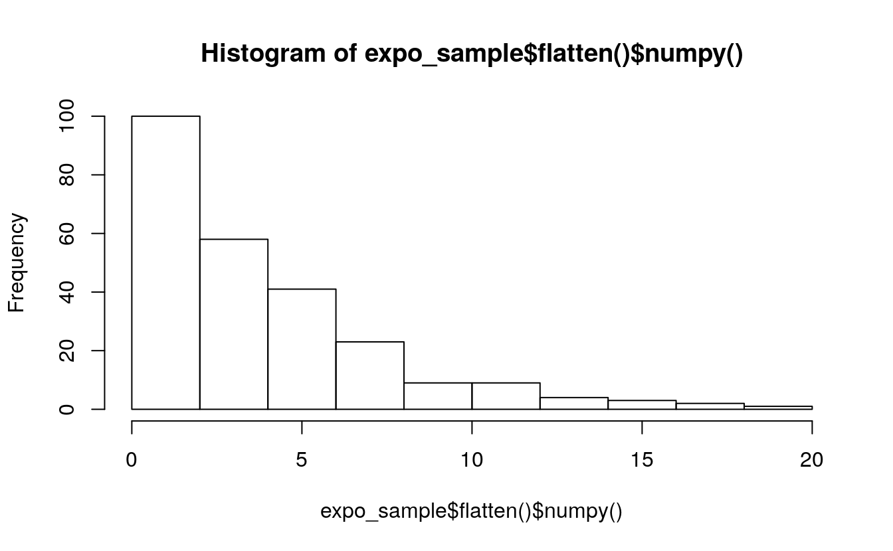

### Weibull distribution


```r
Weibull <- torch$distributions$weibull$Weibull

m = Weibull(torch$tensor(list(1.0)), torch$tensor(list(1.0)))
m$sample()  # sample from a Weibull distribution with scale=1, concentration=1
#> tensor([1.7026])
```

#### Constant `scale`


```r
# constant scale
for (k in 1:10) {
    wei <- Weibull(scale=100, concentration=k)
    wei_sample <- wei$sample_n(500L)
    # plot(wei_sample$flatten()$numpy())
    hist(main=paste0("Scale=100; Concentration=", k),
        wei_sample$flatten()$numpy())
}
```

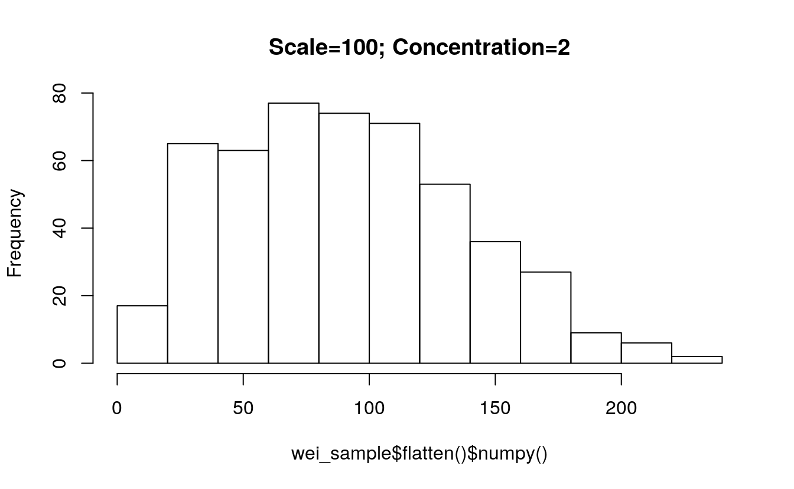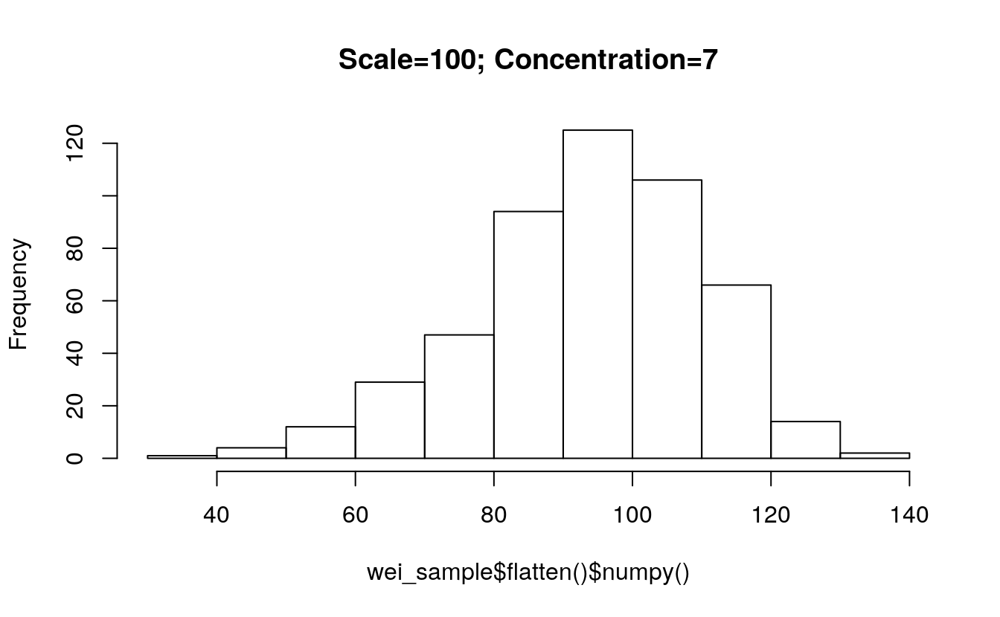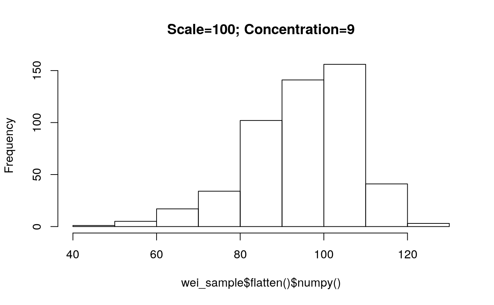

#### Constant `concentration`


```r
# constant concentration
for (s in seq(100, 1000, 100)) {
    wei <- Weibull(scale=s, concentration=1)
    wei_sample <- wei$sample_n(500L)
    # plot(wei_sample$flatten()$numpy())
    hist(main=paste0("Concentration=1; Scale=", s),
        wei_sample$flatten()$numpy())
}
```

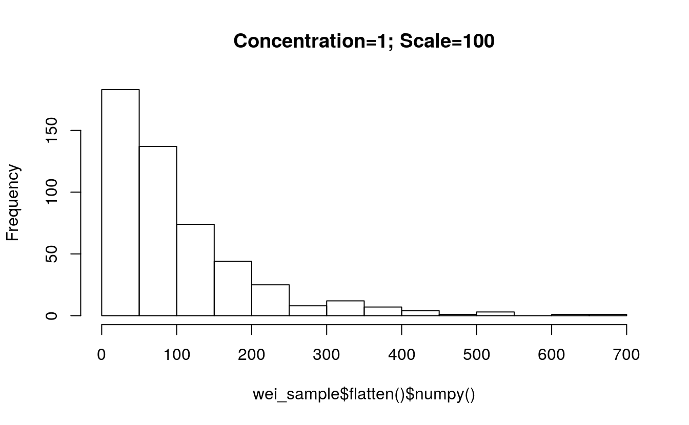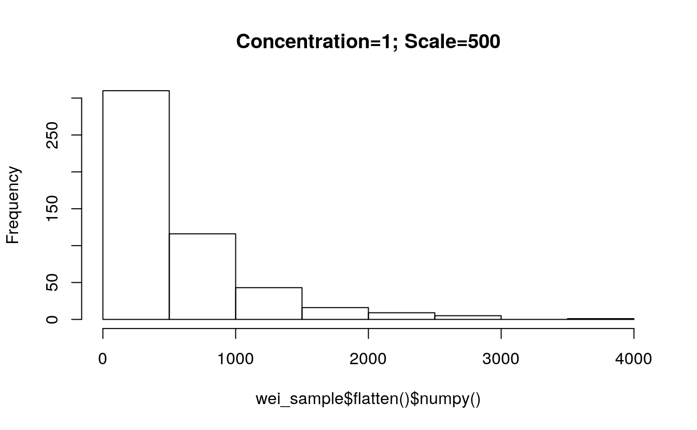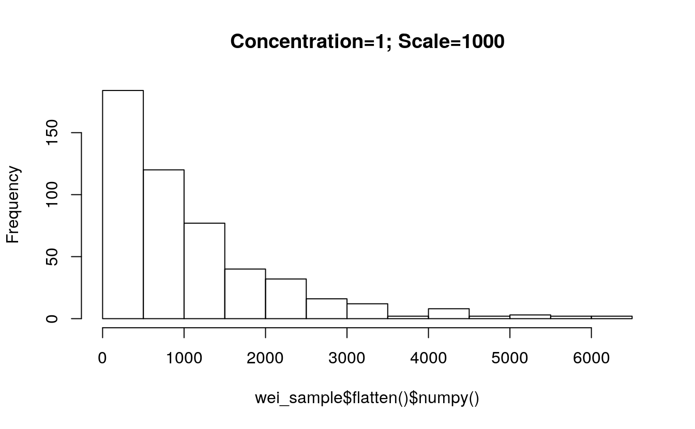
