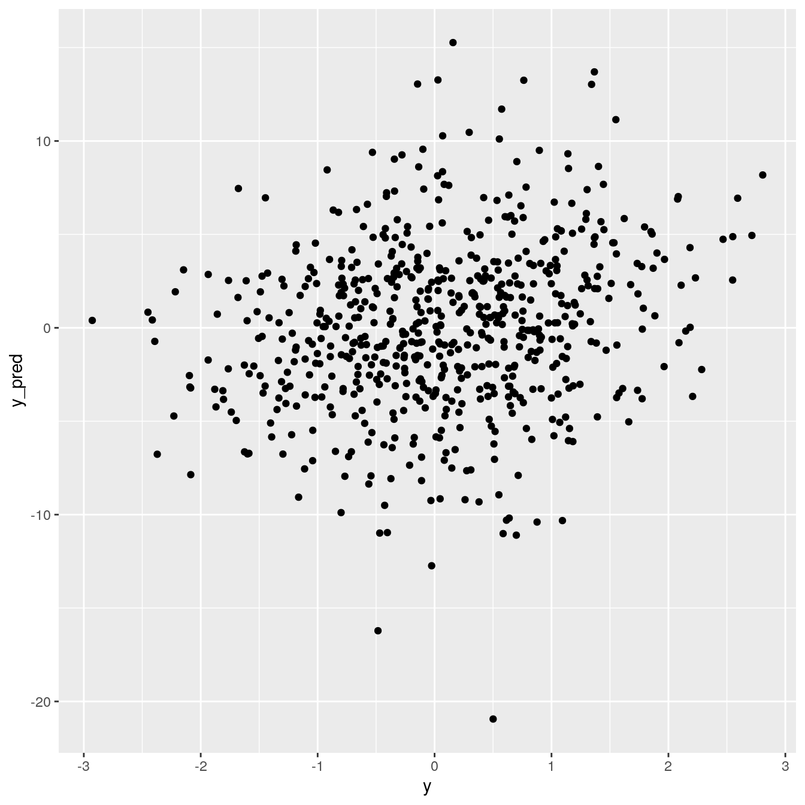
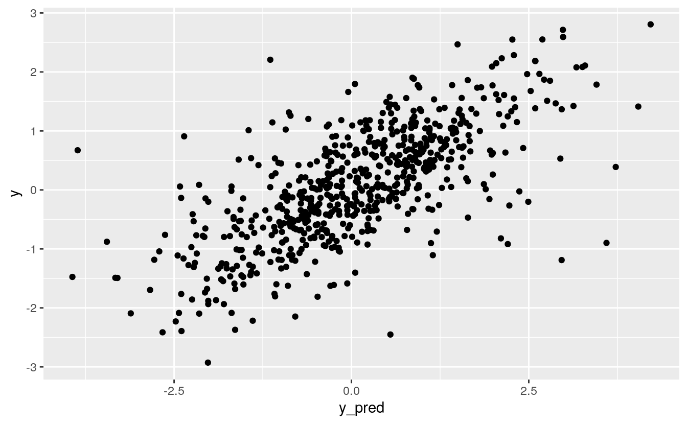
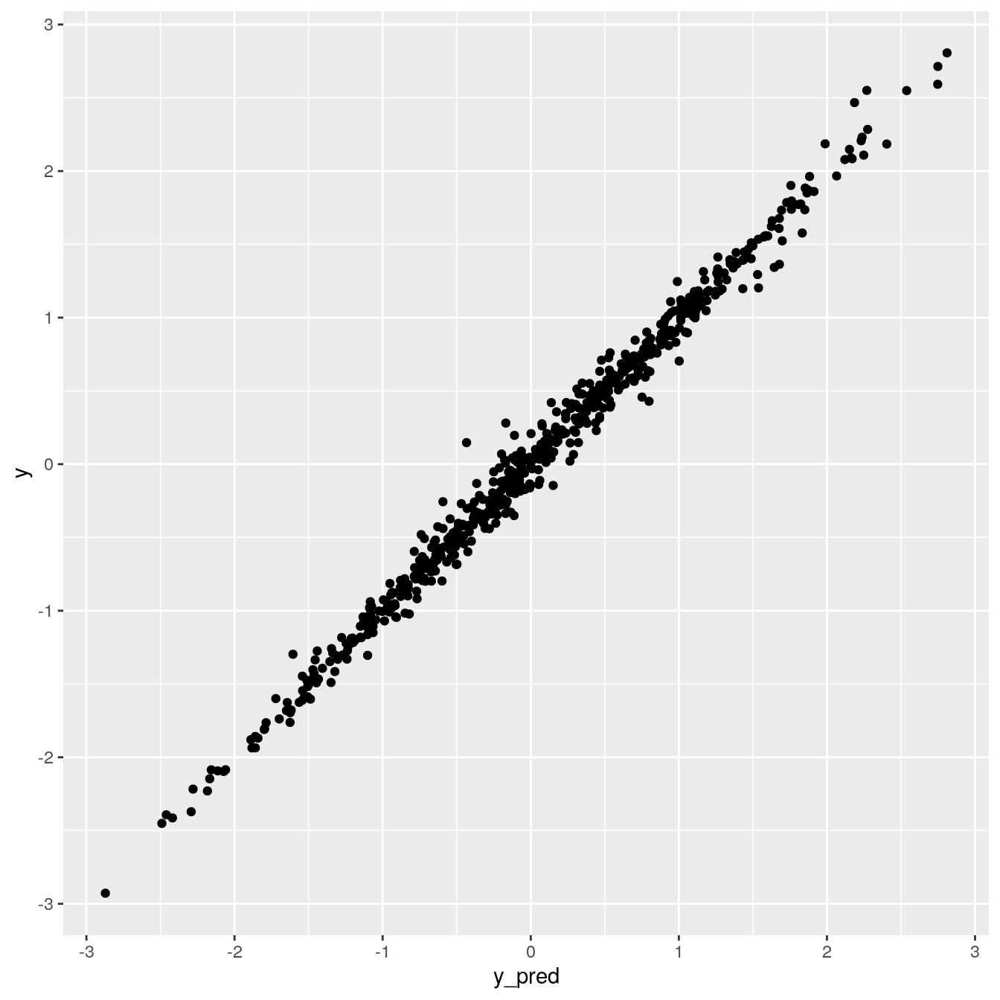
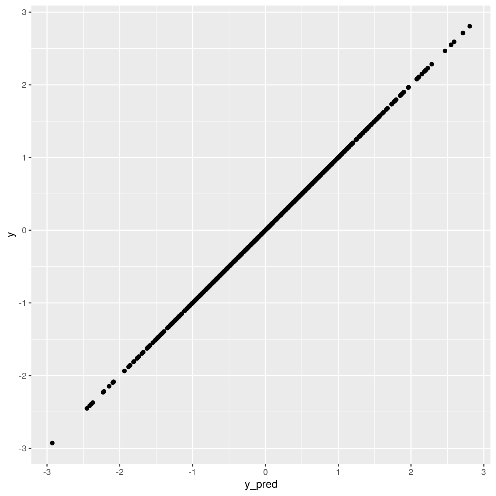

# (PART) Neural Networks {.unnumbered}

# Neural Networks

_Last update: Thu Oct 22 16:46:28 2020 -0500 (54a46ea04)_

## rTorch and PyTorch

We will compare three neural networks:

-   a neural network written in `numpy`

-   a neural network written in `r-base`

-   a neural network written in `PyTorch`

-   a neural network written in `rTorch`


## A neural network with `numpy`

We start the neural network by simply using `numpy`:


```r
library(rTorch)
```


```python
# A simple neural network using NumPy
# Code in file tensor/two_layer_net_numpy.py
import time
import numpy as np

tic = time.process_time()

np.random.seed(123)   # set a seed for reproducibility
# N is batch size; D_in is input dimension;
# H is hidden dimension; D_out is output dimension.
N, D_in, H, D_out = 64, 1000, 100, 10

# Create random input and output data
x = np.random.randn(N, D_in)
y = np.random.randn(N, D_out)
# print(x.shape)
# print(y.shape)

w1 = np.random.randn(D_in, H)
w2 = np.random.randn(H, D_out)
# print(w1.shape)
# print(w2.shape)

learning_rate = 1e-6
for t in range(500):
  # Forward pass: compute predicted y
  h = x.dot(w1)
  # print(t, h.max())
  h_relu = np.maximum(h, 0)
  y_pred = h_relu.dot(w2)
  
  # Compute and print loss
  sq = np.square(y_pred - y)
  loss = sq.sum()
  print(t, loss)
  
  # Backprop to compute gradients of w1 and w2 with respect to loss
  grad_y_pred = 2.0 * (y_pred - y)
  grad_w2 = h_relu.T.dot(grad_y_pred)
  grad_h_relu = grad_y_pred.dot(w2.T)
  grad_h = grad_h_relu.copy()
  grad_h[h < 0] = 0
  grad_w1 = x.T.dot(grad_h)
 
  # Update weights
  w1 -= learning_rate * grad_w1
  w2 -= learning_rate * grad_w2
# processing time  
```

```
#> 0 28624200.800938517
#> 1 24402861.381040636
#> 2 23157437.29147552
#> 3 21617191.63397175
#> 4 18598190.361558598
#> 5 14198211.419692844
#> 6 9786244.45261814
#> 7 6233451.217340663
#> 8 3862647.267829599
#> 9 2412366.632764836
#> 10 1569915.4392193707
#> 11 1078501.3381487518
#> 12 785163.9233288621
#> 13 601495.2825043725
#> 14 479906.0403613456
#> 15 394555.19331746205
#> 16 331438.6987273826
#> 17 282679.6687873873
#> 18 243807.84432087594
#> 19 211970.18110708205
#> 20 185451.6861514274
#> 21 163078.20881862927
#> 22 144011.80160918707
#> 23 127662.96132466741
#> 24 113546.29175681781
#> 25 101291.55288493488
#> 26 90623.20833654879
#> 27 81307.32590692889
#> 28 73135.24710426925
#> 29 65937.50294095621
#> 30 59570.26425368039
#> 31 53923.82804264227
#> 32 48909.69273028215
#> 33 44438.89933807681
#> 34 40445.34031569733
#> 35 36873.30041989413
#> 36 33664.990437423825
#> 37 30781.198962949587
#> 38 28184.24227268406
#> 39 25843.99793108194
#> 40 23727.282448406426
#> 41 21810.062067327668
#> 42 20071.326437572196
#> 43 18492.63752543329
#> 44 17056.72779714255
#> 45 15749.299484025236
#> 46 14557.324481207237
#> 47 13468.469764338035
#> 48 12473.575866914027
#> 49 11562.485809665774
#> 50 10727.865926563407
#> 51 9962.411372816146
#> 52 9259.619803682268
#> 53 8613.269071227103
#> 54 8018.523834750763
#> 55 7471.080819104451
#> 56 6966.00651845651
#> 57 6499.96685422581
#> 58 6069.576425345411
#> 59 5671.2821228408475
#> 60 5302.644980086279
#> 61 4961.339043761728
#> 62 4645.02541423451
#> 63 4351.473575805103
#> 64 4079.2165446062972
#> 65 3826.1480820887655
#> 66 3590.887308956795
#> 67 3372.0103280622666
#> 68 3168.173408650748
#> 69 2978.362100081684
#> 70 2801.302649097963
#> 71 2636.037950790892
#> 72 2481.7354010452655
#> 73 2337.6093944873246
#> 74 2202.8250425683987
#> 75 2076.8872560589616
#> 76 1958.9976460120263
#> 77 1848.5060338548483
#> 78 1744.9993380824799
#> 79 1647.9807349258715
#> 80 1556.9947585282196
#> 81 1471.7081797400347
#> 82 1391.6136870762566
#> 83 1316.3329239757227
#> 84 1245.5902641069824
#> 85 1179.0691783286234
#> 86 1116.5095209528572
#> 87 1057.6662051951396
#> 88 1002.2519686823666
#> 89 950.0167505993219
#> 90 900.7916929993518
#> 91 854.3816389576979
#> 92 810.6277767708903
#> 93 769.3592041348505
#> 94 730.3836012940042
#> 95 693.5644048073411
#> 96 658.7807027999521
#> 97 625.9238747325827
#> 98 594.8758111695068
#> 99 565.4973547949257
#> 100 537.7012178149556
#> 101 511.3901106843991
#> 102 486.4837276215478
#> 103 462.90746955458474
#> 104 440.5787622887435
#> 105 419.4121231392399
#> 106 399.34612374957226
#> 107 380.3221777272873
#> 108 362.2821345456067
#> 109 345.18049757120184
#> 110 328.94028615976936
#> 111 313.5191206271147
#> 112 298.8754770672758
#> 113 284.96926791620496
#> 114 271.7642984526849
#> 115 259.2246266311472
#> 116 247.30122156531897
#> 117 235.96203976771662
#> 118 225.17874184522793
#> 119 214.9253969806085
#> 120 205.16916168826197
#> 121 195.88920014324063
#> 122 187.0522150132689
#> 123 178.6428873875804
#> 124 170.63479897325027
#> 125 163.00806018890546
#> 126 155.7440191346056
#> 127 148.83352898111042
#> 128 142.2496666996878
#> 129 135.97509122834504
#> 130 129.98982612428355
#> 131 124.28418865778005
#> 132 118.84482149781273
#> 133 113.65645952102406
#> 134 108.7054397008061
#> 135 103.98144604072209
#> 136 99.47512083365962
#> 137 95.17318303450762
#> 138 91.06775169947714
#> 139 87.14952592945869
#> 140 83.4075554849774
#> 141 79.8333553283839
#> 142 76.41993249926654
#> 143 73.159531678603
#> 144 70.04535899921396
#> 145 67.0700037713867
#> 146 64.22536514818646
#> 147 61.50715956099643
#> 148 58.90970110703718
#> 149 56.42818157298958
#> 150 54.053456343974474
#> 151 51.78409899250521
#> 152 49.613042222061935
#> 153 47.537088681832714
#> 154 45.55073951374691
#> 155 43.651385230775375
#> 156 41.8333828820336
#> 157 40.0944925576898
#> 158 38.4304655768987
#> 159 36.83773398481151
#> 160 35.313368600585044
#> 161 33.85436928433868
#> 162 32.457997092726586
#> 163 31.120973836567913
#> 164 29.841057186484246
#> 165 28.61536631365921
#> 166 27.441646501921213
#> 167 26.31767712811449
#> 168 25.241065734351473
#> 169 24.210568668753154
#> 170 23.223366825888164
#> 171 22.27691447596546
#> 172 21.370561777029383
#> 173 20.502013041055037
#> 174 19.669605151002397
#> 175 18.872156637147214
#> 176 18.107932697664136
#> 177 17.375347093063624
#> 178 16.67329705241241
#> 179 16.000313127916616
#> 180 15.355056259809643
#> 181 14.736642044314163
#> 182 14.143657665391123
#> 183 13.575482981169435
#> 184 13.03055792072713
#> 185 12.507813624903267
#> 186 12.00650847964371
#> 187 11.525873890625666
#> 188 11.064924569594556
#> 189 10.622845128602144
#> 190 10.199224278747348
#> 191 9.79248532294249
#> 192 9.40221537769526
#> 193 9.027996925837858
#> 194 8.668895520243254
#> 195 8.324385761675554
#> 196 7.99390867066041
#> 197 7.676665609325665
#> 198 7.3722991001285685
#> 199 7.080233920966563
#> 200 6.7999405980009
#> 201 6.530984430178585
#> 202 6.2728878687947365
#> 203 6.025197539285438
#> 204 5.787473375780924
#> 205 5.559253501791474
#> 206 5.340172472449113
#> 207 5.129896948041436
#> 208 4.928007606815918
#> 209 4.734225282679221
#> 210 4.548186858907342
#> 211 4.369651328446663
#> 212 4.198236457646962
#> 213 4.033565011138579
#> 214 3.8754625080281464
#> 215 3.7236914115521316
#> 216 3.5779627242857224
#> 217 3.4379821914239286
#> 218 3.303565587540205
#> 219 3.174454405800678
#> 220 3.0504743070396323
#> 221 2.931383709316906
#> 222 2.8170418304762785
#> 223 2.7072412196038553
#> 224 2.6017277000868093
#> 225 2.50040409121904
#> 226 2.403078781570677
#> 227 2.309594481835507
#> 228 2.219794799730801
#> 229 2.133526678637347
#> 230 2.0506760423604566
#> 231 1.9710453639295484
#> 232 1.894559024310974
#> 233 1.8211210547720629
#> 234 1.7505340383436803
#> 235 1.6826932948721067
#> 236 1.6175070289508109
#> 237 1.5549072300348752
#> 238 1.4947316986695944
#> 239 1.436912502600996
#> 240 1.381372987946563
#> 241 1.3279854205041584
#> 242 1.2766884038688984
#> 243 1.2273848146334094
#> 244 1.1800217450316255
#> 245 1.1344919105891025
#> 246 1.0907369940975837
#> 247 1.0486826235693274
#> 248 1.0082656206399931
#> 249 0.9694282665755529
#> 250 0.9320976601575675
#> 251 0.8962339607475229
#> 252 0.8617533865905884
#> 253 0.8286151485833971
#> 254 0.7967578289852474
#> 255 0.7661404678425654
#> 256 0.7367202044072118
#> 257 0.708422713667491
#> 258 0.6812311487720265
#> 259 0.6550822696783506
#> 260 0.6299469090210432
#> 261 0.605786995355434
#> 262 0.5825650778276774
#> 263 0.5602382140936045
#> 264 0.5387735503110371
#> 265 0.5181403816556053
#> 266 0.49830590931295304
#> 267 0.47922937308117297
#> 268 0.46088901492620127
#> 269 0.44325464817119054
#> 270 0.42630408406116316
#> 271 0.41000543380657917
#> 272 0.39433673295843236
#> 273 0.37927114581493265
#> 274 0.36478176529460243
#> 275 0.35085044445134994
#> 276 0.3374578361158044
#> 277 0.32457682402453136
#> 278 0.31219123729919207
#> 279 0.300296586147234
#> 280 0.28884848624094894
#> 281 0.27783526470539743
#> 282 0.26724487697010957
#> 283 0.2570618106928273
#> 284 0.2472693951468085
#> 285 0.23785306876436113
#> 286 0.22879648231270536
#> 287 0.22008909643106767
#> 288 0.21171318526106842
#> 289 0.2036578219834066
#> 290 0.19591133993811427
#> 291 0.18846041746510728
#> 292 0.18129477007162065
#> 293 0.174405315161736
#> 294 0.16777998120837712
#> 295 0.16140610523836268
#> 296 0.1552756501716649
#> 297 0.14937904644542377
#> 298 0.14370793039467633
#> 299 0.13825290527822973
#> 300 0.13300640130439656
#> 301 0.12796012311324031
#> 302 0.12310750541656884
#> 303 0.11844182274749851
#> 304 0.11395158652041627
#> 305 0.10963187686672912
#> 306 0.10547640155933785
#> 307 0.10148022089409026
#> 308 0.0976363799328684
#> 309 0.09393976586801374
#> 310 0.09038186218007657
#> 311 0.08696004033318867
#> 312 0.08366808215670352
#> 313 0.08050159133387036
#> 314 0.0774556507265311
#> 315 0.07452541616811464
#> 316 0.07170677388789805
#> 317 0.06899492388917926
#> 318 0.06638632065320674
#> 319 0.06387707772657374
#> 320 0.06146291085125196
#> 321 0.0591402294396231
#> 322 0.05690662209831464
#> 323 0.05475707395743591
#> 324 0.05268944906989688
#> 325 0.05069984545069233
#> 326 0.048785688597973095
#> 327 0.046944795197577285
#> 328 0.045173966618895535
#> 329 0.043469382749897256
#> 330 0.04182932192085659
#> 331 0.04025154186795582
#> 332 0.038733588417595735
#> 333 0.03727299017402862
#> 334 0.03586799441058297
#> 335 0.03451589218265247
#> 336 0.03321501089199479
#> 337 0.03196371785309425
#> 338 0.030759357425241718
#> 339 0.029600888472444742
#> 340 0.028485919148238392
#> 341 0.02741317225069457
#> 342 0.026380963792005673
#> 343 0.025387828276963217
#> 344 0.02443225636975702
#> 345 0.02351279471955997
#> 346 0.02262815392798661
#> 347 0.02177684408442846
#> 348 0.02095765200803268
#> 349 0.02016947466161515
#> 350 0.019410962895712616
#> 351 0.018681045066734122
#> 352 0.017978879513468316
#> 353 0.017303468563130222
#> 354 0.016653437842251186
#> 355 0.01602766278432409
#> 356 0.015425464893044428
#> 357 0.01484594678906112
#> 358 0.014288249850265784
#> 359 0.01375163575426638
#> 360 0.01323528665049373
#> 361 0.012738339025978556
#> 362 0.012260186918304262
#> 363 0.011799970856220952
#> 364 0.011357085981162363
#> 365 0.010930950268775873
#> 366 0.010520842685022909
#> 367 0.010126145830079638
#> 368 0.009746393154855839
#> 369 0.009380889339520658
#> 370 0.009029161386689313
#> 371 0.00869059833698051
#> 372 0.00836477207696539
#> 373 0.008051209390678065
#> 374 0.0077494325069793705
#> 375 0.007459023266150334
#> 376 0.007179590434333104
#> 377 0.006910623445853765
#> 378 0.006651749941578513
#> 379 0.006402648026678379
#> 380 0.006162978285307884
#> 381 0.005932194796367616
#> 382 0.005710085052295781
#> 383 0.005496310244895275
#> 384 0.0052906289241425215
#> 385 0.0050926241688279104
#> 386 0.004902076613033862
#> 387 0.004718638851167859
#> 388 0.004542078962047164
#> 389 0.004372164586665975
#> 390 0.004208618626839021
#> 391 0.004051226677923414
#> 392 0.0038997374494828298
#> 393 0.003753918301513866
#> 394 0.003613561837935153
#> 395 0.0034784786917529164
#> 396 0.003348462575629662
#> 397 0.003223327362263324
#> 398 0.0031028635490837437
#> 399 0.002986912218213565
#> 400 0.002875348146367024
#> 401 0.0027679524720207994
#> 402 0.0026645903412969877
#> 403 0.00256506728009952
#> 404 0.0024692701898842025
#> 405 0.0023770671718814063
#> 406 0.0022883091777422303
#> 407 0.0022029269889801703
#> 408 0.0021207379368966914
#> 409 0.0020415781423120893
#> 410 0.001965380838191689
#> 411 0.0018920388674650765
#> 412 0.0018214489876606395
#> 413 0.0017534990549357195
#> 414 0.0016880979054376358
#> 415 0.0016251364192863505
#> 416 0.0015645343026947606
#> 417 0.0015062064772070694
#> 418 0.0014500530088225327
#> 419 0.0013959868097274688
#> 420 0.001343946421404061
#> 421 0.0012938496041169677
#> 422 0.001245622397754905
#> 423 0.0011992050880615885
#> 424 0.0011545283489900085
#> 425 0.0011115075856686302
#> 426 0.001070100670544413
#> 427 0.0010302364937566674
#> 428 0.0009918591300819473
#> 429 0.000954924393232083
#> 430 0.0009193639132775486
#> 431 0.0008851308467932729
#> 432 0.0008521777959560448
#> 433 0.0008204570911784497
#> 434 0.0007899223397731109
#> 435 0.0007605278374214596
#> 436 0.0007322343466954752
#> 437 0.0007049830914115257
#> 438 0.0006787512341473519
#> 439 0.00065350212037464
#> 440 0.0006291921955255096
#> 441 0.0006057856348208776
#> 442 0.0005832525024800561
#> 443 0.0005615598539424442
#> 444 0.0005406761235200468
#> 445 0.0005205750249286578
#> 446 0.0005012184845940066
#> 447 0.0004825848028301716
#> 448 0.0004646447575300741
#> 449 0.0004473739461918762
#> 450 0.0004307513759213604
#> 451 0.00041474810355609723
#> 452 0.00039933580480713945
#> 453 0.0003844970781264902
#> 454 0.0003702109250696993
#> 455 0.00035645948619340297
#> 456 0.0003432213223641764
#> 457 0.0003304723731848576
#> 458 0.00031819830164465815
#> 459 0.00030638121798918724
#> 460 0.0002950045353519474
#> 461 0.0002840533130499193
#> 462 0.00027350873727298176
#> 463 0.00026335657398426546
#> 464 0.000253581258369829
#> 465 0.00024416913722126747
#> 466 0.0002351142689424904
#> 467 0.0002263919313737711
#> 468 0.00021799257674327073
#> 469 0.00020990427540056088
#> 470 0.0002021174506938248
#> 471 0.00019462054044199915
#> 472 0.00018740325426984858
#> 473 0.00018045252249983815
#> 474 0.000173759960543912
#> 475 0.00016731630060690805
#> 476 0.0001611122710715995
#> 477 0.00015513993832625702
#> 478 0.00014938925941558148
#> 479 0.00014385207870578823
#> 480 0.00013852014130375656
#> 481 0.00013338601187671428
#> 482 0.000128442793294424
#> 483 0.0001236841045646944
#> 484 0.00011910150087090696
#> 485 0.00011468967274610794
#> 486 0.00011044058002490428
#> 487 0.00010634983745106246
#> 488 0.00010241132940006558
#> 489 9.861901302344988e-05
#> 490 9.496682985475842e-05
#> 491 9.144989845880715e-05
#> 492 8.806354488018214e-05
#> 493 8.480312707749194e-05
#> 494 8.166404591653792e-05
#> 495 7.864135637113095e-05
#> 496 7.573027443124469e-05
#> 497 7.292787602990206e-05
#> 498 7.023030228370285e-05
#> 499 6.763183953445079e-05
```

```python
toc = time.process_time()
print(toc - tic, "seconds")
```

```
#> 6.927609346000001 seconds
```

## A neural network with `r-base`

It is the same algorithm above in `numpy` but written in R base.


```r
library(tictoc)

tic()
set.seed(123)
N <- 64; D_in <- 1000; H <- 100; D_out <- 10;
# Create random input and output data
x <- array(rnorm(N * D_in),  dim = c(N, D_in))
y <- array(rnorm(N * D_out), dim = c(N, D_out))
# Randomly initialize weights
w1 <- array(rnorm(D_in * H),  dim = c(D_in, H))
w2 <- array(rnorm(H * D_out),  dim = c(H, D_out))
learning_rate <-  1e-6

for (t in seq(1, 500)) {
  # Forward pass: compute predicted y
  h = x %*% w1
  h_relu = pmax(h, 0)
  y_pred = h_relu %*% w2

  # Compute and print loss
  sq <- (y_pred - y)^2
  loss = sum(sq)
  cat(t, loss, "\n")
  
  # Backprop to compute gradients of w1 and w2 with respect to loss
  grad_y_pred = 2.0 * (y_pred - y)
  grad_w2 = t(h_relu) %*% grad_y_pred
  grad_h_relu = grad_y_pred %*% t(w2)
  # grad_h <- sapply(grad_h_relu, function(i) i, simplify = FALSE )   # grad_h = grad_h_relu.copy()
  grad_h <- rlang::duplicate(grad_h_relu)
  grad_h[h < 0] <-  0
  grad_w1 = t(x) %*% grad_h
  
  # Update weights
  w1 = w1 - learning_rate * grad_w1
  w2 = w2 - learning_rate * grad_w2
}
toc()
```

```
#> 1 2.8e+07 
#> 2 25505803 
#> 3 29441299 
#> 4 35797650 
#> 5 39517126 
#> 6 34884942 
#> 7 23333535 
#> 8 11927525 
#> 9 5352787 
#> 10 2496984 
#> 11 1379780 
#> 12 918213 
#> 13 695760 
#> 14 564974 
#> 15 474479 
#> 16 405370 
#> 17 349747 
#> 18 303724 
#> 19 265075 
#> 20 232325 
#> 21 204394 
#> 22 180414 
#> 23 159752 
#> 24 141895 
#> 25 126374 
#> 26 112820 
#> 27 100959 
#> 28 90536 
#> 29 81352 
#> 30 73244 
#> 31 66058 
#> 32 59675 
#> 33 53993 
#> 34 48921 
#> 35 44388 
#> 36 40328 
#> 37 36687 
#> 38 33414 
#> 39 30469 
#> 40 27816 
#> 41 25419 
#> 42 23251 
#> 43 21288 
#> 44 19508 
#> 45 17893 
#> 46 16426 
#> 47 15092 
#> 48 13877 
#> 49 12769 
#> 50 11758 
#> 51 10835 
#> 52 9991 
#> 53 9218 
#> 54 8510 
#> 55 7862 
#> 56 7267 
#> 57 6719 
#> 58 6217 
#> 59 5754 
#> 60 5329 
#> 61 4938 
#> 62 4577 
#> 63 4245 
#> 64 3938 
#> 65 3655 
#> 66 3394 
#> 67 3153 
#> 68 2930 
#> 69 2724 
#> 70 2533 
#> 71 2357 
#> 72 2193 
#> 73 2042 
#> 74 1902 
#> 75 1772 
#> 76 1651 
#> 77 1539 
#> 78 1435 
#> 79 1338 
#> 80 1249 
#> 81 1165 
#> 82 1088 
#> 83 1016 
#> 84 949 
#> 85 886 
#> 86 828 
#> 87 774 
#> 88 724 
#> 89 677 
#> 90 633 
#> 91 592 
#> 92 554 
#> 93 519 
#> 94 486 
#> 95 455 
#> 96 426 
#> 97 399 
#> 98 374 
#> 99 350 
#> 100 328 
#> 101 308 
#> 102 289 
#> 103 271 
#> 104 254 
#> 105 238 
#> 106 224 
#> 107 210 
#> 108 197 
#> 109 185 
#> 110 174 
#> 111 163 
#> 112 153 
#> 113 144 
#> 114 135 
#> 115 127 
#> 116 119 
#> 117 112 
#> 118 106 
#> 119 99.2 
#> 120 93.3 
#> 121 87.8 
#> 122 82.6 
#> 123 77.7 
#> 124 73.1 
#> 125 68.8 
#> 126 64.7 
#> 127 60.9 
#> 128 57.4 
#> 129 54 
#> 130 50.9 
#> 131 47.9 
#> 132 45.1 
#> 133 42.5 
#> 134 40.1 
#> 135 37.8 
#> 136 35.6 
#> 137 33.5 
#> 138 31.6 
#> 139 29.8 
#> 140 28.1 
#> 141 26.5 
#> 142 25 
#> 143 23.6 
#> 144 22.2 
#> 145 21 
#> 146 19.8 
#> 147 18.7 
#> 148 17.6 
#> 149 16.6 
#> 150 15.7 
#> 151 14.8 
#> 152 14 
#> 153 13.2 
#> 154 12.5 
#> 155 11.8 
#> 156 11.1 
#> 157 10.5 
#> 158 9.94 
#> 159 9.39 
#> 160 8.87 
#> 161 8.38 
#> 162 7.92 
#> 163 7.49 
#> 164 7.08 
#> 165 6.69 
#> 166 6.32 
#> 167 5.98 
#> 168 5.65 
#> 169 5.35 
#> 170 5.06 
#> 171 4.78 
#> 172 4.52 
#> 173 4.28 
#> 174 4.05 
#> 175 3.83 
#> 176 3.62 
#> 177 3.43 
#> 178 3.25 
#> 179 3.07 
#> 180 2.91 
#> 181 2.75 
#> 182 2.6 
#> 183 2.47 
#> 184 2.33 
#> 185 2.21 
#> 186 2.09 
#> 187 1.98 
#> 188 1.88 
#> 189 1.78 
#> 190 1.68 
#> 191 1.6 
#> 192 1.51 
#> 193 1.43 
#> 194 1.36 
#> 195 1.29 
#> 196 1.22 
#> 197 1.15 
#> 198 1.09 
#> 199 1.04 
#> 200 0.983 
#> 201 0.932 
#> 202 0.883 
#> 203 0.837 
#> 204 0.794 
#> 205 0.753 
#> 206 0.714 
#> 207 0.677 
#> 208 0.642 
#> 209 0.609 
#> 210 0.577 
#> 211 0.548 
#> 212 0.519 
#> 213 0.493 
#> 214 0.467 
#> 215 0.443 
#> 216 0.421 
#> 217 0.399 
#> 218 0.379 
#> 219 0.359 
#> 220 0.341 
#> 221 0.324 
#> 222 0.307 
#> 223 0.292 
#> 224 0.277 
#> 225 0.263 
#> 226 0.249 
#> 227 0.237 
#> 228 0.225 
#> 229 0.213 
#> 230 0.203 
#> 231 0.192 
#> 232 0.183 
#> 233 0.173 
#> 234 0.165 
#> 235 0.156 
#> 236 0.149 
#> 237 0.141 
#> 238 0.134 
#> 239 0.127 
#> 240 0.121 
#> 241 0.115 
#> 242 0.109 
#> 243 0.104 
#> 244 0.0985 
#> 245 0.0936 
#> 246 0.0889 
#> 247 0.0845 
#> 248 0.0803 
#> 249 0.0763 
#> 250 0.0725 
#> 251 0.0689 
#> 252 0.0655 
#> 253 0.0623 
#> 254 0.0592 
#> 255 0.0563 
#> 256 0.0535 
#> 257 0.0508 
#> 258 0.0483 
#> 259 0.0459 
#> 260 0.0437 
#> 261 0.0415 
#> 262 0.0395 
#> 263 0.0375 
#> 264 0.0357 
#> 265 0.0339 
#> 266 0.0323 
#> 267 0.0307 
#> 268 0.0292 
#> 269 0.0278 
#> 270 0.0264 
#> 271 0.0251 
#> 272 0.0239 
#> 273 0.0227 
#> 274 0.0216 
#> 275 0.0206 
#> 276 0.0196 
#> 277 0.0186 
#> 278 0.0177 
#> 279 0.0168 
#> 280 0.016 
#> 281 0.0152 
#> 282 0.0145 
#> 283 0.0138 
#> 284 0.0131 
#> 285 0.0125 
#> 286 0.0119 
#> 287 0.0113 
#> 288 0.0108 
#> 289 0.0102 
#> 290 0.00975 
#> 291 0.00927 
#> 292 0.00883 
#> 293 0.0084 
#> 294 0.008 
#> 295 0.00761 
#> 296 0.00724 
#> 297 0.0069 
#> 298 0.00656 
#> 299 0.00625 
#> 300 0.00595 
#> 301 0.00566 
#> 302 0.00539 
#> 303 0.00513 
#> 304 0.00489 
#> 305 0.00465 
#> 306 0.00443 
#> 307 0.00422 
#> 308 0.00401 
#> 309 0.00382 
#> 310 0.00364 
#> 311 0.00347 
#> 312 0.0033 
#> 313 0.00314 
#> 314 0.00299 
#> 315 0.00285 
#> 316 0.00271 
#> 317 0.00259 
#> 318 0.00246 
#> 319 0.00234 
#> 320 0.00223 
#> 321 0.00213 
#> 322 0.00203 
#> 323 0.00193 
#> 324 0.00184 
#> 325 0.00175 
#> 326 0.00167 
#> 327 0.00159 
#> 328 0.00151 
#> 329 0.00144 
#> 330 0.00137 
#> 331 0.00131 
#> 332 0.00125 
#> 333 0.00119 
#> 334 0.00113 
#> 335 0.00108 
#> 336 0.00103 
#> 337 0.000979 
#> 338 0.000932 
#> 339 0.000888 
#> 340 0.000846 
#> 341 0.000807 
#> 342 0.000768 
#> 343 0.000732 
#> 344 0.000698 
#> 345 0.000665 
#> 346 0.000634 
#> 347 0.000604 
#> 348 0.000575 
#> 349 0.000548 
#> 350 0.000523 
#> 351 0.000498 
#> 352 0.000475 
#> 353 0.000452 
#> 354 0.000431 
#> 355 0.000411 
#> 356 0.000392 
#> 357 0.000373 
#> 358 0.000356 
#> 359 0.000339 
#> 360 0.000323 
#> 361 0.000308 
#> 362 0.000294 
#> 363 0.00028 
#> 364 0.000267 
#> 365 0.000254 
#> 366 0.000243 
#> 367 0.000231 
#> 368 0.00022 
#> 369 0.00021 
#> 370 2e-04 
#> 371 0.000191 
#> 372 0.000182 
#> 373 0.000174 
#> 374 0.000165 
#> 375 0.000158 
#> 376 0.00015 
#> 377 0.000143 
#> 378 0.000137 
#> 379 0.00013 
#> 380 0.000124 
#> 381 0.000119 
#> 382 0.000113 
#> 383 0.000108 
#> 384 0.000103 
#> 385 9.8e-05 
#> 386 9.34e-05 
#> 387 8.91e-05 
#> 388 8.49e-05 
#> 389 8.1e-05 
#> 390 7.72e-05 
#> 391 7.37e-05 
#> 392 7.02e-05 
#> 393 6.7e-05 
#> 394 6.39e-05 
#> 395 6.09e-05 
#> 396 5.81e-05 
#> 397 5.54e-05 
#> 398 5.28e-05 
#> 399 5.04e-05 
#> 400 4.81e-05 
#> 401 4.58e-05 
#> 402 4.37e-05 
#> 403 4.17e-05 
#> 404 3.98e-05 
#> 405 3.79e-05 
#> 406 3.62e-05 
#> 407 3.45e-05 
#> 408 3.29e-05 
#> 409 3.14e-05 
#> 410 2.99e-05 
#> 411 2.86e-05 
#> 412 2.72e-05 
#> 413 2.6e-05 
#> 414 2.48e-05 
#> 415 2.36e-05 
#> 416 2.25e-05 
#> 417 2.15e-05 
#> 418 2.05e-05 
#> 419 1.96e-05 
#> 420 1.87e-05 
#> 421 1.78e-05 
#> 422 1.7e-05 
#> 423 1.62e-05 
#> 424 1.55e-05 
#> 425 1.48e-05 
#> 426 1.41e-05 
#> 427 1.34e-05 
#> 428 1.28e-05 
#> 429 1.22e-05 
#> 430 1.17e-05 
#> 431 1.11e-05 
#> 432 1.06e-05 
#> 433 1.01e-05 
#> 434 9.66e-06 
#> 435 9.22e-06 
#> 436 8.79e-06 
#> 437 8.39e-06 
#> 438 8e-06 
#> 439 7.64e-06 
#> 440 7.29e-06 
#> 441 6.95e-06 
#> 442 6.63e-06 
#> 443 6.33e-06 
#> 444 6.04e-06 
#> 445 5.76e-06 
#> 446 5.5e-06 
#> 447 5.25e-06 
#> 448 5.01e-06 
#> 449 4.78e-06 
#> 450 4.56e-06 
#> 451 4.35e-06 
#> 452 4.15e-06 
#> 453 3.96e-06 
#> 454 3.78e-06 
#> 455 3.61e-06 
#> 456 3.44e-06 
#> 457 3.28e-06 
#> 458 3.13e-06 
#> 459 2.99e-06 
#> 460 2.85e-06 
#> 461 2.72e-06 
#> 462 2.6e-06 
#> 463 2.48e-06 
#> 464 2.37e-06 
#> 465 2.26e-06 
#> 466 2.15e-06 
#> 467 2.06e-06 
#> 468 1.96e-06 
#> 469 1.87e-06 
#> 470 1.79e-06 
#> 471 1.71e-06 
#> 472 1.63e-06 
#> 473 1.55e-06 
#> 474 1.48e-06 
#> 475 1.42e-06 
#> 476 1.35e-06 
#> 477 1.29e-06 
#> 478 1.23e-06 
#> 479 1.17e-06 
#> 480 1.12e-06 
#> 481 1.07e-06 
#> 482 1.02e-06 
#> 483 9.74e-07 
#> 484 9.3e-07 
#> 485 8.88e-07 
#> 486 8.47e-07 
#> 487 8.09e-07 
#> 488 7.72e-07 
#> 489 7.37e-07 
#> 490 7.03e-07 
#> 491 6.71e-07 
#> 492 6.41e-07 
#> 493 6.12e-07 
#> 494 5.84e-07 
#> 495 5.57e-07 
#> 496 5.32e-07 
#> 497 5.08e-07 
#> 498 4.85e-07 
#> 499 4.63e-07 
#> 500 4.42e-07 
#> 2.83 sec elapsed
```

##  A `PyTorch` neural network

Here is the same example we have used above but written in PyTorch. Notice the following differences with the `numpy` code:

-   we select the computation device which could be `cpu` or `gpu`

-   when building or creating the tensors, we specify which device we want to use

-   the tensors have `torch` methods and properties. Example: `mm()`, `clamp()`, `sum()`, `clone()`, and `t()`,

-   also notice the use some `torch` functions: `device()`, `randn()`


```r
reticulate::use_condaenv("r-torch")
```


```python
# Code in file tensor/two_layer_net_tensor.py
import torch
import time

ms = torch.manual_seed(0)
tic = time.process_time()
device = torch.device('cpu')
# device = torch.device('cuda')  # Uncomment this to run on GPU

# N is batch size; D_in is input dimension;
# H is hidden dimension; D_out is output dimension.
N, D_in, H, D_out = 64, 1000, 100, 10

# Create random input and output data
x = torch.randn(N, D_in, device=device)
y = torch.randn(N, D_out, device=device)

# Randomly initialize weights
w1 = torch.randn(D_in, H, device=device)
w2 = torch.randn(H, D_out, device=device)

learning_rate = 1e-6
for t in range(500):
  # Forward pass: compute predicted y
  h = x.mm(w1)
  h_relu = h.clamp(min=0)
  y_pred = h_relu.mm(w2)

  # Compute and print loss; loss is a scalar, and is stored in a PyTorch Tensor
  # of shape (); we can get its value as a Python number with loss.item().
  loss = (y_pred - y).pow(2).sum()
  print(t, loss.item())

  # Backprop to compute gradients of w1 and w2 with respect to loss
  grad_y_pred = 2.0 * (y_pred - y)
  grad_w2 = h_relu.t().mm(grad_y_pred)
  grad_h_relu = grad_y_pred.mm(w2.t())
  grad_h = grad_h_relu.clone()
  grad_h[h < 0] = 0
  grad_w1 = x.t().mm(grad_h)

  # Update weights using gradient descent
  w1 -= learning_rate * grad_w1
  w2 -= learning_rate * grad_w2
```

```
#> 0 29428664.0
#> 1 22739448.0
#> 2 20605260.0
#> 3 19520372.0
#> 4 17810224.0
#> 5 14999204.0
#> 6 11483334.0
#> 7 8096649.0
#> 8 5398717.5
#> 9 3521559.75
#> 10 2315861.5
#> 11 1570273.5
#> 12 1111700.375
#> 13 825062.8125
#> 14 639684.4375
#> 15 514220.625
#> 16 425155.3125
#> 17 358904.5625
#> 18 307636.71875
#> 19 266625.90625
#> 20 232998.625
#> 21 204887.296875
#> 22 181051.0625
#> 23 160643.0
#> 24 143036.09375
#> 25 127729.578125
#> 26 114360.25
#> 27 102621.0234375
#> 28 92276.9375
#> 29 83144.0859375
#> 30 75053.3984375
#> 31 67870.3984375
#> 32 61485.79296875
#> 33 55786.6328125
#> 34 50690.8515625
#> 35 46128.6328125
#> 36 42029.546875
#> 37 38341.875
#> 38 35017.33203125
#> 39 32016.68359375
#> 40 29303.43359375
#> 41 26847.1484375
#> 42 24620.376953125
#> 43 22599.46875
#> 44 20762.5625
#> 45 19090.986328125
#> 46 17568.359375
#> 47 16180.1083984375
#> 48 14911.99609375
#> 49 13753.8525390625
#> 50 12694.0205078125
#> 51 11723.640625
#> 52 10834.490234375
#> 53 10019.25390625
#> 54 9270.923828125
#> 55 8583.36328125
#> 56 7950.5625
#> 57 7368.46875
#> 58 6832.73779296875
#> 59 6339.20703125
#> 60 5884.1484375
#> 61 5464.44384765625
#> 62 5077.45849609375
#> 63 4719.9833984375
#> 64 4389.5400390625
#> 65 4084.009765625
#> 66 3801.313232421875
#> 67 3539.627197265625
#> 68 3297.266845703125
#> 69 3072.8017578125
#> 70 2864.869140625
#> 71 2672.025390625
#> 72 2493.096435546875
#> 73 2326.89697265625
#> 74 2172.523193359375
#> 75 2029.1279296875
#> 76 1895.768310546875
#> 77 1771.71435546875
#> 78 1656.3409423828125
#> 79 1548.9505615234375
#> 80 1448.9840087890625
#> 81 1355.846923828125
#> 82 1269.0556640625
#> 83 1188.1507568359375
#> 84 1112.7042236328125
#> 85 1042.3167724609375
#> 86 976.61328125
#> 87 915.2999267578125
#> 88 858.0404052734375
#> 89 804.5496826171875
#> 90 754.5780029296875
#> 91 707.8599243164062
#> 92 664.1988525390625
#> 93 623.3640747070312
#> 94 585.147216796875
#> 95 549.3995971679688
#> 96 515.9583740234375
#> 97 484.6272277832031
#> 98 455.28955078125
#> 99 427.81829833984375
#> 100 402.0847473144531
#> 101 377.9535827636719
#> 102 355.3477783203125
#> 103 334.1396179199219
#> 104 314.2633361816406
#> 105 295.61749267578125
#> 106 278.1217346191406
#> 107 261.7001953125
#> 108 246.2969512939453
#> 109 231.8272247314453
#> 110 218.24240112304688
#> 111 205.48812866210938
#> 112 193.5052490234375
#> 113 182.24417114257812
#> 114 171.66690063476562
#> 115 161.72601318359375
#> 116 152.3784942626953
#> 117 143.59078979492188
#> 118 135.32354736328125
#> 119 127.55582427978516
#> 120 120.24463653564453
#> 121 113.36481475830078
#> 122 106.89350128173828
#> 123 100.80726623535156
#> 124 95.07266998291016
#> 125 89.6752700805664
#> 126 84.59477233886719
#> 127 79.80913543701172
#> 128 75.30223083496094
#> 129 71.0572509765625
#> 130 67.05980682373047
#> 131 63.292694091796875
#> 132 59.7408447265625
#> 133 56.394203186035156
#> 134 53.243412017822266
#> 135 50.2683219909668
#> 136 47.46772003173828
#> 137 44.82497787475586
#> 138 42.33271408081055
#> 139 39.983646392822266
#> 140 37.76749801635742
#> 141 35.67666244506836
#> 142 33.70509338378906
#> 143 31.84467124938965
#> 144 30.089385986328125
#> 145 28.432872772216797
#> 146 26.869369506835938
#> 147 25.39266586303711
#> 148 23.999008178710938
#> 149 22.684724807739258
#> 150 21.4434757232666
#> 151 20.270301818847656
#> 152 19.164194107055664
#> 153 18.11824607849121
#> 154 17.131380081176758
#> 155 16.199291229248047
#> 156 15.318136215209961
#> 157 14.486746788024902
#> 158 13.700006484985352
#> 159 12.957758903503418
#> 160 12.256866455078125
#> 161 11.593376159667969
#> 162 10.96681022644043
#> 163 10.374650955200195
#> 164 9.815613746643066
#> 165 9.286172866821289
#> 166 8.78611946105957
#> 167 8.313515663146973
#> 168 7.866476058959961
#> 169 7.443814754486084
#> 170 7.044161319732666
#> 171 6.666952133178711
#> 172 6.309534072875977
#> 173 5.9717559814453125
#> 174 5.652008056640625
#> 175 5.3500075340271
#> 176 5.06421422958374
#> 177 4.793882846832275
#> 178 4.538228511810303
#> 179 4.296501159667969
#> 180 4.067446708679199
#> 181 3.8510499000549316
#> 182 3.6461739540100098
#> 183 3.4524216651916504
#> 184 3.2690694332122803
#> 185 3.0956828594207764
#> 186 2.9311866760253906
#> 187 2.7758116722106934
#> 188 2.628840684890747
#> 189 2.4897918701171875
#> 190 2.357895851135254
#> 191 2.2333240509033203
#> 192 2.1151578426361084
#> 193 2.003354072570801
#> 194 1.897698998451233
#> 195 1.7976123094558716
#> 196 1.7029246091842651
#> 197 1.6131364107131958
#> 198 1.5283033847808838
#> 199 1.4478871822357178
#> 200 1.371699333190918
#> 201 1.2994897365570068
#> 202 1.231500267982483
#> 203 1.1667163372039795
#> 204 1.1054186820983887
#> 205 1.0472912788391113
#> 206 0.9924129247665405
#> 207 0.9405249953269958
#> 208 0.8911417722702026
#> 209 0.8445178866386414
#> 210 0.8003085851669312
#> 211 0.758423388004303
#> 212 0.7187696099281311
#> 213 0.6812056303024292
#> 214 0.6455042362213135
#> 215 0.6117878556251526
#> 216 0.5798596739768982
#> 217 0.5495442152023315
#> 218 0.5209972858428955
#> 219 0.4938827455043793
#> 220 0.46809014678001404
#> 221 0.4436979293823242
#> 222 0.42065465450286865
#> 223 0.3987467288970947
#> 224 0.3779408633708954
#> 225 0.35838788747787476
#> 226 0.3397265076637268
#> 227 0.3221140503883362
#> 228 0.30536866188049316
#> 229 0.2895379662513733
#> 230 0.27451151609420776
#> 231 0.2602919638156891
#> 232 0.24681799113750458
#> 233 0.23405984044075012
#> 234 0.22187164425849915
#> 235 0.2103630006313324
#> 236 0.19945508241653442
#> 237 0.18917179107666016
#> 238 0.1794165074825287
#> 239 0.1700771450996399
#> 240 0.1613144725561142
#> 241 0.152926966547966
#> 242 0.14506009221076965
#> 243 0.1375567466020584
#> 244 0.13043273985385895
#> 245 0.12370903044939041
#> 246 0.11734490096569061
#> 247 0.11129261553287506
#> 248 0.10555146634578705
#> 249 0.10010744631290436
#> 250 0.09495128691196442
#> 251 0.09006303548812866
#> 252 0.08542166650295258
#> 253 0.08105342835187912
#> 254 0.07687549293041229
#> 255 0.07293462008237839
#> 256 0.06918356567621231
#> 257 0.06564081460237503
#> 258 0.062239713966846466
#> 259 0.059055205434560776
#> 260 0.05602336302399635
#> 261 0.05314234644174576
#> 262 0.05042209476232529
#> 263 0.04785769432783127
#> 264 0.045423999428749084
#> 265 0.04309770092368126
#> 266 0.04090772941708565
#> 267 0.03880797326564789
#> 268 0.03683297708630562
#> 269 0.03495331108570099
#> 270 0.03315659612417221
#> 271 0.031475357711315155
#> 272 0.029864072799682617
#> 273 0.028345633298158646
#> 274 0.026901375502347946
#> 275 0.025526201352477074
#> 276 0.024225471541285515
#> 277 0.023021651431918144
#> 278 0.021845556795597076
#> 279 0.020738258957862854
#> 280 0.01967737451195717
#> 281 0.01868186891078949
#> 282 0.017737826332449913
#> 283 0.016843702644109726
#> 284 0.015994098037481308
#> 285 0.015187159180641174
#> 286 0.014432456344366074
#> 287 0.013691866770386696
#> 288 0.013026118278503418
#> 289 0.012365361675620079
#> 290 0.011741021648049355
#> 291 0.011153185740113258
#> 292 0.010602883994579315
#> 293 0.010070282965898514
#> 294 0.009570850059390068
#> 295 0.009099053218960762
#> 296 0.008648849092423916
#> 297 0.008217266760766506
#> 298 0.007814647629857063
#> 299 0.007436459884047508
#> 300 0.007072300184518099
#> 301 0.006720009259879589
#> 302 0.006387100555002689
#> 303 0.00608158390969038
#> 304 0.00578821636736393
#> 305 0.005504274740815163
#> 306 0.005235536955296993
#> 307 0.004986326675862074
#> 308 0.004750200547277927
#> 309 0.004520890768617392
#> 310 0.004305804148316383
#> 311 0.004104197025299072
#> 312 0.003908107057213783
#> 313 0.0037259890232235193
#> 314 0.0035482768435031176
#> 315 0.0033842488192021847
#> 316 0.0032260832376778126
#> 317 0.0030806262511759996
#> 318 0.002938204212114215
#> 319 0.002802144968882203
#> 320 0.002674166578799486
#> 321 0.0025522327050566673
#> 322 0.0024338625371456146
#> 323 0.002325983252376318
#> 324 0.0022217126097530127
#> 325 0.002122103003785014
#> 326 0.0020273567643016577
#> 327 0.0019368595676496625
#> 328 0.0018519405275583267
#> 329 0.0017723542405292392
#> 330 0.0016958083724603057
#> 331 0.00162519421428442
#> 332 0.001555908122099936
#> 333 0.0014901482500135899
#> 334 0.0014247691724449396
#> 335 0.0013653874630108476
#> 336 0.001307258615270257
#> 337 0.0012546550715342164
#> 338 0.0012025412870571017
#> 339 0.0011545777088031173
#> 340 0.001107968739233911
#> 341 0.0010642317356541753
#> 342 0.0010200864635407925
#> 343 0.0009793058270588517
#> 344 0.0009410151396878064
#> 345 0.0009048299980349839
#> 346 0.0008693647105246782
#> 347 0.000835308397654444
#> 348 0.0008031500619836152
#> 349 0.0007735351100564003
#> 350 0.000744393328204751
#> 351 0.00071698147803545
#> 352 0.00069050322053954
#> 353 0.0006645384710282087
#> 354 0.0006397517863661051
#> 355 0.0006177832838147879
#> 356 0.0005949471960775554
#> 357 0.0005744362715631723
#> 358 0.0005537742399610579
#> 359 0.0005348395789042115
#> 360 0.0005162699380889535
#> 361 0.000499469693750143
#> 362 0.00048172459355555475
#> 363 0.0004661969724111259
#> 364 0.0004515194450505078
#> 365 0.0004358708392828703
#> 366 0.0004218583053443581
#> 367 0.00040883725159801543
#> 368 0.0003956131695304066
#> 369 0.0003827497421298176
#> 370 0.000370656605809927
#> 371 0.00036004791036248207
#> 372 0.0003480703162495047
#> 373 0.0003388348559383303
#> 374 0.000327684567309916
#> 375 0.0003175089950673282
#> 376 0.0003082627372350544
#> 377 0.0002986858307849616
#> 378 0.00028960598865523934
#> 379 0.0002815576735883951
#> 380 0.0002736181777436286
#> 381 0.0002657140721566975
#> 382 0.00025785667821764946
#> 383 0.0002509196347091347
#> 384 0.00024437913089059293
#> 385 0.00023740741016808897
#> 386 0.0002299495681654662
#> 387 0.0002234804560430348
#> 388 0.0002169939107261598
#> 389 0.00021134663256816566
#> 390 0.0002056143421214074
#> 391 0.00020046206191182137
#> 392 0.00019536828040145338
#> 393 0.00019056514429394156
#> 394 0.00018598540918901563
#> 395 0.00018159380124416202
#> 396 0.00017640764417592436
#> 397 0.00017208821373060346
#> 398 0.000168110869708471
#> 399 0.00016350964142475277
#> 400 0.00015964081103447825
#> 401 0.00015596051525790244
#> 402 0.00015269994037225842
#> 403 0.00014866374840494245
#> 404 0.00014477886725217104
#> 405 0.00014148686022963375
#> 406 0.00013842849875800312
#> 407 0.00013507613039109856
#> 408 0.0001322997995885089
#> 409 0.00012896949192509055
#> 410 0.00012618394976016134
#> 411 0.00012356613297015429
#> 412 0.00012060831068083644
#> 413 0.00011798611376434565
#> 414 0.0001152795521193184
#> 415 0.00011272911069681868
#> 416 0.00011033188638975844
#> 417 0.00010773474059533328
#> 418 0.00010584026313154027
#> 419 0.00010329326323699206
#> 420 0.00010140397353097796
#> 421 9.970468090614304e-05
#> 422 9.72362540778704e-05
#> 423 9.54945498961024e-05
#> 424 9.346337174065411e-05
#> 425 9.128850797424093e-05
#> 426 8.97917925613001e-05
#> 427 8.779048221185803e-05
#> 428 8.59305146150291e-05
#> 429 8.416303899139166e-05
#> 430 8.247063669841737e-05
#> 431 8.109148620860651e-05
#> 432 7.982019451446831e-05
#> 433 7.818565791239962e-05
#> 434 7.673520303796977e-05
#> 435 7.54009815864265e-05
#> 436 7.374506094492972e-05
#> 437 7.267539331223816e-05
#> 438 7.122510578483343e-05
#> 439 6.98604853823781e-05
#> 440 6.852982915006578e-05
#> 441 6.75098126521334e-05
#> 442 6.636354373767972e-05
#> 443 6.522039620904252e-05
#> 444 6.410140485968441e-05
#> 445 6.307245348580182e-05
#> 446 6.221079092938453e-05
#> 447 6.089429371058941e-05
#> 448 5.975936437607743e-05
#> 449 5.893126945011318e-05
#> 450 5.780566425528377e-05
#> 451 5.694766514352523e-05
#> 452 5.5986300139920786e-05
#> 453 5.502309068106115e-05
#> 454 5.420695379143581e-05
#> 455 5.31858422618825e-05
#> 456 5.239694655756466e-05
#> 457 5.1775907195406035e-05
#> 458 5.109262929181568e-05
#> 459 5.0413200369803235e-05
#> 460 4.956878183293156e-05
#> 461 4.8856254579732195e-05
#> 462 4.8221645556623116e-05
#> 463 4.7429402911802754e-05
#> 464 4.700458885054104e-05
#> 465 4.615000216290355e-05
#> 466 4.5314704038901255e-05
#> 467 4.466490645427257e-05
#> 468 4.406480729812756e-05
#> 469 4.344138142187148e-05
#> 470 4.302451270632446e-05
#> 471 4.255307430867106e-05
#> 472 4.1863419028231874e-05
#> 473 4.148659354541451e-05
#> 474 4.099802754353732e-05
#> 475 4.034798257634975e-05
#> 476 3.994005237473175e-05
#> 477 3.94669477827847e-05
#> 478 3.9117549022194e-05
#> 479 3.8569156458834186e-05
#> 480 3.8105612475192174e-05
#> 481 3.753463170141913e-05
#> 482 3.679965084302239e-05
#> 483 3.646357436082326e-05
#> 484 3.597680915845558e-05
#> 485 3.555299190338701e-05
#> 486 3.504360938677564e-05
#> 487 3.449235737207346e-05
#> 488 3.391931386431679e-05
#> 489 3.374389780219644e-05
#> 490 3.328040838823654e-05
#> 491 3.31329574692063e-05
#> 492 3.259751247242093e-05
#> 493 3.2441555958939716e-05
#> 494 3.1837684218771756e-05
#> 495 3.1491359550273046e-05
#> 496 3.120429755654186e-05
#> 497 3.089967503910884e-05
#> 498 3.059657319681719e-05
#> 499 3.0050463465158828e-05
```

```python
toc = time.process_time()
print(toc - tic, "seconds")
```

```
#> 30.475184615000003 seconds
```

## A neural network in `rTorch`

The example shows the long and manual way of calculating the forward and backward passes but using `rTorch`. The objective is getting familiarized with the rTorch tensor operations.

The following example was converted from **PyTorch** to **rTorch** to show differences and similarities of both approaches. The original source can be found here: [Source](https://github.com/jcjohnson/pytorch-examples#pytorch-tensors){.uri}.

### Load the libraries


```r
library(rTorch)
library(ggplot2)

device = torch$device('cpu')
# device = torch.device('cuda')  # Uncomment this to run on GPU
invisible(torch$manual_seed(0))
```


-   `N` is batch size;
-   `D_in` is input dimension;
-   `H` is hidden dimension;
-   `D_out` is output dimension.


### Dataset

We will create a random dataset for a **two layer neural network**.


```r
N <- 64L; D_in <- 1000L; H <- 100L; D_out <- 10L

# Create random Tensors to hold inputs and outputs
x <- torch$randn(N, D_in, device=device)
y <- torch$randn(N, D_out, device=device)
# dimensions of both tensors
dim(x)
dim(y)
```

```
#> [1]   64 1000
#> [1] 64 10
```

### Initialize the weights


```r
# Randomly initialize weights
w1 <- torch$randn(D_in, H, device=device)   # layer 1
w2 <- torch$randn(H, D_out, device=device)  # layer 2
dim(w1)
dim(w2)
```

```
#> [1] 1000  100
#> [1] 100  10
```

### Iterate through the dataset

Now, we are going to train our neural network on the `training` dataset. The equestion is: *"how many times do we have to expose the training data to the algorithm?".* By looking at the graph of the loss we may get an idea when we should stop.

#### Iterate 50 times

Let's say that for the sake of time we select to run only 50 iterations of the loop doing the training.


```r
learning_rate = 1e-6

# loop
for (t in 1:50) {
  # Forward pass: compute predicted y, y_pred
  h <- x$mm(w1)              # matrix multiplication, x*w1
  h_relu <- h$clamp(min=0)   # make elements greater than zero
  y_pred <- h_relu$mm(w2)    # matrix multiplication, h_relu*w2

  # Compute and print loss; loss is a scalar, and is stored in a PyTorch Tensor
  # of shape (); we can get its value as a Python number with loss.item().
  loss <- (torch$sub(y_pred, y))$pow(2)$sum()   # sum((y_pred-y)^2)
  # cat(t, "\t")
  # cat(loss$item(), "\n")

  # Backprop to compute gradients of w1 and w2 with respect to loss
  grad_y_pred <- torch$mul(torch$scalar_tensor(2.0), torch$sub(y_pred, y))
  grad_w2 <- h_relu$t()$mm(grad_y_pred)        # compute gradient of w2
  grad_h_relu <- grad_y_pred$mm(w2$t())
  grad_h <- grad_h_relu$clone()
  mask <- grad_h$lt(0)                         # filter values lower than zero 
  torch$masked_select(grad_h, mask)$fill_(0.0) # make them equal to zero
  grad_w1 <- x$t()$mm(grad_h)                  # compute gradient of w1
   
  # Update weights using gradient descent
  w1 <- torch$sub(w1, torch$mul(learning_rate, grad_w1))
  w2 <- torch$sub(w2, torch$mul(learning_rate, grad_w2))
}
# y vs predicted y
df_50 <- data.frame(y = y$flatten()$numpy(), 
                    y_pred = y_pred$flatten()$numpy(), iter = 50)

ggplot(df_50, aes(x = y, y = y_pred)) +
    geom_point()
```



We see a lot of dispersion between the predicted values, $y_{pred}$ and the real values, $y$. We are far from our goal.

Let's take a look at the dataframe:


```r
library('DT')
datatable(df_50, options = list(pageLength = 10))
```

<!--html_preserve--><div id="htmlwidget-1202f61defa40973a1ae" style="width:100%;height:auto;" class="datatables html-widget"></div>
<script type="application/json" data-for="htmlwidget-1202f61defa40973a1ae">{"x":{"filter":"none","data":[["1","2","3","4","5","6","7","8","9","10","11","12","13","14","15","16","17","18","19","20","21","22","23","24","25","26","27","28","29","30","31","32","33","34","35","36","37","38","39","40","41","42","43","44","45","46","47","48","49","50","51","52","53","54","55","56","57","58","59","60","61","62","63","64","65","66","67","68","69","70","71","72","73","74","75","76","77","78","79","80","81","82","83","84","85","86","87","88","89","90","91","92","93","94","95","96","97","98","99","100","101","102","103","104","105","106","107","108","109","110","111","112","113","114","115","116","117","118","119","120","121","122","123","124","125","126","127","128","129","130","131","132","133","134","135","136","137","138","139","140","141","142","143","144","145","146","147","148","149","150","151","152","153","154","155","156","157","158","159","160","161","162","163","164","165","166","167","168","169","170","171","172","173","174","175","176","177","178","179","180","181","182","183","184","185","186","187","188","189","190","191","192","193","194","195","196","197","198","199","200","201","202","203","204","205","206","207","208","209","210","211","212","213","214","215","216","217","218","219","220","221","222","223","224","225","226","227","228","229","230","231","232","233","234","235","236","237","238","239","240","241","242","243","244","245","246","247","248","249","250","251","252","253","254","255","256","257","258","259","260","261","262","263","264","265","266","267","268","269","270","271","272","273","274","275","276","277","278","279","280","281","282","283","284","285","286","287","288","289","290","291","292","293","294","295","296","297","298","299","300","301","302","303","304","305","306","307","308","309","310","311","312","313","314","315","316","317","318","319","320","321","322","323","324","325","326","327","328","329","330","331","332","333","334","335","336","337","338","339","340","341","342","343","344","345","346","347","348","349","350","351","352","353","354","355","356","357","358","359","360","361","362","363","364","365","366","367","368","369","370","371","372","373","374","375","376","377","378","379","380","381","382","383","384","385","386","387","388","389","390","391","392","393","394","395","396","397","398","399","400","401","402","403","404","405","406","407","408","409","410","411","412","413","414","415","416","417","418","419","420","421","422","423","424","425","426","427","428","429","430","431","432","433","434","435","436","437","438","439","440","441","442","443","444","445","446","447","448","449","450","451","452","453","454","455","456","457","458","459","460","461","462","463","464","465","466","467","468","469","470","471","472","473","474","475","476","477","478","479","480","481","482","483","484","485","486","487","488","489","490","491","492","493","494","495","496","497","498","499","500","501","502","503","504","505","506","507","508","509","510","511","512","513","514","515","516","517","518","519","520","521","522","523","524","525","526","527","528","529","530","531","532","533","534","535","536","537","538","539","540","541","542","543","544","545","546","547","548","549","550","551","552","553","554","555","556","557","558","559","560","561","562","563","564","565","566","567","568","569","570","571","572","573","574","575","576","577","578","579","580","581","582","583","584","585","586","587","588","589","590","591","592","593","594","595","596","597","598","599","600","601","602","603","604","605","606","607","608","609","610","611","612","613","614","615","616","617","618","619","620","621","622","623","624","625","626","627","628","629","630","631","632","633","634","635","636","637","638","639","640"],[0.439539432525635,-0.754297018051147,-1.16282653808594,2.0784330368042,-0.107455037534237,-0.668881475925446,2.80649328231812,0.296221852302551,-1.58776819705963,-0.821565508842468,-1.23720455169678,1.1736124753952,-0.025056092068553,1.29813921451569,-0.405320107936859,0.687914907932281,0.573816299438477,1.14029932022095,1.10854935646057,-0.200652822852135,-0.0950329527258873,0.554012358188629,-0.200923636555672,0.514018595218658,-0.902324199676514,0.462045043706894,1.14479529857635,0.586340308189392,0.0287854559719563,0.908108353614807,1.39186036586761,-0.678175747394562,-0.507767856121063,1.3325047492981,-1.41511952877045,-0.926043629646301,-2.0967869758606,-1.49188315868378,0.553297281265259,-0.531465470790863,-0.47251883149147,0.512496054172516,1.36379837989807,-0.492673009634018,-0.13156558573246,0.684928417205811,0.808927953243256,0.147486835718155,-1.30472958087921,-1.27481734752655,0.0358943603932858,-0.650473892688751,1.15407776832581,1.73952090740204,1.77681577205658,0.747836530208588,0.121343038976192,0.725927174091339,2.08409571647644,0.314618915319443,-0.273704648017883,-0.370908558368683,0.73249876499176,-0.276257306337357,1.88412368297577,1.46734642982483,1.38343143463135,-0.343748450279236,1.02965831756592,-0.053971029818058,-0.676563918590546,0.635057032108307,0.0473844446241856,-1.3022255897522,-0.116053752601147,1.14558327198029,-1.68124377727509,-0.735105395317078,0.506441831588745,0.420064926147461,0.840940237045288,-1.6252646446228,-1.33149170875549,1.03509962558746,0.522163927555084,-0.264486640691757,-1.01912176609039,-1.07891762256622,0.230719640851021,0.0575014874339104,0.057372011244297,1.02364373207092,0.0976286828517914,-0.76939868927002,-1.18923366069794,0.483916670084,-0.631008625030518,-0.688543796539307,0.661562144756317,-0.412201583385468,-0.627910792827606,0.50980007648468,-0.278688997030258,1.00489139556885,-0.792609035968781,-0.195384562015533,-1.69592773914337,0.87661612033844,0.928927600383759,1.1828361749649,0.597476720809937,-0.557124733924866,0.310391008853912,1.67692542076111,-1.27145409584045,0.449088513851166,-0.410355895757675,0.0949603393673897,0.54656457901001,-1.61125910282135,-1.0022224187851,-0.536034822463989,-1.76216518878937,-0.380799800157547,-0.240222573280334,1.24358701705933,2.71388745307922,0.715229094028473,-0.525675594806671,0.687278926372528,1.13722217082977,-0.0796753093600273,-0.440249502658844,-0.964731931686401,0.641938626766205,1.05612254142761,0.217380881309509,1.86060643196106,0.565135657787323,0.384169638156891,0.680391430854797,-1.07714200019836,-0.539905309677124,-0.377709269523621,-1.5459691286087,-1.34723794460297,1.37259364128113,-0.59486323595047,-1.47529149055481,0.141378223896027,-0.781763195991516,0.0659549683332443,0.147187665104866,-0.730467915534973,1.20296120643616,-0.778852522373199,-0.256312876939774,-0.480794638395309,0.280565619468689,-0.91847962141037,0.821803450584412,1.60868501663208,-0.31889334321022,0.897512316703796,-0.0570719093084335,0.392099618911743,1.13847196102142,-0.0251772664487362,0.583702743053436,1.66084313392639,0.873197674751282,1.96301102638245,-0.336495697498322,1.08700716495514,-0.135316118597984,0.827049791812897,-0.794545888900757,-0.97685843706131,0.539358019828796,-0.891648769378662,-2.22980642318726,-0.494632363319397,0.275612443685532,0.344835698604584,0.998427152633667,1.01148998737335,0.782958209514618,0.782612502574921,0.726174831390381,-0.781954824924469,0.78523713350296,-0.03785065934062,0.913144588470459,-0.346006751060486,0.424634426832199,1.5592337846756,0.603270649909973,0.0818872228264809,-0.193800181150436,0.648213386535645,-0.981655418872833,-1.2883927822113,-0.65392392873764,0.738742887973785,0.793772280216217,1.25758898258209,0.5467689037323,-0.239544197916985,-0.651067435741425,0.530938506126404,0.359117835760117,0.852122604846954,0.0501172505319118,0.135846525430679,-0.281288504600525,-0.511296212673187,-0.0824592635035515,1.04365253448486,-0.296158283948898,-0.783093571662903,-0.264975965023041,0.412918746471405,2.59224128723145,-1.76413655281067,0.0131795899942517,-0.491576015949249,-1.04166376590729,-1.06962287425995,0.144566580653191,-1.22239243984222,0.402175813913345,-0.0648551061749458,1.24612271785736,-0.258353382349014,0.593662083148956,-0.56585305929184,-0.455846130847931,0.7506183385849,2.46735715866089,0.757606685161591,-0.355593979358673,-1.59954941272736,1.34280228614807,-0.173433065414429,0.0283870175480843,0.450505614280701,-0.253949135541916,-0.543810129165649,0.703544914722443,1.12257957458496,0.653032839298248,1.55045545101166,1.05149531364441,1.51056945323944,-1.18391335010529,0.0342941731214523,0.632385730743408,0.214083939790726,0.507457911968231,1.62205672264099,-1.85798478126526,-1.60322773456573,-0.426834791898727,0.973580420017242,-1.04531621932983,0.305896729230881,0.738393545150757,1.17785608768463,0.478395879268646,0.814075767993927,-0.582630634307861,-1.4466472864151,1.00816464424133,-2.39285492897034,0.0470415391027927,1.4440244436264,0.90150398015976,2.09028005599976,0.394273221492767,-0.342434734106064,-0.126014873385429,-0.403483003377914,1.73611783981323,-0.184171676635742,-0.630953133106232,0.664466381072998,-1.14949691295624,-2.92760682106018,0.383812338113785,-1.00506865978241,-1.86951446533203,-0.150733903050423,0.709833800792694,-0.294948995113373,0.229319185018539,0.544362545013428,-1.3355301618576,-0.814439952373505,0.420033246278763,1.09250617027283,0.207453057169914,-0.145292058587074,0.0692310780286789,0.407510906457901,1.29371809959412,1.08061420917511,0.550015866756439,0.0889557003974915,0.0069377738982439,-0.339844405651093,-0.608548402786255,-1.73853647708893,0.0123393032699823,0.459960848093033,-2.37156748771667,0.759174048900604,1.39487326145172,0.230156272649765,-1.04262185096741,-0.135561525821686,-0.488936185836792,1.149658203125,-1.18317210674286,1.07541716098785,1.18139123916626,-0.328439056873322,0.233980491757393,0.253750532865524,0.633527636528015,2.20698499679565,0.320972949266434,0.157719403505325,0.901205241680145,0.208900541067123,-0.320848613977432,-0.36158475279808,-0.874863743782043,1.08172571659088,1.03422319889069,-1.5855199098587,0.464874476194382,0.615399479866028,0.31245020031929,-0.587956488132477,-0.120557822287083,-1.62679326534271,-0.153633534908295,0.632480561733246,-0.797797441482544,0.197712048888206,0.579026639461517,1.5570113658905,1.19463443756104,-0.728304147720337,0.472455471754074,-0.61953866481781,1.04503655433655,-0.696894109249115,0.631996631622314,0.392684757709503,-0.260842710733414,-2.08588624000549,1.57736277580261,2.10883498191833,0.759839177131653,-0.0609268546104431,1.40194427967072,-1.33017647266388,-0.350784838199615,1.78544461727142,-0.93564635515213,-0.336425423622131,1.41331219673157,2.54926681518555,-0.438161075115204,0.388833820819855,0.420430094003677,-0.970123708248138,0.157733798027039,0.672364056110382,0.689327657222748,1.25793242454529,0.208329930901527,1.30420339107513,-1.01681196689606,0.0340192764997482,0.0468630194664001,-0.655791997909546,-0.0518111661076546,0.53397136926651,-0.367805689573288,-0.149802401661873,-1.24385416507721,-0.356957346200943,-0.343124598264694,0.147742047905922,-0.767182886600494,-1.18694031238556,-0.111414447426796,1.44831216335297,-0.616112291812897,0.91121244430542,0.762977838516235,-2.08523464202881,-0.119060792028904,-0.155548185110092,-0.847692489624023,1.07052659988403,0.496166437864304,0.61499160528183,-0.52290540933609,-1.06168055534363,1.09348595142365,-2.41389727592468,-0.701844096183777,-0.0162160322070122,-0.100055105984211,-0.57418954372406,0.175899997353554,0.385950535535812,-1.1067990064621,-0.799518227577209,1.08353328704834,-0.245175629854202,-1.87998199462891,0.517560184001923,-0.357546508312225,1.36908030509949,-1.39318442344666,-0.711358308792114,-0.0524966716766357,-0.122117348015308,1.52384996414185,2.18463826179504,2.55058979988098,-0.682937264442444,1.3669114112854,0.0118683055043221,0.429137498140335,-0.362325817346573,0.898727476596832,-0.230691611766815,-0.373411655426025,0.845845818519592,-0.328011870384216,-0.143125355243683,1.30479025840759,0.100363440811634,0.0422812886536121,-0.324296325445175,-1.42820751667023,0.500875532627106,-0.145312190055847,0.715300559997559,-0.595801651477814,0.699101269245148,0.831451296806335,0.638275742530823,0.457592636346817,0.38017264008522,-1.0087993144989,0.435767233371735,-1.29698061943054,0.339007794857025,1.19736635684967,-0.663176357746124,-1.25850284099579,0.209224611520767,0.196372225880623,1.17941534519196,-0.247855141758919,-0.842710316181183,-0.797388255596161,0.599364519119263,-0.269835710525513,-1.81058573722839,1.9664820432663,1.04750883579254,0.0209606550633907,0.0741334483027458,-0.421211630105972,-1.21693456172943,0.485518246889114,1.86963248252869,1.49062860012054,0.625080585479736,-1.51746892929077,-1.50516092777252,-1.20020163059235,-2.0928966999054,-1.44911777973175,0.279012799263,-0.0419337302446365,0.756036877632141,0.084790512919426,-0.889083027839661,-0.567962169647217,-1.03150808811188,-0.433479875326157,0.097819596529007,0.301456868648529,2.23111534118652,-0.517887890338898,-0.938608705997467,-0.346754461526871,0.942228972911835,-1.80494356155396,-0.0124589959159493,0.479495853185654,1.42300963401794,0.57377690076828,1.55510902404785,0.667560398578644,-0.761754393577576,-1.30884838104248,0.0302980430424213,0.750286638736725,-0.89146625995636,1.33884692192078,-0.143998742103577,2.14807891845703,1.28504872322083,-0.866819202899933,-0.108652882277966,0.990457057952881,-2.45131683349609,1.77526950836182,0.0830995142459869,-1.93572521209717,-0.87860494852066,0.599732398986816,0.538616061210632,1.31381571292877,1.73313367366791,0.281832277774811,1.53467679023743,-1.40263342857361,-0.706631720066071,0.357090443372726,-0.898518562316895,-0.416899830102921,0.0433520376682281,1.05085802078247,0.980076014995575,-0.0532569214701653,-0.420717418193817,-1.46665179729462,0.274842888116837,-0.718235731124878,-0.182547762989998,0.80063134431839,-0.0313245616853237,0.896117568016052,0.0421649515628815,0.0273376405239105,1.39262330532074,-2.14686560630798,-1.1807861328125,-1.48972427845001,-0.46911209821701,0.648316323757172,0.46718031167984,-0.138452157378197,-0.952125310897827,-0.439078092575073,1.18510091304779,0.842213332653046,-1.67776465415955,-1.02261054515839,-2.21733427047729,1.03586447238922,0.684444785118103,1.12069082260132,1.90196812152863,-0.597773730754852,-1.47468376159668,-0.562463998794556,-0.677535176277161,0.260706901550293,1.36680102348328,-0.413756042718887,0.369057029485703,-0.531320333480835,0.954257965087891,-0.798902451992035,1.7960159778595,-0.483894735574722,-0.159759372472763,-0.213578015565872,-1.10647249221802,-0.820538103580475,0.0631549507379532,-0.134857654571533,-0.170695155858994,-0.302606046199799,0.59526801109314,-1.93627655506134,-0.638446867465973,-0.68477588891983,-1.10610258579254,1.77184212207794,0.0683338791131973,1.02068066596985,0.845246732234955,0.643325686454773,-0.12224492430687,1.11673080921173,-0.235121309757233,0.999392211437225,0.0258242059499025,0.0749484300613403,2.28444766998291,-0.092828243970871,0.888816952705383,-0.70961731672287,0.344895094633102,-1.11165857315063,-0.68843811750412,1.12645101547241,0.086083397269249,0.164777681231499,0.21193066239357,0.589186668395996,0.325943499803543,-0.980620205402374,-0.461010575294495,-0.818840801715851,1.8507251739502,0.404905021190643,-0.158823534846306,0.0531131289899349,0.058046318590641,-0.162078306078911,0.204505622386932,2.18598604202271,0.85862398147583,-0.667577147483826,-0.402992725372314,-0.111181795597076,-0.126755461096764],[0.190077677369118,-1.53050541877747,-9.06758213043213,6.892165184021,-0.75517737865448,-2.90016674995422,8.18110275268555,10.4630861282349,-6.71952867507935,6.18036794662476,-3.12637281417847,6.66335678100586,-12.7372350692749,6.1175684928894,-2.72832083702087,2.77062463760376,11.7059373855591,9.31595802307129,4.09831809997559,4.32242727279663,-3.18583869934082,10.1063060760498,2.72895050048828,0.682927548885345,0.34854456782341,5.75869274139404,-6.04106140136719,-11.0167551040649,13.2674427032471,3.44829750061035,2.75492334365845,-4.71347904205322,2.10664963722229,0.329641133546829,0.53304785490036,0.507918477058411,-2.55685329437256,-2.56313443183899,1.63423109054565,1.11958396434784,-3.03133583068848,-7.03973627090454,4.47109794616699,-3.97359275817871,-2.82985758781433,-2.01068568229675,-0.138052552938461,-3.92577481269836,2.59529662132263,-3.25013518333435,-0.760820150375366,2.00292706489563,-5.38992118835449,1.81695103645325,-0.0706550106406212,0.384937852621078,7.62604141235352,-1.01805758476257,7.02452421188354,4.83030414581299,-0.186246037483215,3.84269666671753,-3.73875880241394,4.46008682250977,0.642071962356567,-1.2014422416687,-0.81640350818634,9.02828598022461,0.265022814273834,2.02323198318481,1.39352655410767,7.10584545135498,-9.15311431884766,-0.604762136936188,0.818421483039856,8.52865791320801,1.62330186367035,-6.89368581771851,3.5429515838623,6.9702844619751,-3.29031586647034,-6.64043140411377,-3.75751066207886,1.82163965702057,-1.96252512931824,-4.42730236053467,4.53188896179199,2.62989091873169,0.942108690738678,0.626099228858948,-2.66966891288757,6.72650671005249,-3.73110604286194,2.126629114151,-1.19293141365051,2.66126370429993,-0.56486850976944,2.35239028930664,5.01134300231934,7.03357839584351,-0.925344288349152,-3.52139067649841,9.25717163085938,-0.617624819278717,2.65254616737366,-0.739695250988007,-4.96073865890503,-10.3976831436157,4.62571048736572,-6.08938455581665,-2.67319202423096,-2.53608250617981,-7.60580348968506,2.31079196929932,-4.05028343200684,-3.096036195755,7.22952461242676,3.05577754974365,0.532985389232635,2.51837205886841,-1.37823939323425,-5.61042833328247,2.53611183166504,0.889259874820709,3.01186537742615,-3.02412986755371,4.94439506530762,3.72688150405884,4.84500312805176,-3.52527832984924,1.18979787826538,-4.28553438186646,4.98603868484497,-3.70318365097046,2.40403485298157,-3.54821085929871,-5.34279918670654,5.01922607421875,1.88623213768005,1.14527595043182,-2.09496855735779,-0.686178207397461,-1.97943449020386,0.194434896111488,-2.049236536026,-4.37561559677124,4.86904764175415,-0.46510574221611,2.76586747169495,1.86192572116852,2.33734679222107,5.61403799057007,-7.50683450698853,0.086566723883152,1.2174586057663,1.7197517156601,-2.17240786552429,3.41667771339417,-2.51765704154968,8.45388031005859,1.48711025714874,-3.24995541572571,5.78688859939575,-0.395077764987946,1.54653584957123,-3.81110143661499,-1.00572538375854,2.43786644935608,0.76192170381546,-5.0332202911377,-1.31240475177765,-2.07609868049622,-3.10198283195496,1.29638135433197,0.286886125802994,-1.26683008670807,3.60620164871216,0.935199320316315,2.13485550880432,-1.54214286804199,-4.72141265869141,-2.76774716377258,-0.0603798367083073,1.65717351436615,2.36201429367065,-2.10885882377625,4.08909797668457,7.53065061569214,-0.418595284223557,-3.2538526058197,-5.38896131515503,0.907279849052429,-0.498357653617859,2.93323802947998,2.56548810005188,-0.924410045146942,5.94937086105347,7.67787885665894,2.68021965026855,-4.16706275939941,-1.92480802536011,2.24184036254883,-2.07033658027649,2.28581380844116,-0.134798556566238,5.28338479995728,0.64920312166214,-2.9775505065918,0.560933649539948,0.269637435674667,3.7247462272644,-0.205623626708984,0.159058332443237,-1.33403480052948,3.42299842834473,-1.56620359420776,0.368811219930649,-1.91101956367493,-1.08877038955688,-3.40611958503723,-0.847931087017059,2.50251913070679,6.93679237365723,-2.19507551193237,0.0692686289548874,1.83086359500885,-5.4878249168396,-2.51854467391968,2.65183544158936,-5.72286510467529,-0.258072286844254,3.98394012451172,0.748429775238037,-1.47053778171539,-0.742436945438385,2.63675618171692,-0.984299182891846,-0.0873988643288612,4.73665809631348,5.90166568756104,-4.56018400192261,-6.74989891052246,13.0304718017578,-5.8725528717041,2.55493998527527,1.13163018226624,-2.40507221221924,-7.92478704452515,8.89652729034424,-2.76692271232605,6.0076961517334,11.1429605484009,0.270223289728165,2.37504291534424,-1.03353714942932,6.85314893722534,-3.69860816001892,-2.31047320365906,-6.21775102615356,5.84768438339233,0.729399859905243,0.380055665969849,-9.50328350067139,0.259002864360809,-0.877952933311462,-0.263768017292023,6.53175210952759,0.21570149064064,-0.657732427120209,3.44132828712463,-0.89898955821991,6.95826816558838,-4.90609693527222,-0.726492345333099,-0.861813068389893,7.67887258529663,-0.659289717674255,-0.798580229282379,2.61592078208923,7.31708765029907,-1.50670540332794,-10.9621496200562,-3.34622311592102,-0.0578662417829037,1.02693092823029,-4.57228326797485,1.73317122459412,0.395036578178406,0.724709391593933,0.262714087963104,-4.23408889770508,3.19894909858704,2.35078763961792,-1.06574237346649,-2.70269584655762,3.09035134315491,-1.7495242357254,1.7207179069519,2.5017626285553,-1.53506362438202,1.71895790100098,-1.48050081729889,10.2779960632324,-0.382851511240005,5.80600690841675,1.72709512710571,-8.9393138885498,-4.70939874649048,-3.51767587661743,-5.89484214782715,5.42244672775269,-4.51091814041138,-5.83868789672852,-0.558999717235565,-6.7679648399353,-4.0075159072876,2.09320998191833,-2.14988541603088,-7.11273908615112,8.61558151245117,-1.05135440826416,-3.23216509819031,4.44137382507324,-0.587915182113647,0.104938879609108,-1.48016774654388,-4.06338310241699,1.14419662952423,-2.16201114654541,-3.67294549942017,1.84565150737762,15.2684030532837,-1.19406092166901,3.58501148223877,2.1937313079834,4.07964706420898,-4.6502799987793,5.19347190856934,3.65560483932495,-2.45878529548645,-1.9371063709259,1.64498066902161,3.89024090766907,-1.60282623767853,-2.73625540733337,-1.99556565284729,-0.825448036193848,-3.12775945663452,3.2893762588501,-2.0736198425293,0.177846312522888,-3.73550415039062,1.35671532154083,-1.64113700389862,0.549542248249054,-4.42154741287231,3.0673840045929,-0.834171950817108,3.46476292610168,1.10242033004761,-1.59842145442963,-3.21976256370544,-3.49189710617065,2.27983546257019,-0.511046707630157,-1.98134589195251,8.63729667663574,0.271552979946136,2.69882225990295,1.04660952091217,0.0648100003600121,4.83339548110962,3.26379799842834,2.55609726905823,-1.85481262207031,4.97476577758789,0.55331015586853,-0.573075354099274,1.36184465885162,-3.43599319458008,0.677843511104584,2.09556078910828,-4.51897811889648,2.56232094764709,-1.89738297462463,2.48792314529419,3.10092544555664,-2.49884557723999,2.09953689575195,6.81940221786499,2.4415864944458,1.12857222557068,0.812146365642548,0.494320690631866,1.61243879795074,-0.898997187614441,-7.94753313064575,4.10696458816528,-8.18127250671387,5.25332021713257,2.57681441307068,-3.265296459198,13.2508516311646,-7.86056041717529,-0.78257828950882,0.209176048636436,-6.61420011520386,-5.06240510940552,-3.18971633911133,-10.2988805770874,1.07972347736359,3.23730206489563,-10.3191576004028,0.419963270425797,-1.27895736694336,-1.13892769813538,9.55670166015625,6.61274909973145,-6.52053928375244,-3.28939700126648,-1.67252051830292,-9.89169597625732,5.18581962585449,-3.68443655967712,-3.29104566574097,-5.54871368408203,0.460572630167007,2.10138511657715,-5.84224843978882,-6.63552856445312,-3.36777305603027,1.96008932590485,4.55132865905762,4.29182004928589,4.8792781829834,0.535766541957855,4.82014751434326,-3.32751750946045,3.15115809440613,-6.41435480117798,0.624739944934845,5.41675186157227,-8.0746374130249,2.35510444641113,-2.04724168777466,3.77533793449402,7.39664697647095,-4.36926174163818,3.20669913291931,3.18519949913025,2.92851877212524,-20.9418296813965,13.0480165481567,-7.90041875839233,1.39088571071625,-11.0999841690063,-5.97225093841553,-10.1856107711792,-3.67249321937561,-9.31832122802734,2.36908340454102,2.78176164627075,-6.75986337661743,1.80128121376038,0.189614444971085,3.50604486465454,-2.38083934783936,1.65214550495148,-3.31824421882629,5.0608115196228,-0.340367257595062,0.0686452090740204,-1.44328129291534,1.73193371295929,-0.353386998176575,-3.36781215667725,3.66302537918091,3.31611824035645,-0.229756861925125,-2.00316643714905,4.80885744094849,-0.291037768125534,-5.26283740997314,3.18907976150513,1.57448649406433,5.92746448516846,0.862984359264374,-0.564567923545837,-1.81447494029999,-3.16904854774475,-3.11744952201843,5.15632295608521,5.43212223052979,0.892467856407166,-2.22425293922424,-0.977275490760803,-6.12014722824097,2.96100878715515,-6.26009798049927,-6.68713188171387,2.52456378936768,2.67249774932861,0.274221897125244,-3.16376185417175,-4.89663076400757,4.71314668655396,-3.82943177223206,-3.66925144195557,0.552741527557373,5.67977905273438,2.33660387992859,3.95606446266174,-2.58868789672852,-0.527035176753998,-2.88407635688782,1.99479830265045,1.64786601066589,-4.2394118309021,-0.736781597137451,3.56220030784607,-0.174005106091499,2.81575179100037,6.30284976959229,-2.8841986656189,3.33617520332336,0.833844482898712,-3.79611587524414,-7.08888626098633,2.85608148574829,-2.58902859687805,0.908976793289185,3.52828550338745,2.25139093399048,3.44581270217896,-0.916269481182098,4.55128526687622,-5.09696388244629,4.1760835647583,-1.06814658641815,3.65882396697998,-0.733617544174194,-1.52031934261322,5.30250453948975,2.89249920845032,1.52950215339661,5.31269025802612,-3.49180483818054,-7.64957284927368,1.22617197036743,-6.22127342224121,-1.58545017242432,-9.24578857421875,9.49876976013184,-5.88954782485962,0.926124572753906,-4.76846027374268,3.10244917869568,-4.18880462646484,1.92442834377289,-10.9878234863281,1.61740064620972,-4.89951658248901,-0.282270282506943,0.0646388754248619,-0.973914980888367,-3.10573053359985,-0.109174124896526,7.45722055435181,-3.72351336479187,1.92779695987701,4.86974287033081,5.71216583251953,-4.77968454360962,4.00297117233276,-5.11308002471924,-0.460113018751144,-8.36253833770752,2.55632996559143,-9.20193481445312,13.699836730957,-1.89111852645874,2.78125929832458,9.39195919036865,3.04643654823303,1.89228415489197,5.39817905426025,-16.2164344787598,1.48848688602448,-7.35486650466919,2.21351146697998,2.2910361289978,-2.54076075553894,3.10419106483459,-1.55762445926666,2.85126399993896,-1.0339093208313,-1.72404265403748,-3.26268124580383,-0.779312908649445,-3.59237313270569,3.27660202980042,8.35673522949219,-5.77876615524292,3.3371729850769,-3.1279513835907,3.2067768573761,0.604329705238342,5.07011985778809,-3.75616216659546,8.13931465148926,2.62733840942383,-2.23352265357971,7.42579698562622,-0.059936985373497,3.23267126083374,-2.08549237251282,-7.55202341079712,-3.55683374404907,-1.64331698417664,-0.92256486415863,-0.785670042037964,0.808013916015625,1.12833881378174,1.87870669364929,0.731071054935455,-2.47135543823242,0.624343872070312,5.14696931838989,-2.07527041435242,-3.71224498748779,0.120962992310524,-5.49016571044922,-1.70618832111359,-1.15755009651184,0.0253578200936317,-1.74794816970825,6.33081865310669,2.63501238822937,-6.92466306686401,-3.92579364776611],[50,50,50,50,50,50,50,50,50,50,50,50,50,50,50,50,50,50,50,50,50,50,50,50,50,50,50,50,50,50,50,50,50,50,50,50,50,50,50,50,50,50,50,50,50,50,50,50,50,50,50,50,50,50,50,50,50,50,50,50,50,50,50,50,50,50,50,50,50,50,50,50,50,50,50,50,50,50,50,50,50,50,50,50,50,50,50,50,50,50,50,50,50,50,50,50,50,50,50,50,50,50,50,50,50,50,50,50,50,50,50,50,50,50,50,50,50,50,50,50,50,50,50,50,50,50,50,50,50,50,50,50,50,50,50,50,50,50,50,50,50,50,50,50,50,50,50,50,50,50,50,50,50,50,50,50,50,50,50,50,50,50,50,50,50,50,50,50,50,50,50,50,50,50,50,50,50,50,50,50,50,50,50,50,50,50,50,50,50,50,50,50,50,50,50,50,50,50,50,50,50,50,50,50,50,50,50,50,50,50,50,50,50,50,50,50,50,50,50,50,50,50,50,50,50,50,50,50,50,50,50,50,50,50,50,50,50,50,50,50,50,50,50,50,50,50,50,50,50,50,50,50,50,50,50,50,50,50,50,50,50,50,50,50,50,50,50,50,50,50,50,50,50,50,50,50,50,50,50,50,50,50,50,50,50,50,50,50,50,50,50,50,50,50,50,50,50,50,50,50,50,50,50,50,50,50,50,50,50,50,50,50,50,50,50,50,50,50,50,50,50,50,50,50,50,50,50,50,50,50,50,50,50,50,50,50,50,50,50,50,50,50,50,50,50,50,50,50,50,50,50,50,50,50,50,50,50,50,50,50,50,50,50,50,50,50,50,50,50,50,50,50,50,50,50,50,50,50,50,50,50,50,50,50,50,50,50,50,50,50,50,50,50,50,50,50,50,50,50,50,50,50,50,50,50,50,50,50,50,50,50,50,50,50,50,50,50,50,50,50,50,50,50,50,50,50,50,50,50,50,50,50,50,50,50,50,50,50,50,50,50,50,50,50,50,50,50,50,50,50,50,50,50,50,50,50,50,50,50,50,50,50,50,50,50,50,50,50,50,50,50,50,50,50,50,50,50,50,50,50,50,50,50,50,50,50,50,50,50,50,50,50,50,50,50,50,50,50,50,50,50,50,50,50,50,50,50,50,50,50,50,50,50,50,50,50,50,50,50,50,50,50,50,50,50,50,50,50,50,50,50,50,50,50,50,50,50,50,50,50,50,50,50,50,50,50,50,50,50,50,50,50,50,50,50,50,50,50,50,50,50,50,50,50,50,50,50,50,50,50,50,50,50,50,50,50,50,50,50,50,50,50,50,50,50,50,50,50,50,50,50,50,50,50,50,50,50,50,50,50,50,50,50,50,50,50,50,50,50,50,50,50,50,50,50,50,50,50,50,50,50,50,50,50,50,50,50,50,50,50,50,50,50,50,50,50,50,50,50,50]],"container":"<table class=\"display\">\n  <thead>\n    <tr>\n      <th> <\/th>\n      <th>y<\/th>\n      <th>y_pred<\/th>\n      <th>iter<\/th>\n    <\/tr>\n  <\/thead>\n<\/table>","options":{"pageLength":10,"columnDefs":[{"className":"dt-right","targets":[1,2,3]},{"orderable":false,"targets":0}],"order":[],"autoWidth":false,"orderClasses":false}},"evals":[],"jsHooks":[]}</script><!--/html_preserve-->

#### A training function

Now, we convert the script above to a function, so we could reuse it several times. We want to study the effect of the iteration on the performance of the algorithm.

This time we create a function `train` to input the number of iterations that we want to run:


```r
train <- function(iterations) {
    # Randomly initialize weights
    w1 <- torch$randn(D_in, H, device=device)   # layer 1
    w2 <- torch$randn(H, D_out, device=device)  # layer 2
    
    learning_rate = 1e-6
    # loop
    for (t in 1:iterations) {
      # Forward pass: compute predicted y
      h <- x$mm(w1)
      h_relu <- h$clamp(min=0)
      y_pred <- h_relu$mm(w2)
    
      # Compute and print loss; loss is a scalar stored in a PyTorch Tensor
      # of shape (); we can get its value as a Python number with loss.item().
      loss <- (torch$sub(y_pred, y))$pow(2)$sum()
      # cat(t, "\t"); cat(loss$item(), "\n")
    
      # Backprop to compute gradients of w1 and w2 with respect to loss
      grad_y_pred <- torch$mul(torch$scalar_tensor(2.0), torch$sub(y_pred, y))
      grad_w2 <- h_relu$t()$mm(grad_y_pred)
      grad_h_relu <- grad_y_pred$mm(w2$t())
      grad_h <- grad_h_relu$clone()
      mask <- grad_h$lt(0)
      torch$masked_select(grad_h, mask)$fill_(0.0)
      grad_w1 <- x$t()$mm(grad_h)
       
      # Update weights using gradient descent
      w1 <- torch$sub(w1, torch$mul(learning_rate, grad_w1))
      w2 <- torch$sub(w2, torch$mul(learning_rate, grad_w2))
    }
    data.frame(y = y$flatten()$numpy(), 
                        y_pred = y_pred$flatten()$numpy(), iter = iterations)
}
```

#### Run it at 100 iterations


```r
# retrieve the results and store them in a dataframe
df_100 <- train(iterations = 100)
datatable(df_100, options = list(pageLength = 10))
# plot
ggplot(df_100, aes(x = y_pred, y = y)) +
    geom_point()
```

<!--html_preserve--><div id="htmlwidget-a5e68a2cd2425dc65a1f" style="width:100%;height:auto;" class="datatables html-widget"></div>
<script type="application/json" data-for="htmlwidget-a5e68a2cd2425dc65a1f">{"x":{"filter":"none","data":[["1","2","3","4","5","6","7","8","9","10","11","12","13","14","15","16","17","18","19","20","21","22","23","24","25","26","27","28","29","30","31","32","33","34","35","36","37","38","39","40","41","42","43","44","45","46","47","48","49","50","51","52","53","54","55","56","57","58","59","60","61","62","63","64","65","66","67","68","69","70","71","72","73","74","75","76","77","78","79","80","81","82","83","84","85","86","87","88","89","90","91","92","93","94","95","96","97","98","99","100","101","102","103","104","105","106","107","108","109","110","111","112","113","114","115","116","117","118","119","120","121","122","123","124","125","126","127","128","129","130","131","132","133","134","135","136","137","138","139","140","141","142","143","144","145","146","147","148","149","150","151","152","153","154","155","156","157","158","159","160","161","162","163","164","165","166","167","168","169","170","171","172","173","174","175","176","177","178","179","180","181","182","183","184","185","186","187","188","189","190","191","192","193","194","195","196","197","198","199","200","201","202","203","204","205","206","207","208","209","210","211","212","213","214","215","216","217","218","219","220","221","222","223","224","225","226","227","228","229","230","231","232","233","234","235","236","237","238","239","240","241","242","243","244","245","246","247","248","249","250","251","252","253","254","255","256","257","258","259","260","261","262","263","264","265","266","267","268","269","270","271","272","273","274","275","276","277","278","279","280","281","282","283","284","285","286","287","288","289","290","291","292","293","294","295","296","297","298","299","300","301","302","303","304","305","306","307","308","309","310","311","312","313","314","315","316","317","318","319","320","321","322","323","324","325","326","327","328","329","330","331","332","333","334","335","336","337","338","339","340","341","342","343","344","345","346","347","348","349","350","351","352","353","354","355","356","357","358","359","360","361","362","363","364","365","366","367","368","369","370","371","372","373","374","375","376","377","378","379","380","381","382","383","384","385","386","387","388","389","390","391","392","393","394","395","396","397","398","399","400","401","402","403","404","405","406","407","408","409","410","411","412","413","414","415","416","417","418","419","420","421","422","423","424","425","426","427","428","429","430","431","432","433","434","435","436","437","438","439","440","441","442","443","444","445","446","447","448","449","450","451","452","453","454","455","456","457","458","459","460","461","462","463","464","465","466","467","468","469","470","471","472","473","474","475","476","477","478","479","480","481","482","483","484","485","486","487","488","489","490","491","492","493","494","495","496","497","498","499","500","501","502","503","504","505","506","507","508","509","510","511","512","513","514","515","516","517","518","519","520","521","522","523","524","525","526","527","528","529","530","531","532","533","534","535","536","537","538","539","540","541","542","543","544","545","546","547","548","549","550","551","552","553","554","555","556","557","558","559","560","561","562","563","564","565","566","567","568","569","570","571","572","573","574","575","576","577","578","579","580","581","582","583","584","585","586","587","588","589","590","591","592","593","594","595","596","597","598","599","600","601","602","603","604","605","606","607","608","609","610","611","612","613","614","615","616","617","618","619","620","621","622","623","624","625","626","627","628","629","630","631","632","633","634","635","636","637","638","639","640"],[0.439539432525635,-0.754297018051147,-1.16282653808594,2.0784330368042,-0.107455037534237,-0.668881475925446,2.80649328231812,0.296221852302551,-1.58776819705963,-0.821565508842468,-1.23720455169678,1.1736124753952,-0.025056092068553,1.29813921451569,-0.405320107936859,0.687914907932281,0.573816299438477,1.14029932022095,1.10854935646057,-0.200652822852135,-0.0950329527258873,0.554012358188629,-0.200923636555672,0.514018595218658,-0.902324199676514,0.462045043706894,1.14479529857635,0.586340308189392,0.0287854559719563,0.908108353614807,1.39186036586761,-0.678175747394562,-0.507767856121063,1.3325047492981,-1.41511952877045,-0.926043629646301,-2.0967869758606,-1.49188315868378,0.553297281265259,-0.531465470790863,-0.47251883149147,0.512496054172516,1.36379837989807,-0.492673009634018,-0.13156558573246,0.684928417205811,0.808927953243256,0.147486835718155,-1.30472958087921,-1.27481734752655,0.0358943603932858,-0.650473892688751,1.15407776832581,1.73952090740204,1.77681577205658,0.747836530208588,0.121343038976192,0.725927174091339,2.08409571647644,0.314618915319443,-0.273704648017883,-0.370908558368683,0.73249876499176,-0.276257306337357,1.88412368297577,1.46734642982483,1.38343143463135,-0.343748450279236,1.02965831756592,-0.053971029818058,-0.676563918590546,0.635057032108307,0.0473844446241856,-1.3022255897522,-0.116053752601147,1.14558327198029,-1.68124377727509,-0.735105395317078,0.506441831588745,0.420064926147461,0.840940237045288,-1.6252646446228,-1.33149170875549,1.03509962558746,0.522163927555084,-0.264486640691757,-1.01912176609039,-1.07891762256622,0.230719640851021,0.0575014874339104,0.057372011244297,1.02364373207092,0.0976286828517914,-0.76939868927002,-1.18923366069794,0.483916670084,-0.631008625030518,-0.688543796539307,0.661562144756317,-0.412201583385468,-0.627910792827606,0.50980007648468,-0.278688997030258,1.00489139556885,-0.792609035968781,-0.195384562015533,-1.69592773914337,0.87661612033844,0.928927600383759,1.1828361749649,0.597476720809937,-0.557124733924866,0.310391008853912,1.67692542076111,-1.27145409584045,0.449088513851166,-0.410355895757675,0.0949603393673897,0.54656457901001,-1.61125910282135,-1.0022224187851,-0.536034822463989,-1.76216518878937,-0.380799800157547,-0.240222573280334,1.24358701705933,2.71388745307922,0.715229094028473,-0.525675594806671,0.687278926372528,1.13722217082977,-0.0796753093600273,-0.440249502658844,-0.964731931686401,0.641938626766205,1.05612254142761,0.217380881309509,1.86060643196106,0.565135657787323,0.384169638156891,0.680391430854797,-1.07714200019836,-0.539905309677124,-0.377709269523621,-1.5459691286087,-1.34723794460297,1.37259364128113,-0.59486323595047,-1.47529149055481,0.141378223896027,-0.781763195991516,0.0659549683332443,0.147187665104866,-0.730467915534973,1.20296120643616,-0.778852522373199,-0.256312876939774,-0.480794638395309,0.280565619468689,-0.91847962141037,0.821803450584412,1.60868501663208,-0.31889334321022,0.897512316703796,-0.0570719093084335,0.392099618911743,1.13847196102142,-0.0251772664487362,0.583702743053436,1.66084313392639,0.873197674751282,1.96301102638245,-0.336495697498322,1.08700716495514,-0.135316118597984,0.827049791812897,-0.794545888900757,-0.97685843706131,0.539358019828796,-0.891648769378662,-2.22980642318726,-0.494632363319397,0.275612443685532,0.344835698604584,0.998427152633667,1.01148998737335,0.782958209514618,0.782612502574921,0.726174831390381,-0.781954824924469,0.78523713350296,-0.03785065934062,0.913144588470459,-0.346006751060486,0.424634426832199,1.5592337846756,0.603270649909973,0.0818872228264809,-0.193800181150436,0.648213386535645,-0.981655418872833,-1.2883927822113,-0.65392392873764,0.738742887973785,0.793772280216217,1.25758898258209,0.5467689037323,-0.239544197916985,-0.651067435741425,0.530938506126404,0.359117835760117,0.852122604846954,0.0501172505319118,0.135846525430679,-0.281288504600525,-0.511296212673187,-0.0824592635035515,1.04365253448486,-0.296158283948898,-0.783093571662903,-0.264975965023041,0.412918746471405,2.59224128723145,-1.76413655281067,0.0131795899942517,-0.491576015949249,-1.04166376590729,-1.06962287425995,0.144566580653191,-1.22239243984222,0.402175813913345,-0.0648551061749458,1.24612271785736,-0.258353382349014,0.593662083148956,-0.56585305929184,-0.455846130847931,0.7506183385849,2.46735715866089,0.757606685161591,-0.355593979358673,-1.59954941272736,1.34280228614807,-0.173433065414429,0.0283870175480843,0.450505614280701,-0.253949135541916,-0.543810129165649,0.703544914722443,1.12257957458496,0.653032839298248,1.55045545101166,1.05149531364441,1.51056945323944,-1.18391335010529,0.0342941731214523,0.632385730743408,0.214083939790726,0.507457911968231,1.62205672264099,-1.85798478126526,-1.60322773456573,-0.426834791898727,0.973580420017242,-1.04531621932983,0.305896729230881,0.738393545150757,1.17785608768463,0.478395879268646,0.814075767993927,-0.582630634307861,-1.4466472864151,1.00816464424133,-2.39285492897034,0.0470415391027927,1.4440244436264,0.90150398015976,2.09028005599976,0.394273221492767,-0.342434734106064,-0.126014873385429,-0.403483003377914,1.73611783981323,-0.184171676635742,-0.630953133106232,0.664466381072998,-1.14949691295624,-2.92760682106018,0.383812338113785,-1.00506865978241,-1.86951446533203,-0.150733903050423,0.709833800792694,-0.294948995113373,0.229319185018539,0.544362545013428,-1.3355301618576,-0.814439952373505,0.420033246278763,1.09250617027283,0.207453057169914,-0.145292058587074,0.0692310780286789,0.407510906457901,1.29371809959412,1.08061420917511,0.550015866756439,0.0889557003974915,0.0069377738982439,-0.339844405651093,-0.608548402786255,-1.73853647708893,0.0123393032699823,0.459960848093033,-2.37156748771667,0.759174048900604,1.39487326145172,0.230156272649765,-1.04262185096741,-0.135561525821686,-0.488936185836792,1.149658203125,-1.18317210674286,1.07541716098785,1.18139123916626,-0.328439056873322,0.233980491757393,0.253750532865524,0.633527636528015,2.20698499679565,0.320972949266434,0.157719403505325,0.901205241680145,0.208900541067123,-0.320848613977432,-0.36158475279808,-0.874863743782043,1.08172571659088,1.03422319889069,-1.5855199098587,0.464874476194382,0.615399479866028,0.31245020031929,-0.587956488132477,-0.120557822287083,-1.62679326534271,-0.153633534908295,0.632480561733246,-0.797797441482544,0.197712048888206,0.579026639461517,1.5570113658905,1.19463443756104,-0.728304147720337,0.472455471754074,-0.61953866481781,1.04503655433655,-0.696894109249115,0.631996631622314,0.392684757709503,-0.260842710733414,-2.08588624000549,1.57736277580261,2.10883498191833,0.759839177131653,-0.0609268546104431,1.40194427967072,-1.33017647266388,-0.350784838199615,1.78544461727142,-0.93564635515213,-0.336425423622131,1.41331219673157,2.54926681518555,-0.438161075115204,0.388833820819855,0.420430094003677,-0.970123708248138,0.157733798027039,0.672364056110382,0.689327657222748,1.25793242454529,0.208329930901527,1.30420339107513,-1.01681196689606,0.0340192764997482,0.0468630194664001,-0.655791997909546,-0.0518111661076546,0.53397136926651,-0.367805689573288,-0.149802401661873,-1.24385416507721,-0.356957346200943,-0.343124598264694,0.147742047905922,-0.767182886600494,-1.18694031238556,-0.111414447426796,1.44831216335297,-0.616112291812897,0.91121244430542,0.762977838516235,-2.08523464202881,-0.119060792028904,-0.155548185110092,-0.847692489624023,1.07052659988403,0.496166437864304,0.61499160528183,-0.52290540933609,-1.06168055534363,1.09348595142365,-2.41389727592468,-0.701844096183777,-0.0162160322070122,-0.100055105984211,-0.57418954372406,0.175899997353554,0.385950535535812,-1.1067990064621,-0.799518227577209,1.08353328704834,-0.245175629854202,-1.87998199462891,0.517560184001923,-0.357546508312225,1.36908030509949,-1.39318442344666,-0.711358308792114,-0.0524966716766357,-0.122117348015308,1.52384996414185,2.18463826179504,2.55058979988098,-0.682937264442444,1.3669114112854,0.0118683055043221,0.429137498140335,-0.362325817346573,0.898727476596832,-0.230691611766815,-0.373411655426025,0.845845818519592,-0.328011870384216,-0.143125355243683,1.30479025840759,0.100363440811634,0.0422812886536121,-0.324296325445175,-1.42820751667023,0.500875532627106,-0.145312190055847,0.715300559997559,-0.595801651477814,0.699101269245148,0.831451296806335,0.638275742530823,0.457592636346817,0.38017264008522,-1.0087993144989,0.435767233371735,-1.29698061943054,0.339007794857025,1.19736635684967,-0.663176357746124,-1.25850284099579,0.209224611520767,0.196372225880623,1.17941534519196,-0.247855141758919,-0.842710316181183,-0.797388255596161,0.599364519119263,-0.269835710525513,-1.81058573722839,1.9664820432663,1.04750883579254,0.0209606550633907,0.0741334483027458,-0.421211630105972,-1.21693456172943,0.485518246889114,1.86963248252869,1.49062860012054,0.625080585479736,-1.51746892929077,-1.50516092777252,-1.20020163059235,-2.0928966999054,-1.44911777973175,0.279012799263,-0.0419337302446365,0.756036877632141,0.084790512919426,-0.889083027839661,-0.567962169647217,-1.03150808811188,-0.433479875326157,0.097819596529007,0.301456868648529,2.23111534118652,-0.517887890338898,-0.938608705997467,-0.346754461526871,0.942228972911835,-1.80494356155396,-0.0124589959159493,0.479495853185654,1.42300963401794,0.57377690076828,1.55510902404785,0.667560398578644,-0.761754393577576,-1.30884838104248,0.0302980430424213,0.750286638736725,-0.89146625995636,1.33884692192078,-0.143998742103577,2.14807891845703,1.28504872322083,-0.866819202899933,-0.108652882277966,0.990457057952881,-2.45131683349609,1.77526950836182,0.0830995142459869,-1.93572521209717,-0.87860494852066,0.599732398986816,0.538616061210632,1.31381571292877,1.73313367366791,0.281832277774811,1.53467679023743,-1.40263342857361,-0.706631720066071,0.357090443372726,-0.898518562316895,-0.416899830102921,0.0433520376682281,1.05085802078247,0.980076014995575,-0.0532569214701653,-0.420717418193817,-1.46665179729462,0.274842888116837,-0.718235731124878,-0.182547762989998,0.80063134431839,-0.0313245616853237,0.896117568016052,0.0421649515628815,0.0273376405239105,1.39262330532074,-2.14686560630798,-1.1807861328125,-1.48972427845001,-0.46911209821701,0.648316323757172,0.46718031167984,-0.138452157378197,-0.952125310897827,-0.439078092575073,1.18510091304779,0.842213332653046,-1.67776465415955,-1.02261054515839,-2.21733427047729,1.03586447238922,0.684444785118103,1.12069082260132,1.90196812152863,-0.597773730754852,-1.47468376159668,-0.562463998794556,-0.677535176277161,0.260706901550293,1.36680102348328,-0.413756042718887,0.369057029485703,-0.531320333480835,0.954257965087891,-0.798902451992035,1.7960159778595,-0.483894735574722,-0.159759372472763,-0.213578015565872,-1.10647249221802,-0.820538103580475,0.0631549507379532,-0.134857654571533,-0.170695155858994,-0.302606046199799,0.59526801109314,-1.93627655506134,-0.638446867465973,-0.68477588891983,-1.10610258579254,1.77184212207794,0.0683338791131973,1.02068066596985,0.845246732234955,0.643325686454773,-0.12224492430687,1.11673080921173,-0.235121309757233,0.999392211437225,0.0258242059499025,0.0749484300613403,2.28444766998291,-0.092828243970871,0.888816952705383,-0.70961731672287,0.344895094633102,-1.11165857315063,-0.68843811750412,1.12645101547241,0.086083397269249,0.164777681231499,0.21193066239357,0.589186668395996,0.325943499803543,-0.980620205402374,-0.461010575294495,-0.818840801715851,1.8507251739502,0.404905021190643,-0.158823534846306,0.0531131289899349,0.058046318590641,-0.162078306078911,0.204505622386932,2.18598604202271,0.85862398147583,-0.667577147483826,-0.402992725372314,-0.111181795597076,-0.126755461096764],[0.703834116458893,-1.54719889163971,-2.36726570129395,3.17208480834961,-0.89874529838562,-1.616046667099,4.2175817489624,0.513609349727631,-1.64965343475342,2.10693669319153,-2.20694804191589,1.44631946086884,2.36708736419678,0.558708906173706,0.796987652778625,0.807973384857178,-0.352206259965897,0.90878838300705,-0.320027053356171,-2.01781725883484,-0.897454380989075,0.82386714220047,2.49316430091858,-1.59014308452606,1.12100267410278,-0.0572209507226944,-1.11455917358398,0.573776006698608,-0.52374804019928,-2.35821223258972,1.3128856420517,0.784061968326569,-0.748767256736755,2.25379586219788,-1.33406555652618,0.227418258786201,-2.1461546421051,-3.2984311580658,0.896629989147186,-1.58291625976562,-0.663813710212708,1.37216818332672,1.52515780925751,-0.674323260784149,0.051896832883358,0.854890823364258,0.370498687028885,-0.399777173995972,-0.920064508914948,-2.29724264144897,-0.556904077529907,-0.808682441711426,0.414305835962296,1.82821214199066,1.41994988918304,1.05793249607086,0.0913395062088966,1.30528128147125,3.25683641433716,0.879062950611115,-0.0618353746831417,-0.466617316007614,0.469294935464859,0.0343441255390644,0.87999427318573,2.8790111541748,2.59148287773132,0.0774708539247513,0.244698777794838,0.732310354709625,-0.711077272891998,0.960269272327423,-0.318291753530502,-1.39021039009094,-0.20795151591301,0.127348735928535,-1.63899421691895,-0.666111826896667,1.1713479757309,1.08669185638428,0.842446744441986,-0.895491778850555,-0.989971280097961,1.40563631057739,0.507463216781616,2.2261860370636,-1.58032166957855,-2.18029713630676,-0.0254131946712732,-2.41675853729248,-1.6906156539917,-0.926687121391296,1.86719727516174,-2.18660593032837,2.9632785320282,-0.487105309963226,-1.64787554740906,0.311639726161957,-0.360562741756439,-2.23850727081299,-1.08882486820221,0.860241532325745,0.240759894251823,0.16754138469696,-0.529308795928955,0.0730727761983871,-2.83808135986328,1.03248023986816,1.65143990516663,-0.142969787120819,1.21287858486176,-0.648393034934998,-0.212693065404892,2.52671241760254,-1.43964052200317,-0.991938054561615,0.0504095554351807,-0.300656080245972,0.622054636478424,-0.248010694980621,-0.856464266777039,-0.858178436756134,-1.08499383926392,-0.516334891319275,-0.00753825297579169,0.885850846767426,2.980623960495,0.980529487133026,-1.56072998046875,1.26718032360077,1.61951756477356,-0.340163677930832,-0.699912965297699,-0.237082749605179,0.900382936000824,1.42789161205292,0.818467140197754,1.63931596279144,-0.120930410921574,1.35042643547058,1.01618695259094,-1.2584855556488,-0.816569447517395,-0.278335601091385,-1.80887269973755,-1.67595493793488,1.69149577617645,-0.489755362272263,-1.52653169631958,0.781899690628052,-0.269810825586319,-0.13530008494854,-0.461908608675003,-0.34259769320488,-0.607393741607666,-2.09460830688477,1.23581266403198,0.242730244994164,0.160224229097366,2.20429253578186,1.0594402551651,2.15235495567322,1.08681690692902,0.264923930168152,0.0547469742596149,0.775386393070221,0.569610595703125,-0.669253826141357,-0.37867596745491,-0.0447566248476505,1.24809813499451,2.47721600532532,-1.56449246406555,2.13992476463318,-0.935257732868195,1.66680979728699,0.0103825982660055,-1.30560719966888,1.26583969593048,0.081270195543766,-2.47713208198547,-0.854500651359558,-0.263136386871338,0.20684078335762,1.81067180633545,-1.44954228401184,0.443519294261932,0.972632348537445,1.5180732011795,-0.0964599922299385,0.395640075206757,-0.716268956661224,-0.218551084399223,-0.0575860664248466,0.655950367450714,1.55452072620392,0.961350500583649,0.947645902633667,0.532379984855652,1.41406846046448,-0.275673717260361,-1.61524653434753,-2.05959606170654,1.57922375202179,0.321065545082092,-0.858801364898682,1.57326364517212,-0.573018610477448,-0.0453070886433125,2.94519281387329,0.130059227347374,0.747582733631134,1.40614867210388,-0.578072726726532,0.651154518127441,-0.824714422225952,-0.730369031429291,1.04098749160767,-0.52897846698761,-1.71250641345978,-0.302960336208344,0.39006844162941,2.98402619361877,-2.39930367469788,0.291313976049423,-1.66160750389099,-1.01818585395813,-0.73185920715332,0.0667915716767311,-1.14178550243378,0.403751343488693,0.045404776930809,2.20358991622925,-1.00529408454895,0.676521778106689,-0.955049932003021,-0.907167017459869,0.66531503200531,1.49642097949982,-0.0276126023381948,0.266235500574112,-1.05798959732056,0.876697778701782,0.437723070383072,-0.345779240131378,0.783924341201782,-0.0351639501750469,-1.01626002788544,0.450897753238678,1.1811386346817,1.67641615867615,2.29056549072266,0.416781663894653,2.75879836082458,-2.77947235107422,1.27469265460968,1.11725950241089,-0.707822859287262,1.11000597476959,2.04032135009766,-2.24677872657776,-1.52277684211731,-0.608657598495483,1.09777283668518,-0.163058400154114,-0.139011278748512,0.332343697547913,1.07013702392578,1.14513564109802,0.246813967823982,-0.475971639156342,-1.42431604862213,0.727673292160034,-2.39596176147461,-0.147637262940407,0.616028428077698,0.846065819263458,1.98180782794952,0.853743672370911,0.354805171489716,-0.695267736911774,-0.64019638299942,0.95640903711319,-0.571680426597595,-1.41255903244019,0.767514288425446,-1.52948117256165,-2.02263736724854,1.06035983562469,-0.704550445079803,-1.90920412540436,-0.272562474012375,2.42131114006042,-1.0420093536377,0.727624595165253,0.89825838804245,-1.87707841396332,-0.521984815597534,-0.74757993221283,0.0114476997405291,-0.318515628576279,-0.619737863540649,0.615137875080109,-0.324264854192734,1.75987040996552,1.24275398254395,0.329595953226089,0.794416308403015,-0.486807405948639,-0.501708209514618,-0.99751341342926,-2.06388568878174,1.89295041561127,-1.02953588962555,-1.63975274562836,1.3359626531601,0.527389764785767,0.220645532011986,-2.7089946269989,-2.40038800239563,-1.15795660018921,2.33269453048706,-0.837093114852905,-0.346022248268127,0.258569806814194,0.8720663189888,-1.12364077568054,0.246818616986275,2.17061591148376,-1.14385223388672,0.0456511862576008,-0.133163079619408,-0.269223988056183,0.0751144513487816,-0.974001169204712,-1.74772524833679,-0.318848609924316,1.66532671451569,1.46573197841644,-0.058739110827446,1.04828143119812,0.445752769708633,1.05234038829803,0.226645320653915,0.542750239372253,-0.296570390462875,0.627480864524841,0.195577904582024,-2.07336115837097,0.0921347439289093,0.315839439630508,0.772885680198669,1.56638336181641,-1.37021148204803,0.924091398715973,-0.858954012393951,1.40036523342133,0.228073492646217,-0.22332002222538,1.15508782863617,0.331564396619797,-2.43157434463501,0.539993703365326,3.29279899597168,0.724220037460327,-0.133298590779305,2.30824589729309,-1.75788879394531,0.310625106096268,3.45513129234314,-0.638622164726257,1.13872933387756,4.04360628128052,2.2686128616333,0.0239409916102886,3.72611832618713,-1.31065344810486,-2.25641465187073,-0.738392949104309,-3.85966372489929,0.184390395879745,1.55582475662231,0.645364105701447,0.440864980220795,-1.54809832572937,0.474350929260254,-1.14490389823914,-0.602015793323517,0.724280655384064,-1.07848870754242,-0.911873817443848,0.528493583202362,-1.82708215713501,0.180696874856949,-0.714701533317566,1.64034223556519,-1.12392115592957,-0.984497845172882,0.371432423591614,0.55419260263443,0.229860916733742,1.16321170330048,0.898195326328278,-1.68951439857483,-0.973173260688782,1.94526422023773,-0.686925113201141,0.746881544589996,-0.291029155254364,0.0859309360384941,-0.614876270294189,-1.34306454658508,0.210387825965881,-2.66254568099976,-1.07394361495972,-1.69281387329102,0.26801997423172,-0.118091709911823,1.3465336561203,1.54853737354279,-0.876502335071564,-0.417774379253387,0.89779257774353,0.14160093665123,-2.01840424537659,1.4032393693924,-0.17464891076088,0.964562773704529,-1.41351306438446,-0.97885125875473,0.57752525806427,-0.114210292696953,2.07428669929504,2.59411311149597,2.69193911552429,-0.370135486125946,1.23942923545837,-0.447469085454941,-0.580663323402405,-0.563585638999939,0.743280053138733,-0.712338984012604,-0.651243209838867,0.466480165719986,-0.229647949337959,-1.52657186985016,1.50989174842834,0.645528793334961,0.372042596340179,0.859025478363037,-0.629151046276093,0.757420778274536,-0.697311520576477,1.55957162380219,-0.502806901931763,-0.36877503991127,1.26126539707184,-0.300734668970108,0.948331892490387,1.02800738811493,-1.61916291713715,0.643508613109589,-1.8453996181488,0.143648087978363,0.858691513538361,-0.413897633552551,-1.76471698284149,0.369903266429901,1.61904644966125,0.199587196111679,-0.192456185817719,-0.920999109745026,-1.79635679721832,1.97725045681,-0.477502375841141,-0.477137714624405,2.64979362487793,1.10134506225586,0.53382283449173,0.392458528280258,-0.0546820089221001,-0.511685490608215,-0.283982962369919,2.71620583534241,0.493449568748474,1.99308812618256,-1.83539795875549,-2.03832054138184,-0.791555643081665,-3.11094617843628,-1.55068731307983,-0.334672540426254,0.637344062328339,-0.230411812663078,0.438481122255325,-0.971152126789093,-0.388988852500916,-0.178030356764793,-1.34837818145752,0.369517296552658,0.745153784751892,2.11916422843933,-1.40552461147308,-0.388819843530655,-1.21352922916412,0.576574087142944,-1.07563030719757,0.147688314318657,0.654213607311249,3.12982201576233,0.348713248968124,1.86625099182129,1.95553851127625,-2.62734365463257,-2.22289109230042,0.117232128977776,-0.120362810790539,-0.977489709854126,0.9829341173172,-2.0575487613678,2.041752576828,2.08162331581116,-0.209022015333176,-0.297123193740845,0.642472803592682,0.549345314502716,0.93537974357605,-0.429268658161163,-2.01867818832397,-3.44740080833435,0.29026785492897,-1.41468572616577,-0.880990922451019,1.77283883094788,-1.07094442844391,1.16491889953613,0.0534136518836021,1.20360922813416,1.02335691452026,3.59537243843079,-0.357489198446274,0.450008541345596,0.843716144561768,1.47575128078461,0.251722633838654,-0.171476617455482,-1.70870983600616,-0.26189786195755,-0.477833062410355,-0.906368672847748,1.31276988983154,-0.9377601146698,1.11724841594696,0.950861096382141,0.924160063266754,0.646037042140961,-0.792152166366577,-1.02813231945038,-3.32825398445129,1.64248156547546,0.974730968475342,0.540023922920227,-0.566371381282806,-0.367525637149811,-0.306668609380722,0.612323462963104,1.476726770401,-2.03482604026794,-1.09078586101532,-1.39125144481659,0.560756981372833,0.0666571408510208,0.886967539787292,0.860241591930389,-0.0220613982528448,-3.93373680114746,-0.885414063930511,0.269783198833466,1.99279832839966,2.9644923210144,-0.31376188993454,-0.131052732467651,-2.22459483146667,1.42966318130493,-1.47544300556183,0.0499129518866539,0.382416188716888,-0.0642956346273422,0.355993717908859,1.14748513698578,-0.271989285945892,0.21133741736412,-0.435627907514572,0.268609315156937,-0.581500828266144,-0.195960521697998,-1.79777812957764,-1.24546647071838,-0.731761872768402,-0.832606136798859,1.98906767368317,-0.20665816962719,1.10124254226685,1.13365077972412,0.998969852924347,-0.692552387714386,1.53644347190857,-0.452970296144485,0.172808542847633,0.780135035514832,-0.880146861076355,2.28999328613281,1.07580077648163,-0.0511325858533382,0.14879035949707,1.09362041950226,-2.44969868659973,-0.349586814641953,0.840644836425781,-2.14814257621765,-0.350068390369415,-0.649524867534637,0.0424352772533894,-0.148907050490379,-0.17911060154438,-1.66192364692688,-0.576954483985901,2.79984903335571,0.773348569869995,0.934295177459717,-0.357273489236832,0.350926578044891,-0.593130469322205,0.873287200927734,2.58945846557617,1.34456813335419,-0.779400825500488,-0.466935664415359,0.572236955165863,-0.831965446472168],[100,100,100,100,100,100,100,100,100,100,100,100,100,100,100,100,100,100,100,100,100,100,100,100,100,100,100,100,100,100,100,100,100,100,100,100,100,100,100,100,100,100,100,100,100,100,100,100,100,100,100,100,100,100,100,100,100,100,100,100,100,100,100,100,100,100,100,100,100,100,100,100,100,100,100,100,100,100,100,100,100,100,100,100,100,100,100,100,100,100,100,100,100,100,100,100,100,100,100,100,100,100,100,100,100,100,100,100,100,100,100,100,100,100,100,100,100,100,100,100,100,100,100,100,100,100,100,100,100,100,100,100,100,100,100,100,100,100,100,100,100,100,100,100,100,100,100,100,100,100,100,100,100,100,100,100,100,100,100,100,100,100,100,100,100,100,100,100,100,100,100,100,100,100,100,100,100,100,100,100,100,100,100,100,100,100,100,100,100,100,100,100,100,100,100,100,100,100,100,100,100,100,100,100,100,100,100,100,100,100,100,100,100,100,100,100,100,100,100,100,100,100,100,100,100,100,100,100,100,100,100,100,100,100,100,100,100,100,100,100,100,100,100,100,100,100,100,100,100,100,100,100,100,100,100,100,100,100,100,100,100,100,100,100,100,100,100,100,100,100,100,100,100,100,100,100,100,100,100,100,100,100,100,100,100,100,100,100,100,100,100,100,100,100,100,100,100,100,100,100,100,100,100,100,100,100,100,100,100,100,100,100,100,100,100,100,100,100,100,100,100,100,100,100,100,100,100,100,100,100,100,100,100,100,100,100,100,100,100,100,100,100,100,100,100,100,100,100,100,100,100,100,100,100,100,100,100,100,100,100,100,100,100,100,100,100,100,100,100,100,100,100,100,100,100,100,100,100,100,100,100,100,100,100,100,100,100,100,100,100,100,100,100,100,100,100,100,100,100,100,100,100,100,100,100,100,100,100,100,100,100,100,100,100,100,100,100,100,100,100,100,100,100,100,100,100,100,100,100,100,100,100,100,100,100,100,100,100,100,100,100,100,100,100,100,100,100,100,100,100,100,100,100,100,100,100,100,100,100,100,100,100,100,100,100,100,100,100,100,100,100,100,100,100,100,100,100,100,100,100,100,100,100,100,100,100,100,100,100,100,100,100,100,100,100,100,100,100,100,100,100,100,100,100,100,100,100,100,100,100,100,100,100,100,100,100,100,100,100,100,100,100,100,100,100,100,100,100,100,100,100,100,100,100,100,100,100,100,100,100,100,100,100,100,100,100,100,100,100,100,100,100,100,100,100,100,100,100,100,100,100,100,100,100,100,100,100,100,100,100,100,100,100,100,100,100,100,100,100,100,100,100,100,100,100,100,100,100,100,100,100,100,100,100,100,100,100,100,100,100,100,100,100,100,100,100,100,100,100,100,100,100,100,100,100,100,100,100,100,100,100,100,100,100,100,100,100,100,100,100,100,100,100,100,100,100,100,100,100,100]],"container":"<table class=\"display\">\n  <thead>\n    <tr>\n      <th> <\/th>\n      <th>y<\/th>\n      <th>y_pred<\/th>\n      <th>iter<\/th>\n    <\/tr>\n  <\/thead>\n<\/table>","options":{"pageLength":10,"columnDefs":[{"className":"dt-right","targets":[1,2,3]},{"orderable":false,"targets":0}],"order":[],"autoWidth":false,"orderClasses":false}},"evals":[],"jsHooks":[]}</script><!--/html_preserve-->

#### 250 iterations

Still there are differences between the value and the prediction. Let's try with more iterations, like **250**:


```r
df_250 <- train(iterations = 200)
datatable(df_250, options = list(pageLength = 25))
# plot
ggplot(df_250, aes(x = y_pred, y = y)) +
    geom_point()
```

<!--html_preserve--><div id="htmlwidget-e1231a09600ae0410e72" style="width:100%;height:auto;" class="datatables html-widget"></div>
<script type="application/json" data-for="htmlwidget-e1231a09600ae0410e72">{"x":{"filter":"none","data":[["1","2","3","4","5","6","7","8","9","10","11","12","13","14","15","16","17","18","19","20","21","22","23","24","25","26","27","28","29","30","31","32","33","34","35","36","37","38","39","40","41","42","43","44","45","46","47","48","49","50","51","52","53","54","55","56","57","58","59","60","61","62","63","64","65","66","67","68","69","70","71","72","73","74","75","76","77","78","79","80","81","82","83","84","85","86","87","88","89","90","91","92","93","94","95","96","97","98","99","100","101","102","103","104","105","106","107","108","109","110","111","112","113","114","115","116","117","118","119","120","121","122","123","124","125","126","127","128","129","130","131","132","133","134","135","136","137","138","139","140","141","142","143","144","145","146","147","148","149","150","151","152","153","154","155","156","157","158","159","160","161","162","163","164","165","166","167","168","169","170","171","172","173","174","175","176","177","178","179","180","181","182","183","184","185","186","187","188","189","190","191","192","193","194","195","196","197","198","199","200","201","202","203","204","205","206","207","208","209","210","211","212","213","214","215","216","217","218","219","220","221","222","223","224","225","226","227","228","229","230","231","232","233","234","235","236","237","238","239","240","241","242","243","244","245","246","247","248","249","250","251","252","253","254","255","256","257","258","259","260","261","262","263","264","265","266","267","268","269","270","271","272","273","274","275","276","277","278","279","280","281","282","283","284","285","286","287","288","289","290","291","292","293","294","295","296","297","298","299","300","301","302","303","304","305","306","307","308","309","310","311","312","313","314","315","316","317","318","319","320","321","322","323","324","325","326","327","328","329","330","331","332","333","334","335","336","337","338","339","340","341","342","343","344","345","346","347","348","349","350","351","352","353","354","355","356","357","358","359","360","361","362","363","364","365","366","367","368","369","370","371","372","373","374","375","376","377","378","379","380","381","382","383","384","385","386","387","388","389","390","391","392","393","394","395","396","397","398","399","400","401","402","403","404","405","406","407","408","409","410","411","412","413","414","415","416","417","418","419","420","421","422","423","424","425","426","427","428","429","430","431","432","433","434","435","436","437","438","439","440","441","442","443","444","445","446","447","448","449","450","451","452","453","454","455","456","457","458","459","460","461","462","463","464","465","466","467","468","469","470","471","472","473","474","475","476","477","478","479","480","481","482","483","484","485","486","487","488","489","490","491","492","493","494","495","496","497","498","499","500","501","502","503","504","505","506","507","508","509","510","511","512","513","514","515","516","517","518","519","520","521","522","523","524","525","526","527","528","529","530","531","532","533","534","535","536","537","538","539","540","541","542","543","544","545","546","547","548","549","550","551","552","553","554","555","556","557","558","559","560","561","562","563","564","565","566","567","568","569","570","571","572","573","574","575","576","577","578","579","580","581","582","583","584","585","586","587","588","589","590","591","592","593","594","595","596","597","598","599","600","601","602","603","604","605","606","607","608","609","610","611","612","613","614","615","616","617","618","619","620","621","622","623","624","625","626","627","628","629","630","631","632","633","634","635","636","637","638","639","640"],[0.439539432525635,-0.754297018051147,-1.16282653808594,2.0784330368042,-0.107455037534237,-0.668881475925446,2.80649328231812,0.296221852302551,-1.58776819705963,-0.821565508842468,-1.23720455169678,1.1736124753952,-0.025056092068553,1.29813921451569,-0.405320107936859,0.687914907932281,0.573816299438477,1.14029932022095,1.10854935646057,-0.200652822852135,-0.0950329527258873,0.554012358188629,-0.200923636555672,0.514018595218658,-0.902324199676514,0.462045043706894,1.14479529857635,0.586340308189392,0.0287854559719563,0.908108353614807,1.39186036586761,-0.678175747394562,-0.507767856121063,1.3325047492981,-1.41511952877045,-0.926043629646301,-2.0967869758606,-1.49188315868378,0.553297281265259,-0.531465470790863,-0.47251883149147,0.512496054172516,1.36379837989807,-0.492673009634018,-0.13156558573246,0.684928417205811,0.808927953243256,0.147486835718155,-1.30472958087921,-1.27481734752655,0.0358943603932858,-0.650473892688751,1.15407776832581,1.73952090740204,1.77681577205658,0.747836530208588,0.121343038976192,0.725927174091339,2.08409571647644,0.314618915319443,-0.273704648017883,-0.370908558368683,0.73249876499176,-0.276257306337357,1.88412368297577,1.46734642982483,1.38343143463135,-0.343748450279236,1.02965831756592,-0.053971029818058,-0.676563918590546,0.635057032108307,0.0473844446241856,-1.3022255897522,-0.116053752601147,1.14558327198029,-1.68124377727509,-0.735105395317078,0.506441831588745,0.420064926147461,0.840940237045288,-1.6252646446228,-1.33149170875549,1.03509962558746,0.522163927555084,-0.264486640691757,-1.01912176609039,-1.07891762256622,0.230719640851021,0.0575014874339104,0.057372011244297,1.02364373207092,0.0976286828517914,-0.76939868927002,-1.18923366069794,0.483916670084,-0.631008625030518,-0.688543796539307,0.661562144756317,-0.412201583385468,-0.627910792827606,0.50980007648468,-0.278688997030258,1.00489139556885,-0.792609035968781,-0.195384562015533,-1.69592773914337,0.87661612033844,0.928927600383759,1.1828361749649,0.597476720809937,-0.557124733924866,0.310391008853912,1.67692542076111,-1.27145409584045,0.449088513851166,-0.410355895757675,0.0949603393673897,0.54656457901001,-1.61125910282135,-1.0022224187851,-0.536034822463989,-1.76216518878937,-0.380799800157547,-0.240222573280334,1.24358701705933,2.71388745307922,0.715229094028473,-0.525675594806671,0.687278926372528,1.13722217082977,-0.0796753093600273,-0.440249502658844,-0.964731931686401,0.641938626766205,1.05612254142761,0.217380881309509,1.86060643196106,0.565135657787323,0.384169638156891,0.680391430854797,-1.07714200019836,-0.539905309677124,-0.377709269523621,-1.5459691286087,-1.34723794460297,1.37259364128113,-0.59486323595047,-1.47529149055481,0.141378223896027,-0.781763195991516,0.0659549683332443,0.147187665104866,-0.730467915534973,1.20296120643616,-0.778852522373199,-0.256312876939774,-0.480794638395309,0.280565619468689,-0.91847962141037,0.821803450584412,1.60868501663208,-0.31889334321022,0.897512316703796,-0.0570719093084335,0.392099618911743,1.13847196102142,-0.0251772664487362,0.583702743053436,1.66084313392639,0.873197674751282,1.96301102638245,-0.336495697498322,1.08700716495514,-0.135316118597984,0.827049791812897,-0.794545888900757,-0.97685843706131,0.539358019828796,-0.891648769378662,-2.22980642318726,-0.494632363319397,0.275612443685532,0.344835698604584,0.998427152633667,1.01148998737335,0.782958209514618,0.782612502574921,0.726174831390381,-0.781954824924469,0.78523713350296,-0.03785065934062,0.913144588470459,-0.346006751060486,0.424634426832199,1.5592337846756,0.603270649909973,0.0818872228264809,-0.193800181150436,0.648213386535645,-0.981655418872833,-1.2883927822113,-0.65392392873764,0.738742887973785,0.793772280216217,1.25758898258209,0.5467689037323,-0.239544197916985,-0.651067435741425,0.530938506126404,0.359117835760117,0.852122604846954,0.0501172505319118,0.135846525430679,-0.281288504600525,-0.511296212673187,-0.0824592635035515,1.04365253448486,-0.296158283948898,-0.783093571662903,-0.264975965023041,0.412918746471405,2.59224128723145,-1.76413655281067,0.0131795899942517,-0.491576015949249,-1.04166376590729,-1.06962287425995,0.144566580653191,-1.22239243984222,0.402175813913345,-0.0648551061749458,1.24612271785736,-0.258353382349014,0.593662083148956,-0.56585305929184,-0.455846130847931,0.7506183385849,2.46735715866089,0.757606685161591,-0.355593979358673,-1.59954941272736,1.34280228614807,-0.173433065414429,0.0283870175480843,0.450505614280701,-0.253949135541916,-0.543810129165649,0.703544914722443,1.12257957458496,0.653032839298248,1.55045545101166,1.05149531364441,1.51056945323944,-1.18391335010529,0.0342941731214523,0.632385730743408,0.214083939790726,0.507457911968231,1.62205672264099,-1.85798478126526,-1.60322773456573,-0.426834791898727,0.973580420017242,-1.04531621932983,0.305896729230881,0.738393545150757,1.17785608768463,0.478395879268646,0.814075767993927,-0.582630634307861,-1.4466472864151,1.00816464424133,-2.39285492897034,0.0470415391027927,1.4440244436264,0.90150398015976,2.09028005599976,0.394273221492767,-0.342434734106064,-0.126014873385429,-0.403483003377914,1.73611783981323,-0.184171676635742,-0.630953133106232,0.664466381072998,-1.14949691295624,-2.92760682106018,0.383812338113785,-1.00506865978241,-1.86951446533203,-0.150733903050423,0.709833800792694,-0.294948995113373,0.229319185018539,0.544362545013428,-1.3355301618576,-0.814439952373505,0.420033246278763,1.09250617027283,0.207453057169914,-0.145292058587074,0.0692310780286789,0.407510906457901,1.29371809959412,1.08061420917511,0.550015866756439,0.0889557003974915,0.0069377738982439,-0.339844405651093,-0.608548402786255,-1.73853647708893,0.0123393032699823,0.459960848093033,-2.37156748771667,0.759174048900604,1.39487326145172,0.230156272649765,-1.04262185096741,-0.135561525821686,-0.488936185836792,1.149658203125,-1.18317210674286,1.07541716098785,1.18139123916626,-0.328439056873322,0.233980491757393,0.253750532865524,0.633527636528015,2.20698499679565,0.320972949266434,0.157719403505325,0.901205241680145,0.208900541067123,-0.320848613977432,-0.36158475279808,-0.874863743782043,1.08172571659088,1.03422319889069,-1.5855199098587,0.464874476194382,0.615399479866028,0.31245020031929,-0.587956488132477,-0.120557822287083,-1.62679326534271,-0.153633534908295,0.632480561733246,-0.797797441482544,0.197712048888206,0.579026639461517,1.5570113658905,1.19463443756104,-0.728304147720337,0.472455471754074,-0.61953866481781,1.04503655433655,-0.696894109249115,0.631996631622314,0.392684757709503,-0.260842710733414,-2.08588624000549,1.57736277580261,2.10883498191833,0.759839177131653,-0.0609268546104431,1.40194427967072,-1.33017647266388,-0.350784838199615,1.78544461727142,-0.93564635515213,-0.336425423622131,1.41331219673157,2.54926681518555,-0.438161075115204,0.388833820819855,0.420430094003677,-0.970123708248138,0.157733798027039,0.672364056110382,0.689327657222748,1.25793242454529,0.208329930901527,1.30420339107513,-1.01681196689606,0.0340192764997482,0.0468630194664001,-0.655791997909546,-0.0518111661076546,0.53397136926651,-0.367805689573288,-0.149802401661873,-1.24385416507721,-0.356957346200943,-0.343124598264694,0.147742047905922,-0.767182886600494,-1.18694031238556,-0.111414447426796,1.44831216335297,-0.616112291812897,0.91121244430542,0.762977838516235,-2.08523464202881,-0.119060792028904,-0.155548185110092,-0.847692489624023,1.07052659988403,0.496166437864304,0.61499160528183,-0.52290540933609,-1.06168055534363,1.09348595142365,-2.41389727592468,-0.701844096183777,-0.0162160322070122,-0.100055105984211,-0.57418954372406,0.175899997353554,0.385950535535812,-1.1067990064621,-0.799518227577209,1.08353328704834,-0.245175629854202,-1.87998199462891,0.517560184001923,-0.357546508312225,1.36908030509949,-1.39318442344666,-0.711358308792114,-0.0524966716766357,-0.122117348015308,1.52384996414185,2.18463826179504,2.55058979988098,-0.682937264442444,1.3669114112854,0.0118683055043221,0.429137498140335,-0.362325817346573,0.898727476596832,-0.230691611766815,-0.373411655426025,0.845845818519592,-0.328011870384216,-0.143125355243683,1.30479025840759,0.100363440811634,0.0422812886536121,-0.324296325445175,-1.42820751667023,0.500875532627106,-0.145312190055847,0.715300559997559,-0.595801651477814,0.699101269245148,0.831451296806335,0.638275742530823,0.457592636346817,0.38017264008522,-1.0087993144989,0.435767233371735,-1.29698061943054,0.339007794857025,1.19736635684967,-0.663176357746124,-1.25850284099579,0.209224611520767,0.196372225880623,1.17941534519196,-0.247855141758919,-0.842710316181183,-0.797388255596161,0.599364519119263,-0.269835710525513,-1.81058573722839,1.9664820432663,1.04750883579254,0.0209606550633907,0.0741334483027458,-0.421211630105972,-1.21693456172943,0.485518246889114,1.86963248252869,1.49062860012054,0.625080585479736,-1.51746892929077,-1.50516092777252,-1.20020163059235,-2.0928966999054,-1.44911777973175,0.279012799263,-0.0419337302446365,0.756036877632141,0.084790512919426,-0.889083027839661,-0.567962169647217,-1.03150808811188,-0.433479875326157,0.097819596529007,0.301456868648529,2.23111534118652,-0.517887890338898,-0.938608705997467,-0.346754461526871,0.942228972911835,-1.80494356155396,-0.0124589959159493,0.479495853185654,1.42300963401794,0.57377690076828,1.55510902404785,0.667560398578644,-0.761754393577576,-1.30884838104248,0.0302980430424213,0.750286638736725,-0.89146625995636,1.33884692192078,-0.143998742103577,2.14807891845703,1.28504872322083,-0.866819202899933,-0.108652882277966,0.990457057952881,-2.45131683349609,1.77526950836182,0.0830995142459869,-1.93572521209717,-0.87860494852066,0.599732398986816,0.538616061210632,1.31381571292877,1.73313367366791,0.281832277774811,1.53467679023743,-1.40263342857361,-0.706631720066071,0.357090443372726,-0.898518562316895,-0.416899830102921,0.0433520376682281,1.05085802078247,0.980076014995575,-0.0532569214701653,-0.420717418193817,-1.46665179729462,0.274842888116837,-0.718235731124878,-0.182547762989998,0.80063134431839,-0.0313245616853237,0.896117568016052,0.0421649515628815,0.0273376405239105,1.39262330532074,-2.14686560630798,-1.1807861328125,-1.48972427845001,-0.46911209821701,0.648316323757172,0.46718031167984,-0.138452157378197,-0.952125310897827,-0.439078092575073,1.18510091304779,0.842213332653046,-1.67776465415955,-1.02261054515839,-2.21733427047729,1.03586447238922,0.684444785118103,1.12069082260132,1.90196812152863,-0.597773730754852,-1.47468376159668,-0.562463998794556,-0.677535176277161,0.260706901550293,1.36680102348328,-0.413756042718887,0.369057029485703,-0.531320333480835,0.954257965087891,-0.798902451992035,1.7960159778595,-0.483894735574722,-0.159759372472763,-0.213578015565872,-1.10647249221802,-0.820538103580475,0.0631549507379532,-0.134857654571533,-0.170695155858994,-0.302606046199799,0.59526801109314,-1.93627655506134,-0.638446867465973,-0.68477588891983,-1.10610258579254,1.77184212207794,0.0683338791131973,1.02068066596985,0.845246732234955,0.643325686454773,-0.12224492430687,1.11673080921173,-0.235121309757233,0.999392211437225,0.0258242059499025,0.0749484300613403,2.28444766998291,-0.092828243970871,0.888816952705383,-0.70961731672287,0.344895094633102,-1.11165857315063,-0.68843811750412,1.12645101547241,0.086083397269249,0.164777681231499,0.21193066239357,0.589186668395996,0.325943499803543,-0.980620205402374,-0.461010575294495,-0.818840801715851,1.8507251739502,0.404905021190643,-0.158823534846306,0.0531131289899349,0.058046318590641,-0.162078306078911,0.204505622386932,2.18598604202271,0.85862398147583,-0.667577147483826,-0.402992725372314,-0.111181795597076,-0.126755461096764],[0.416376441717148,-0.762046635150909,-1.10118460655212,2.12094402313232,-0.160695448517799,-0.650894403457642,2.81078743934631,0.307965219020844,-1.50592219829559,-0.837333500385284,-1.23055815696716,1.19007575511932,-0.211850300431252,1.27696335315704,-0.317788153886795,0.685784637928009,0.5134157538414,1.10741257667542,0.944597780704498,-0.105019070208073,-0.0955470576882362,0.56923520565033,-0.246476292610168,0.514791011810303,-0.87775593996048,0.471660494804382,1.11476480960846,0.562025487422943,-0.00392284570261836,0.929039061069489,1.43073654174805,-0.725279748439789,-0.718210697174072,1.26249158382416,-1.32259285449982,-0.994554817676544,-2.07268214225769,-1.44645798206329,0.347697526216507,-0.463319361209869,-0.509428143501282,0.311503529548645,1.67891800403595,-0.467386871576309,-0.364857226610184,0.611050128936768,0.931650102138519,0.322178363800049,-1.10127472877502,-1.44145154953003,0.0123449256643653,-0.64796108007431,1.2460800409317,1.75974941253662,1.7614860534668,0.808315455913544,0.104002729058266,0.66932475566864,2.16998243331909,0.29984638094902,-0.264789909124374,-0.354412138462067,0.76785135269165,-0.275404453277588,1.85330247879028,1.47005176544189,1.37374997138977,-0.323740273714066,1.06795644760132,-0.0627140179276466,-0.680419504642487,0.627166450023651,0.132013738155365,-1.27031123638153,-0.190920919179916,1.14014434814453,-1.64906358718872,-0.672754943370819,0.591968774795532,0.37965989112854,0.797398090362549,-1.5632826089859,-1.30322754383087,1.06674921512604,0.522853374481201,-0.188405454158783,-1.08177244663239,-1.12749683856964,0.289126604795456,0.0568129345774651,0.0707699209451675,1.0327707529068,0.108846679329872,-0.736944377422333,-1.21165478229523,0.492407828569412,-0.63969212770462,-0.661761283874512,0.660954535007477,-0.398055106401443,-0.604881942272186,0.461191266775131,-0.169367849826813,1.01435983181,-0.879030823707581,-0.257078617811203,-1.62353408336639,0.94719386100769,1.00318074226379,1.13027787208557,0.596952497959137,-0.506492674350739,0.236260831356049,1.67859256267548,-1.23748350143433,0.514873564243317,-0.459470957517624,0.0455218181014061,0.524298012256622,-1.54235243797302,-1.02519547939301,-0.54784107208252,-1.62514090538025,-0.336582988500595,-0.322530090808868,1.26536071300507,2.74878835678101,0.735257625579834,-0.400799423456192,0.646869003772736,1.12138438224792,-0.125527158379555,-0.279472440481186,-0.915751516819,0.530673325061798,1.04093766212463,0.303176194429398,1.91224527359009,0.698593020439148,0.325640767812729,0.694234192371368,-1.07517743110657,-0.507029414176941,-0.376277267932892,-1.54038262367249,-1.3561555147171,1.38172483444214,-0.609456241130829,-1.48839962482452,0.119941756129265,-0.851054966449738,0.28846862912178,-0.433292388916016,-0.747738301753998,1.5378475189209,-0.719400346279144,-0.592764377593994,-0.73952716588974,-0.168373689055443,-0.767564535140991,0.783240139484406,1.67657470703125,-0.241547584533691,0.974485397338867,-0.110615238547325,0.437914788722992,1.07239329814911,-0.0566805824637413,0.668903827667236,1.63054490089417,0.911647915840149,1.88272452354431,-0.347141176462173,1.07345259189606,-0.125600874423981,0.780689537525177,-0.730918645858765,-0.968783855438232,0.466286510229111,-0.86324942111969,-2.18284106254578,-0.544150590896606,0.0755987241864204,0.234666988253593,1.10972535610199,0.927916884422302,0.821754336357117,0.790132939815521,0.526060163974762,-0.751738131046295,0.76277893781662,0.0519318282604218,0.946803689002991,-0.309039741754532,0.441149234771729,1.58633077144623,0.56818699836731,0.0585953034460545,-0.138328045606613,0.630850672721863,-0.938985586166382,-1.33669972419739,-0.632829129695892,0.697335183620453,0.82137793302536,1.17485404014587,0.637383759021759,-0.185593396425247,-0.716299593448639,0.465467900037766,0.376454442739487,0.871681809425354,-0.0536633171141148,0.0692417919635773,-0.209638446569443,-0.559872329235077,-0.0801063627004623,1.05011701583862,-0.406427294015884,-0.77703982591629,-0.275133371353149,0.277444779872894,2.74782419204712,-1.78685820102692,-0.0798178762197495,-0.506891489028931,-0.912054359912872,-0.987392485141754,0.266097962856293,-1.24630689620972,0.458491712808609,-0.0990034118294716,0.989955365657806,-0.38044062256813,0.77350515127182,-0.587256908416748,-0.502604246139526,0.638888478279114,2.18613481521606,0.85276871919632,-0.382532775402069,-1.72113561630249,1.64406836032867,-0.0406776182353497,-0.17633219063282,0.409285336732864,-0.158885538578033,-0.449841737747192,1.00254142284393,1.06941592693329,0.648911416530609,1.57502734661102,0.997597992420197,1.48925125598907,-1.14406251907349,0.00731440261006355,0.631928503513336,0.220618531107903,0.464127063751221,1.62489378452301,-1.85948312282562,-1.48747313022614,-0.627762913703918,0.902612626552582,-0.906642496585846,0.366248697042465,0.641741931438446,1.10509693622589,0.348669588565826,0.879604279994965,-0.545117497444153,-1.54164612293243,1.09900057315826,-2.46052479743958,-0.00581294810399413,1.38681054115295,1.04453003406525,2.16252326965332,0.438705027103424,-0.378057897090912,-0.114376097917557,-0.489371329545975,1.85040247440338,-0.0721011236310005,-0.732077240943909,0.627910435199738,-1.06479430198669,-2.87196493148804,0.489411175251007,-1.00101184844971,-1.84184968471527,-0.0663207024335861,0.477449685335159,-0.396547704935074,0.442719399929047,0.524216711521149,-1.45558512210846,-0.950710713863373,0.138764947652817,1.097083568573,0.190990537405014,-0.00113201420754194,-0.196910202503204,0.303567230701447,1.53164541721344,1.15060019493103,0.397851377725601,-0.0634960681200027,-0.17034849524498,-0.263788729906082,-0.624098241329193,-1.69799244403839,-0.0884273126721382,0.435925334692001,-2.29273390769958,0.78505665063858,1.34413623809814,0.163803920149803,-1.13236451148987,-0.082676462829113,-0.45334991812706,1.09490168094635,-1.27684998512268,1.02353072166443,1.27505207061768,-0.364804953336716,0.210287734866142,0.168532162904739,0.465884447097778,2.23106646537781,0.330083161592484,0.182960197329521,0.783325552940369,0.224065840244293,-0.276819705963135,-0.33761602640152,-0.935951709747314,1.04143536090851,0.948857367038727,-1.52717745304108,0.464936077594757,0.547620058059692,0.465257346630096,-0.53233540058136,-0.252469003200531,-1.64367389678955,-0.0655887350440025,0.725725293159485,-0.670575976371765,0.185944780707359,0.532786428928375,1.60023927688599,1.29211556911469,-0.64420759677887,0.403360903263092,-0.5147864818573,0.966411530971527,-0.713809907436371,0.804691672325134,0.38025963306427,-0.252682209014893,-2.15704274177551,1.83304500579834,2.24840021133423,0.535959005355835,-0.0422181822359562,1.48850452899933,-1.24050271511078,-0.112420476973057,1.72832632064819,-0.972841084003448,-0.16983887553215,1.26350331306458,2.53833746910095,-0.308032810688019,0.535643339157104,0.240294590592384,-1.0745712518692,0.0940881595015526,0.696367681026459,0.685248851776123,1.32342123985291,0.00210322346538305,1.25599014759064,-0.848297297954559,0.0595841854810715,-0.0503611899912357,-0.750090718269348,-0.249682143330574,0.60787445306778,-0.387927383184433,-0.126591473817825,-1.23364353179932,-0.364579379558563,-0.324320405721664,0.172156810760498,-0.786241233348846,-1.20306205749512,-0.0824136584997177,1.4414267539978,-0.640416204929352,0.939442157745361,0.85027801990509,-2.06041836738586,-0.141764432191849,-0.177199676632881,-0.826091647148132,1.0854218006134,0.525185942649841,0.538197934627533,-0.505955755710602,-1.04663717746735,1.01609110832214,-2.41902995109558,-0.660271346569061,0.00113978039007634,-0.136033535003662,-0.618806421756744,0.128865033388138,0.426519155502319,-1.09430956840515,-0.861738979816437,1.09831869602203,-0.275931507349014,-1.88964366912842,0.500142991542816,-0.329161524772644,1.36979269981384,-1.40641617774963,-0.701925098896027,-0.149906292557716,-0.184251710772514,1.69812822341919,2.40383553504944,2.26921248435974,-0.49765744805336,1.34699642658234,0.102940008044243,0.798830509185791,-0.306566804647446,0.893265128135681,-0.211694538593292,-0.544211566448212,0.704770982265472,-0.134823128581047,-0.156114920973778,1.30621016025543,0.0320488698780537,-0.124585218727589,-0.286409884691238,-1.46273469924927,0.422623336315155,0.151436343789101,0.742152273654938,-0.786297380924225,0.66341245174408,0.97979348897934,0.790067732334137,0.75134015083313,0.271001517772675,-0.955362498760223,0.530608534812927,-1.60531485080719,0.236089199781418,1.4318516254425,-0.712726533412933,-1.34500324726105,0.108195997774601,-0.110022336244583,1.24880528450012,-0.263325870037079,-0.881349742412567,-0.599079310894012,0.717556834220886,-0.46879830956459,-1.79926741123199,2.06537103652954,1.18401741981506,0.26476588845253,0.0489738993346691,-0.427722573280334,-1.19934117794037,0.497769564390182,1.87345254421234,1.50019884109497,0.615546047687531,-1.50630593299866,-1.4998072385788,-1.18517708778381,-2.11318945884705,-1.46157622337341,0.380225598812103,-0.137783408164978,0.795689880847931,0.136981338262558,-0.845588386058807,-0.668900310993195,-1.08998894691467,-0.489026486873627,0.124664016067982,0.342452645301819,2.23731589317322,-0.643145620822906,-1.08310401439667,-0.226549506187439,0.898362159729004,-1.79655408859253,-0.0673534125089645,0.325968205928802,1.46042728424072,0.57703560590744,1.57820916175842,0.755822241306305,-0.783746004104614,-1.30836653709412,0.0171148832887411,0.747026264667511,-0.944843947887421,1.36663162708282,-0.187118574976921,2.15215921401978,1.26460409164429,-0.7701695561409,-0.0760453045368195,0.908524513244629,-2.49064898490906,1.82317733764648,0.155392333865166,-1.85948324203491,-0.924522817134857,0.581593632698059,0.59031468629837,1.16589772701263,1.69354438781738,0.437850147485733,1.53648686408997,-1.47092008590698,-0.783877789974213,0.174332663416862,-0.829680681228638,-0.415333777666092,0.0134014608338475,1.11557245254517,1.01340866088867,-0.125009253621101,-0.4543297290802,-1.43343257904053,0.32669073343277,-0.68051415681839,-0.202974572777748,0.800994336605072,0.00978897046297789,1.05836379528046,0.13751432299614,-0.106218703091145,1.43504440784454,-2.16745781898499,-1.14943969249725,-1.34859359264374,-0.524330973625183,0.634669244289398,0.399018555879593,0.0537016466259956,-0.919031023979187,-0.592433869838715,1.20318078994751,0.897642254829407,-1.61774444580078,-0.819969058036804,-2.28005790710449,1.06513273715973,0.665621519088745,1.01260423660278,1.75648021697998,-0.424509137868881,-1.51175320148468,-0.507608413696289,-0.733338832855225,0.0772675350308418,1.39274895191193,-0.387909263372421,0.354707419872284,-0.651737034320831,0.877897322177887,-0.710808515548706,1.76104545593262,-0.47689813375473,-0.176372826099396,-0.346367686986923,-1.06464493274689,-0.828137099742889,0.0522748418152332,-0.00713323056697845,-0.119027607142925,-0.430020183324814,0.58051460981369,-1.88203966617584,-0.539778470993042,-0.503392696380615,-1.15035140514374,1.80823826789856,0.0351124331355095,1.11005735397339,0.803939521312714,0.619187712669373,-0.202510386705399,1.1901330947876,-0.203926518559456,1.01191067695618,-0.0405458435416222,0.0826742500066757,2.27489042282104,-0.0792067423462868,0.882897794246674,-0.710806310176849,0.356473505496979,-1.10383892059326,-0.696715831756592,1.14495027065277,0.0930149778723717,0.139953553676605,0.236306846141815,0.690196394920349,0.465485602617264,-1.08848416805267,-0.415037930011749,-0.831404864788055,1.86534476280212,0.541418552398682,-0.181463181972504,0.0809484198689461,-0.0995630696415901,-0.00679265195503831,0.211925089359283,1.98782873153687,0.809923589229584,-0.567052602767944,-0.236225664615631,0.0612074136734009,-0.18315315246582],[200,200,200,200,200,200,200,200,200,200,200,200,200,200,200,200,200,200,200,200,200,200,200,200,200,200,200,200,200,200,200,200,200,200,200,200,200,200,200,200,200,200,200,200,200,200,200,200,200,200,200,200,200,200,200,200,200,200,200,200,200,200,200,200,200,200,200,200,200,200,200,200,200,200,200,200,200,200,200,200,200,200,200,200,200,200,200,200,200,200,200,200,200,200,200,200,200,200,200,200,200,200,200,200,200,200,200,200,200,200,200,200,200,200,200,200,200,200,200,200,200,200,200,200,200,200,200,200,200,200,200,200,200,200,200,200,200,200,200,200,200,200,200,200,200,200,200,200,200,200,200,200,200,200,200,200,200,200,200,200,200,200,200,200,200,200,200,200,200,200,200,200,200,200,200,200,200,200,200,200,200,200,200,200,200,200,200,200,200,200,200,200,200,200,200,200,200,200,200,200,200,200,200,200,200,200,200,200,200,200,200,200,200,200,200,200,200,200,200,200,200,200,200,200,200,200,200,200,200,200,200,200,200,200,200,200,200,200,200,200,200,200,200,200,200,200,200,200,200,200,200,200,200,200,200,200,200,200,200,200,200,200,200,200,200,200,200,200,200,200,200,200,200,200,200,200,200,200,200,200,200,200,200,200,200,200,200,200,200,200,200,200,200,200,200,200,200,200,200,200,200,200,200,200,200,200,200,200,200,200,200,200,200,200,200,200,200,200,200,200,200,200,200,200,200,200,200,200,200,200,200,200,200,200,200,200,200,200,200,200,200,200,200,200,200,200,200,200,200,200,200,200,200,200,200,200,200,200,200,200,200,200,200,200,200,200,200,200,200,200,200,200,200,200,200,200,200,200,200,200,200,200,200,200,200,200,200,200,200,200,200,200,200,200,200,200,200,200,200,200,200,200,200,200,200,200,200,200,200,200,200,200,200,200,200,200,200,200,200,200,200,200,200,200,200,200,200,200,200,200,200,200,200,200,200,200,200,200,200,200,200,200,200,200,200,200,200,200,200,200,200,200,200,200,200,200,200,200,200,200,200,200,200,200,200,200,200,200,200,200,200,200,200,200,200,200,200,200,200,200,200,200,200,200,200,200,200,200,200,200,200,200,200,200,200,200,200,200,200,200,200,200,200,200,200,200,200,200,200,200,200,200,200,200,200,200,200,200,200,200,200,200,200,200,200,200,200,200,200,200,200,200,200,200,200,200,200,200,200,200,200,200,200,200,200,200,200,200,200,200,200,200,200,200,200,200,200,200,200,200,200,200,200,200,200,200,200,200,200,200,200,200,200,200,200,200,200,200,200,200,200,200,200,200,200,200,200,200,200,200,200,200,200,200,200,200,200,200,200,200,200,200,200,200,200,200,200,200,200,200,200,200,200,200,200,200,200,200,200,200,200,200,200,200,200,200,200,200,200,200,200,200,200,200,200,200,200,200,200,200]],"container":"<table class=\"display\">\n  <thead>\n    <tr>\n      <th> <\/th>\n      <th>y<\/th>\n      <th>y_pred<\/th>\n      <th>iter<\/th>\n    <\/tr>\n  <\/thead>\n<\/table>","options":{"pageLength":25,"columnDefs":[{"className":"dt-right","targets":[1,2,3]},{"orderable":false,"targets":0}],"order":[],"autoWidth":false,"orderClasses":false}},"evals":[],"jsHooks":[]}</script><!--/html_preserve-->

We see the formation of a line between the values and prediction, which means we are getting closer at finding the right algorithm, in this particular case, weights and bias.

#### 500 iterations

Let's try one more time with 500 iterations:


```r
df_500 <- train(iterations = 500)
datatable(df_500, options = list(pageLength = 25))
ggplot(df_500, aes(x = y_pred, y = y)) +
    geom_point()
```

<!--html_preserve--><div id="htmlwidget-5fc805ffa30354cf995b" style="width:100%;height:auto;" class="datatables html-widget"></div>
<script type="application/json" data-for="htmlwidget-5fc805ffa30354cf995b">{"x":{"filter":"none","data":[["1","2","3","4","5","6","7","8","9","10","11","12","13","14","15","16","17","18","19","20","21","22","23","24","25","26","27","28","29","30","31","32","33","34","35","36","37","38","39","40","41","42","43","44","45","46","47","48","49","50","51","52","53","54","55","56","57","58","59","60","61","62","63","64","65","66","67","68","69","70","71","72","73","74","75","76","77","78","79","80","81","82","83","84","85","86","87","88","89","90","91","92","93","94","95","96","97","98","99","100","101","102","103","104","105","106","107","108","109","110","111","112","113","114","115","116","117","118","119","120","121","122","123","124","125","126","127","128","129","130","131","132","133","134","135","136","137","138","139","140","141","142","143","144","145","146","147","148","149","150","151","152","153","154","155","156","157","158","159","160","161","162","163","164","165","166","167","168","169","170","171","172","173","174","175","176","177","178","179","180","181","182","183","184","185","186","187","188","189","190","191","192","193","194","195","196","197","198","199","200","201","202","203","204","205","206","207","208","209","210","211","212","213","214","215","216","217","218","219","220","221","222","223","224","225","226","227","228","229","230","231","232","233","234","235","236","237","238","239","240","241","242","243","244","245","246","247","248","249","250","251","252","253","254","255","256","257","258","259","260","261","262","263","264","265","266","267","268","269","270","271","272","273","274","275","276","277","278","279","280","281","282","283","284","285","286","287","288","289","290","291","292","293","294","295","296","297","298","299","300","301","302","303","304","305","306","307","308","309","310","311","312","313","314","315","316","317","318","319","320","321","322","323","324","325","326","327","328","329","330","331","332","333","334","335","336","337","338","339","340","341","342","343","344","345","346","347","348","349","350","351","352","353","354","355","356","357","358","359","360","361","362","363","364","365","366","367","368","369","370","371","372","373","374","375","376","377","378","379","380","381","382","383","384","385","386","387","388","389","390","391","392","393","394","395","396","397","398","399","400","401","402","403","404","405","406","407","408","409","410","411","412","413","414","415","416","417","418","419","420","421","422","423","424","425","426","427","428","429","430","431","432","433","434","435","436","437","438","439","440","441","442","443","444","445","446","447","448","449","450","451","452","453","454","455","456","457","458","459","460","461","462","463","464","465","466","467","468","469","470","471","472","473","474","475","476","477","478","479","480","481","482","483","484","485","486","487","488","489","490","491","492","493","494","495","496","497","498","499","500","501","502","503","504","505","506","507","508","509","510","511","512","513","514","515","516","517","518","519","520","521","522","523","524","525","526","527","528","529","530","531","532","533","534","535","536","537","538","539","540","541","542","543","544","545","546","547","548","549","550","551","552","553","554","555","556","557","558","559","560","561","562","563","564","565","566","567","568","569","570","571","572","573","574","575","576","577","578","579","580","581","582","583","584","585","586","587","588","589","590","591","592","593","594","595","596","597","598","599","600","601","602","603","604","605","606","607","608","609","610","611","612","613","614","615","616","617","618","619","620","621","622","623","624","625","626","627","628","629","630","631","632","633","634","635","636","637","638","639","640"],[0.439539432525635,-0.754297018051147,-1.16282653808594,2.0784330368042,-0.107455037534237,-0.668881475925446,2.80649328231812,0.296221852302551,-1.58776819705963,-0.821565508842468,-1.23720455169678,1.1736124753952,-0.025056092068553,1.29813921451569,-0.405320107936859,0.687914907932281,0.573816299438477,1.14029932022095,1.10854935646057,-0.200652822852135,-0.0950329527258873,0.554012358188629,-0.200923636555672,0.514018595218658,-0.902324199676514,0.462045043706894,1.14479529857635,0.586340308189392,0.0287854559719563,0.908108353614807,1.39186036586761,-0.678175747394562,-0.507767856121063,1.3325047492981,-1.41511952877045,-0.926043629646301,-2.0967869758606,-1.49188315868378,0.553297281265259,-0.531465470790863,-0.47251883149147,0.512496054172516,1.36379837989807,-0.492673009634018,-0.13156558573246,0.684928417205811,0.808927953243256,0.147486835718155,-1.30472958087921,-1.27481734752655,0.0358943603932858,-0.650473892688751,1.15407776832581,1.73952090740204,1.77681577205658,0.747836530208588,0.121343038976192,0.725927174091339,2.08409571647644,0.314618915319443,-0.273704648017883,-0.370908558368683,0.73249876499176,-0.276257306337357,1.88412368297577,1.46734642982483,1.38343143463135,-0.343748450279236,1.02965831756592,-0.053971029818058,-0.676563918590546,0.635057032108307,0.0473844446241856,-1.3022255897522,-0.116053752601147,1.14558327198029,-1.68124377727509,-0.735105395317078,0.506441831588745,0.420064926147461,0.840940237045288,-1.6252646446228,-1.33149170875549,1.03509962558746,0.522163927555084,-0.264486640691757,-1.01912176609039,-1.07891762256622,0.230719640851021,0.0575014874339104,0.057372011244297,1.02364373207092,0.0976286828517914,-0.76939868927002,-1.18923366069794,0.483916670084,-0.631008625030518,-0.688543796539307,0.661562144756317,-0.412201583385468,-0.627910792827606,0.50980007648468,-0.278688997030258,1.00489139556885,-0.792609035968781,-0.195384562015533,-1.69592773914337,0.87661612033844,0.928927600383759,1.1828361749649,0.597476720809937,-0.557124733924866,0.310391008853912,1.67692542076111,-1.27145409584045,0.449088513851166,-0.410355895757675,0.0949603393673897,0.54656457901001,-1.61125910282135,-1.0022224187851,-0.536034822463989,-1.76216518878937,-0.380799800157547,-0.240222573280334,1.24358701705933,2.71388745307922,0.715229094028473,-0.525675594806671,0.687278926372528,1.13722217082977,-0.0796753093600273,-0.440249502658844,-0.964731931686401,0.641938626766205,1.05612254142761,0.217380881309509,1.86060643196106,0.565135657787323,0.384169638156891,0.680391430854797,-1.07714200019836,-0.539905309677124,-0.377709269523621,-1.5459691286087,-1.34723794460297,1.37259364128113,-0.59486323595047,-1.47529149055481,0.141378223896027,-0.781763195991516,0.0659549683332443,0.147187665104866,-0.730467915534973,1.20296120643616,-0.778852522373199,-0.256312876939774,-0.480794638395309,0.280565619468689,-0.91847962141037,0.821803450584412,1.60868501663208,-0.31889334321022,0.897512316703796,-0.0570719093084335,0.392099618911743,1.13847196102142,-0.0251772664487362,0.583702743053436,1.66084313392639,0.873197674751282,1.96301102638245,-0.336495697498322,1.08700716495514,-0.135316118597984,0.827049791812897,-0.794545888900757,-0.97685843706131,0.539358019828796,-0.891648769378662,-2.22980642318726,-0.494632363319397,0.275612443685532,0.344835698604584,0.998427152633667,1.01148998737335,0.782958209514618,0.782612502574921,0.726174831390381,-0.781954824924469,0.78523713350296,-0.03785065934062,0.913144588470459,-0.346006751060486,0.424634426832199,1.5592337846756,0.603270649909973,0.0818872228264809,-0.193800181150436,0.648213386535645,-0.981655418872833,-1.2883927822113,-0.65392392873764,0.738742887973785,0.793772280216217,1.25758898258209,0.5467689037323,-0.239544197916985,-0.651067435741425,0.530938506126404,0.359117835760117,0.852122604846954,0.0501172505319118,0.135846525430679,-0.281288504600525,-0.511296212673187,-0.0824592635035515,1.04365253448486,-0.296158283948898,-0.783093571662903,-0.264975965023041,0.412918746471405,2.59224128723145,-1.76413655281067,0.0131795899942517,-0.491576015949249,-1.04166376590729,-1.06962287425995,0.144566580653191,-1.22239243984222,0.402175813913345,-0.0648551061749458,1.24612271785736,-0.258353382349014,0.593662083148956,-0.56585305929184,-0.455846130847931,0.7506183385849,2.46735715866089,0.757606685161591,-0.355593979358673,-1.59954941272736,1.34280228614807,-0.173433065414429,0.0283870175480843,0.450505614280701,-0.253949135541916,-0.543810129165649,0.703544914722443,1.12257957458496,0.653032839298248,1.55045545101166,1.05149531364441,1.51056945323944,-1.18391335010529,0.0342941731214523,0.632385730743408,0.214083939790726,0.507457911968231,1.62205672264099,-1.85798478126526,-1.60322773456573,-0.426834791898727,0.973580420017242,-1.04531621932983,0.305896729230881,0.738393545150757,1.17785608768463,0.478395879268646,0.814075767993927,-0.582630634307861,-1.4466472864151,1.00816464424133,-2.39285492897034,0.0470415391027927,1.4440244436264,0.90150398015976,2.09028005599976,0.394273221492767,-0.342434734106064,-0.126014873385429,-0.403483003377914,1.73611783981323,-0.184171676635742,-0.630953133106232,0.664466381072998,-1.14949691295624,-2.92760682106018,0.383812338113785,-1.00506865978241,-1.86951446533203,-0.150733903050423,0.709833800792694,-0.294948995113373,0.229319185018539,0.544362545013428,-1.3355301618576,-0.814439952373505,0.420033246278763,1.09250617027283,0.207453057169914,-0.145292058587074,0.0692310780286789,0.407510906457901,1.29371809959412,1.08061420917511,0.550015866756439,0.0889557003974915,0.0069377738982439,-0.339844405651093,-0.608548402786255,-1.73853647708893,0.0123393032699823,0.459960848093033,-2.37156748771667,0.759174048900604,1.39487326145172,0.230156272649765,-1.04262185096741,-0.135561525821686,-0.488936185836792,1.149658203125,-1.18317210674286,1.07541716098785,1.18139123916626,-0.328439056873322,0.233980491757393,0.253750532865524,0.633527636528015,2.20698499679565,0.320972949266434,0.157719403505325,0.901205241680145,0.208900541067123,-0.320848613977432,-0.36158475279808,-0.874863743782043,1.08172571659088,1.03422319889069,-1.5855199098587,0.464874476194382,0.615399479866028,0.31245020031929,-0.587956488132477,-0.120557822287083,-1.62679326534271,-0.153633534908295,0.632480561733246,-0.797797441482544,0.197712048888206,0.579026639461517,1.5570113658905,1.19463443756104,-0.728304147720337,0.472455471754074,-0.61953866481781,1.04503655433655,-0.696894109249115,0.631996631622314,0.392684757709503,-0.260842710733414,-2.08588624000549,1.57736277580261,2.10883498191833,0.759839177131653,-0.0609268546104431,1.40194427967072,-1.33017647266388,-0.350784838199615,1.78544461727142,-0.93564635515213,-0.336425423622131,1.41331219673157,2.54926681518555,-0.438161075115204,0.388833820819855,0.420430094003677,-0.970123708248138,0.157733798027039,0.672364056110382,0.689327657222748,1.25793242454529,0.208329930901527,1.30420339107513,-1.01681196689606,0.0340192764997482,0.0468630194664001,-0.655791997909546,-0.0518111661076546,0.53397136926651,-0.367805689573288,-0.149802401661873,-1.24385416507721,-0.356957346200943,-0.343124598264694,0.147742047905922,-0.767182886600494,-1.18694031238556,-0.111414447426796,1.44831216335297,-0.616112291812897,0.91121244430542,0.762977838516235,-2.08523464202881,-0.119060792028904,-0.155548185110092,-0.847692489624023,1.07052659988403,0.496166437864304,0.61499160528183,-0.52290540933609,-1.06168055534363,1.09348595142365,-2.41389727592468,-0.701844096183777,-0.0162160322070122,-0.100055105984211,-0.57418954372406,0.175899997353554,0.385950535535812,-1.1067990064621,-0.799518227577209,1.08353328704834,-0.245175629854202,-1.87998199462891,0.517560184001923,-0.357546508312225,1.36908030509949,-1.39318442344666,-0.711358308792114,-0.0524966716766357,-0.122117348015308,1.52384996414185,2.18463826179504,2.55058979988098,-0.682937264442444,1.3669114112854,0.0118683055043221,0.429137498140335,-0.362325817346573,0.898727476596832,-0.230691611766815,-0.373411655426025,0.845845818519592,-0.328011870384216,-0.143125355243683,1.30479025840759,0.100363440811634,0.0422812886536121,-0.324296325445175,-1.42820751667023,0.500875532627106,-0.145312190055847,0.715300559997559,-0.595801651477814,0.699101269245148,0.831451296806335,0.638275742530823,0.457592636346817,0.38017264008522,-1.0087993144989,0.435767233371735,-1.29698061943054,0.339007794857025,1.19736635684967,-0.663176357746124,-1.25850284099579,0.209224611520767,0.196372225880623,1.17941534519196,-0.247855141758919,-0.842710316181183,-0.797388255596161,0.599364519119263,-0.269835710525513,-1.81058573722839,1.9664820432663,1.04750883579254,0.0209606550633907,0.0741334483027458,-0.421211630105972,-1.21693456172943,0.485518246889114,1.86963248252869,1.49062860012054,0.625080585479736,-1.51746892929077,-1.50516092777252,-1.20020163059235,-2.0928966999054,-1.44911777973175,0.279012799263,-0.0419337302446365,0.756036877632141,0.084790512919426,-0.889083027839661,-0.567962169647217,-1.03150808811188,-0.433479875326157,0.097819596529007,0.301456868648529,2.23111534118652,-0.517887890338898,-0.938608705997467,-0.346754461526871,0.942228972911835,-1.80494356155396,-0.0124589959159493,0.479495853185654,1.42300963401794,0.57377690076828,1.55510902404785,0.667560398578644,-0.761754393577576,-1.30884838104248,0.0302980430424213,0.750286638736725,-0.89146625995636,1.33884692192078,-0.143998742103577,2.14807891845703,1.28504872322083,-0.866819202899933,-0.108652882277966,0.990457057952881,-2.45131683349609,1.77526950836182,0.0830995142459869,-1.93572521209717,-0.87860494852066,0.599732398986816,0.538616061210632,1.31381571292877,1.73313367366791,0.281832277774811,1.53467679023743,-1.40263342857361,-0.706631720066071,0.357090443372726,-0.898518562316895,-0.416899830102921,0.0433520376682281,1.05085802078247,0.980076014995575,-0.0532569214701653,-0.420717418193817,-1.46665179729462,0.274842888116837,-0.718235731124878,-0.182547762989998,0.80063134431839,-0.0313245616853237,0.896117568016052,0.0421649515628815,0.0273376405239105,1.39262330532074,-2.14686560630798,-1.1807861328125,-1.48972427845001,-0.46911209821701,0.648316323757172,0.46718031167984,-0.138452157378197,-0.952125310897827,-0.439078092575073,1.18510091304779,0.842213332653046,-1.67776465415955,-1.02261054515839,-2.21733427047729,1.03586447238922,0.684444785118103,1.12069082260132,1.90196812152863,-0.597773730754852,-1.47468376159668,-0.562463998794556,-0.677535176277161,0.260706901550293,1.36680102348328,-0.413756042718887,0.369057029485703,-0.531320333480835,0.954257965087891,-0.798902451992035,1.7960159778595,-0.483894735574722,-0.159759372472763,-0.213578015565872,-1.10647249221802,-0.820538103580475,0.0631549507379532,-0.134857654571533,-0.170695155858994,-0.302606046199799,0.59526801109314,-1.93627655506134,-0.638446867465973,-0.68477588891983,-1.10610258579254,1.77184212207794,0.0683338791131973,1.02068066596985,0.845246732234955,0.643325686454773,-0.12224492430687,1.11673080921173,-0.235121309757233,0.999392211437225,0.0258242059499025,0.0749484300613403,2.28444766998291,-0.092828243970871,0.888816952705383,-0.70961731672287,0.344895094633102,-1.11165857315063,-0.68843811750412,1.12645101547241,0.086083397269249,0.164777681231499,0.21193066239357,0.589186668395996,0.325943499803543,-0.980620205402374,-0.461010575294495,-0.818840801715851,1.8507251739502,0.404905021190643,-0.158823534846306,0.0531131289899349,0.058046318590641,-0.162078306078911,0.204505622386932,2.18598604202271,0.85862398147583,-0.667577147483826,-0.402992725372314,-0.111181795597076,-0.126755461096764],[0.439671605825424,-0.754314064979553,-1.16285026073456,2.07847952842712,-0.107358679175377,-0.668804347515106,2.80674266815186,0.296386808156967,-1.58786106109619,-0.821638345718384,-1.23687732219696,1.17351770401001,-0.025502311065793,1.29804027080536,-0.405300408601761,0.687743008136749,0.573338866233826,1.14001071453094,1.1091365814209,-0.200021222233772,-0.0950512886047363,0.553923368453979,-0.20102259516716,0.51398229598999,-0.902376353740692,0.4619460105896,1.14463090896606,0.58625191450119,0.028899323195219,0.908384323120117,1.39183676242828,-0.67793083190918,-0.507392227649689,1.33248460292816,-1.41519677639008,-0.925956606864929,-2.09674692153931,-1.49176824092865,0.553091883659363,-0.532013833522797,-0.472526788711548,0.512456893920898,1.36409783363342,-0.492442697286606,-0.131560921669006,0.685108363628387,0.809481918811798,0.147982433438301,-1.30525481700897,-1.2754670381546,0.0357600264251232,-0.650511503219604,1.15403747558594,1.73935723304749,1.77678656578064,0.747861266136169,0.121231220662594,0.725747406482697,2.08406734466553,0.314796954393387,-0.273580223321915,-0.371124714612961,0.732469916343689,-0.276092052459717,1.88420641422272,1.46727693080902,1.38365817070007,-0.343541115522385,1.02954196929932,-0.0539430566132069,-0.676687121391296,0.635119378566742,0.0474033690989017,-1.30212807655334,-0.116173394024372,1.14563727378845,-1.6810644865036,-0.734944701194763,0.506361961364746,0.419928461313248,0.840599656105042,-1.62501335144043,-1.33135497570038,1.03506290912628,0.521954357624054,-0.264377117156982,-1.01888251304626,-1.07888889312744,0.230454713106155,0.0570391155779362,0.0577297545969486,1.02351117134094,0.097656212747097,-0.769588470458984,-1.18915045261383,0.483889281749725,-0.631279826164246,-0.688682079315186,0.661755681037903,-0.412090450525284,-0.628138959407806,0.509777843952179,-0.27860102057457,1.00510668754578,-0.792578220367432,-0.195227473974228,-1.69566535949707,0.876827657222748,0.928703904151917,1.18268918991089,0.597474098205566,-0.557039856910706,0.310490339994431,1.67697370052338,-1.27135896682739,0.449180990457535,-0.410214960575104,0.0950707271695137,0.546407163143158,-1.611492395401,-1.00233006477356,-0.535920321941376,-1.76200914382935,-0.380737394094467,-0.240245342254639,1.24364137649536,2.71400761604309,0.715347111225128,-0.525836527347565,0.687055051326752,1.13705861568451,-0.0795033127069473,-0.440157622098923,-0.96467924118042,0.641780436038971,1.05619835853577,0.217474400997162,1.86067080497742,0.565006792545319,0.383911848068237,0.680507004261017,-1.07710671424866,-0.539895176887512,-0.377852737903595,-1.54590821266174,-1.34729027748108,1.372318983078,-0.595108985900879,-1.47516679763794,0.14156186580658,-0.781768620014191,0.0658338218927383,0.147079437971115,-0.730470657348633,1.20301568508148,-0.778922259807587,-0.25643715262413,-0.480866432189941,0.280739635229111,-0.918139636516571,0.821841239929199,1.60862410068512,-0.318853497505188,0.897512972354889,-0.0570827834308147,0.39208459854126,1.13853144645691,-0.0250767208635807,0.583589971065521,1.66079652309418,0.872856557369232,1.96341300010681,-0.336145460605621,1.08705246448517,-0.135378360748291,0.827258169651031,-0.794416606426239,-0.976829946041107,0.539026975631714,-0.892156362533569,-2.23012399673462,-0.494818449020386,0.275400161743164,0.345060557126999,0.998119711875916,1.01165235042572,0.782912850379944,0.782510042190552,0.726197004318237,-0.781675457954407,0.785367667675018,-0.0379537902772427,0.913162291049957,-0.345955461263657,0.424645036458969,1.55930912494659,0.603281676769257,0.0819459035992622,-0.193842649459839,0.648282766342163,-0.981597542762756,-1.28818929195404,-0.653409719467163,0.738967597484589,0.793722450733185,1.25778245925903,0.547049105167389,-0.239240899682045,-0.651384115219116,0.530269384384155,0.359173446893692,0.851652801036835,0.0499239973723888,0.136185362935066,-0.281284183263779,-0.511227905750275,-0.0819049254059792,1.04404675960541,-0.296363085508347,-0.783014595508575,-0.264964938163757,0.412311792373657,2.59172034263611,-1.76366484165192,0.0132520589977503,-0.491628140211105,-1.04090404510498,-1.06889736652374,0.14404059946537,-1.22235488891602,0.402188330888748,-0.064878985285759,1.24610948562622,-0.258389055728912,0.593728840351105,-0.565845549106598,-0.455778568983078,0.750668883323669,2.467365026474,0.757523536682129,-0.35557547211647,-1.59944081306458,1.34290432929993,-0.173472493886948,0.0282685495913029,0.450519025325775,-0.253941804170609,-0.543802618980408,0.703500032424927,1.12232422828674,0.652708530426025,1.5507847070694,1.05182492733002,1.51067817211151,-1.18414008617401,0.034535389393568,0.632578015327454,0.21415701508522,0.507176220417023,1.621542096138,-1.85839509963989,-1.6034095287323,-0.426977902650833,0.973664402961731,-1.04559922218323,0.30584853887558,0.73861688375473,1.17784261703491,0.47818249464035,0.814072251319885,-0.582447350025177,-1.44682443141937,1.00839412212372,-2.39270162582397,0.0471139624714851,1.44402492046356,0.901713728904724,2.09045910835266,0.394080072641373,-0.342596828937531,-0.12655682861805,-0.403266936540604,1.73622584342957,-0.184188440442085,-0.631172955036163,0.664507925510406,-1.14958310127258,-2.92774438858032,0.383717447519302,-1.00511813163757,-1.86940252780914,-0.150673672556877,0.709802269935608,-0.295069932937622,0.229150846600533,0.544113993644714,-1.33600151538849,-0.814906060695648,0.420482873916626,1.09300136566162,0.207538619637489,-0.145096123218536,0.0691700279712677,0.40717089176178,1.29374814033508,1.08049333095551,0.549341559410095,0.088538646697998,0.00754340412095189,-0.33944496512413,-0.607928335666656,-1.73889338970184,0.0115678738802671,0.4593366086483,-2.37126612663269,0.758624076843262,1.39405369758606,0.229655399918556,-1.04174554347992,-0.134385675191879,-0.488914966583252,1.14964044094086,-1.18323743343353,1.07525229454041,1.1814261674881,-0.328572750091553,0.233897715806961,0.253768801689148,0.633617579936981,2.20710587501526,0.321000337600708,0.157493710517883,0.9010089635849,0.209076091647148,-0.320720851421356,-0.361540466547012,-0.87448787689209,1.08205568790436,1.03406238555908,-1.58561623096466,0.464937299489975,0.615564584732056,0.312594681978226,-0.588073313236237,-0.120526522397995,-1.62685215473175,-0.15373469889164,0.632363140583038,-0.797760426998138,0.197636321187019,0.579364240169525,1.5570262670517,1.19441711902618,-0.728558123111725,0.472732841968536,-0.619745433330536,1.04462015628815,-0.697179913520813,0.632528007030487,0.393261522054672,-0.261028110980988,-2.0856921672821,1.57756102085114,2.10863494873047,0.759780585765839,-0.0608980804681778,1.40168464183807,-1.33043575286865,-0.350737899541855,1.78530514240265,-0.935510516166687,-0.336507886648178,1.4133939743042,2.54922771453857,-0.438066720962524,0.388745963573456,0.420301795005798,-0.970236778259277,0.15785513818264,0.672487676143646,0.689186632633209,1.25794839859009,0.208315595984459,1.30417704582214,-1.01690697669983,0.0340202935039997,0.0468824096024036,-0.655873000621796,-0.0517777390778065,0.53393691778183,-0.367805629968643,-0.149907663464546,-1.24380326271057,-0.356837898492813,-0.343071460723877,0.147730201482773,-0.767119407653809,-1.18684053421021,-0.111548788845539,1.44825291633606,-0.616437435150146,0.911424875259399,0.763142287731171,-2.08520770072937,-0.119118176400661,-0.155445918440819,-0.847542822360992,1.07058012485504,0.496011942625046,0.61469566822052,-0.523041963577271,-1.06164848804474,1.09352743625641,-2.41388130187988,-0.701890587806702,-0.0161463189870119,-0.099848710000515,-0.574159801006317,0.175684899091721,0.385717779397964,-1.10681748390198,-0.799430787563324,1.08355116844177,-0.245137870311737,-1.87996482849121,0.517645835876465,-0.357432931661606,1.36919689178467,-1.39326620101929,-0.711509943008423,-0.0526801757514477,-0.12185026705265,1.52433490753174,2.18451070785522,2.55052852630615,-0.682622253894806,1.36697399616241,0.0118354521691799,0.428789377212524,-0.362798362970352,0.898712873458862,-0.230551272630692,-0.373229414224625,0.845787405967712,-0.328052371740341,-0.143053844571114,1.30481386184692,0.100396640598774,0.042154535651207,-0.324527978897095,-1.42822277545929,0.500832438468933,-0.145419180393219,0.715396106243134,-0.595833718776703,0.699079096317291,0.831584513187408,0.638421595096588,0.457565516233444,0.380130708217621,-1.00894415378571,0.435648411512375,-1.29716813564301,0.338991284370422,1.19734072685242,-0.663270235061646,-1.25866365432739,0.209110587835312,0.196468636393547,1.17971634864807,-0.24772809445858,-0.842771410942078,-0.797675609588623,0.599213540554047,-0.269717335700989,-1.81068778038025,1.96606600284576,1.04723310470581,0.0212798677384853,0.0746393427252769,-0.42146959900856,-1.2168675661087,0.485548764467239,1.86968374252319,1.49045062065125,0.625062525272369,-1.51737368106842,-1.50520157814026,-1.20028114318848,-2.09306311607361,-1.44901013374329,0.279180616140366,-0.0417645238339901,0.755944013595581,0.0849259048700333,-0.889145910739899,-0.56813246011734,-1.03161811828613,-0.433355242013931,0.0977708920836449,0.301536351442337,2.23106217384338,-0.518158555030823,-0.938365995883942,-0.346837937831879,0.942372560501099,-1.80433475971222,-0.0119575345888734,0.479322671890259,1.4227100610733,0.573625981807709,1.55506157875061,0.667307496070862,-0.761857688426971,-1.30892503261566,0.0302741881459951,0.749996721744537,-0.891721069812775,1.33918869495392,-0.14354307949543,2.14805054664612,1.28498101234436,-0.866843283176422,-0.10875079780817,0.990319490432739,-2.4513897895813,1.77503788471222,0.0829190239310265,-1.93559038639069,-0.878440320491791,0.599645137786865,0.538710713386536,1.3139476776123,1.73318159580231,0.281825244426727,1.53465378284454,-1.40271651744843,-0.70679098367691,0.357015490531921,-0.898543477058411,-0.417076587677002,0.0432199835777283,1.05069184303284,0.980360865592957,-0.0533450171351433,-0.420587420463562,-1.46622896194458,0.275098234415054,-0.718423187732697,-0.182628467679024,0.800818562507629,-0.0313286855816841,0.896083831787109,0.0419049188494682,0.0272823218256235,1.39242041110992,-2.1472635269165,-1.18110084533691,-1.48939990997314,-0.468889147043228,0.648235023021698,0.467397928237915,-0.138311386108398,-0.952063858509064,-0.439243853092194,1.18517160415649,0.842434406280518,-1.67775535583496,-1.02276873588562,-2.21770644187927,1.03580391407013,0.684584558010101,1.12080419063568,1.90185165405273,-0.597767651081085,-1.47462594509125,-0.562583148479462,-0.677616119384766,0.26076140999794,1.36676585674286,-0.413519233465195,0.368961721658707,-0.531357288360596,0.954263985157013,-0.798705756664276,1.79599440097809,-0.483954310417175,-0.159718438982964,-0.213555887341499,-1.10636484622955,-0.82032173871994,0.0628891289234161,-0.1351238489151,-0.170457407832146,-0.302502512931824,0.595358431339264,-1.93600642681122,-0.638107657432556,-0.684926688671112,-1.1059330701828,1.7719978094101,0.0683776289224625,1.02030253410339,0.845096290111542,0.64346045255661,-0.122496947646141,1.1164687871933,-0.235305577516556,0.999835669994354,0.0262968130409718,0.0750949084758759,2.28428387641907,-0.0928413346409798,0.888938009738922,-0.709515035152435,0.344992190599442,-1.1115870475769,-0.68828296661377,1.1263484954834,0.0860176533460617,0.165016055107117,0.211858302354813,0.589170455932617,0.325880587100983,-0.980388343334198,-0.461120188236237,-0.819339036941528,1.85038220882416,0.40531787276268,-0.158445030450821,0.0533723309636116,0.0579057931900024,-0.16228124499321,0.204417675733566,2.18615102767944,0.858586192131042,-0.667585849761963,-0.402956992387772,-0.111144423484802,-0.126560762524605],[500,500,500,500,500,500,500,500,500,500,500,500,500,500,500,500,500,500,500,500,500,500,500,500,500,500,500,500,500,500,500,500,500,500,500,500,500,500,500,500,500,500,500,500,500,500,500,500,500,500,500,500,500,500,500,500,500,500,500,500,500,500,500,500,500,500,500,500,500,500,500,500,500,500,500,500,500,500,500,500,500,500,500,500,500,500,500,500,500,500,500,500,500,500,500,500,500,500,500,500,500,500,500,500,500,500,500,500,500,500,500,500,500,500,500,500,500,500,500,500,500,500,500,500,500,500,500,500,500,500,500,500,500,500,500,500,500,500,500,500,500,500,500,500,500,500,500,500,500,500,500,500,500,500,500,500,500,500,500,500,500,500,500,500,500,500,500,500,500,500,500,500,500,500,500,500,500,500,500,500,500,500,500,500,500,500,500,500,500,500,500,500,500,500,500,500,500,500,500,500,500,500,500,500,500,500,500,500,500,500,500,500,500,500,500,500,500,500,500,500,500,500,500,500,500,500,500,500,500,500,500,500,500,500,500,500,500,500,500,500,500,500,500,500,500,500,500,500,500,500,500,500,500,500,500,500,500,500,500,500,500,500,500,500,500,500,500,500,500,500,500,500,500,500,500,500,500,500,500,500,500,500,500,500,500,500,500,500,500,500,500,500,500,500,500,500,500,500,500,500,500,500,500,500,500,500,500,500,500,500,500,500,500,500,500,500,500,500,500,500,500,500,500,500,500,500,500,500,500,500,500,500,500,500,500,500,500,500,500,500,500,500,500,500,500,500,500,500,500,500,500,500,500,500,500,500,500,500,500,500,500,500,500,500,500,500,500,500,500,500,500,500,500,500,500,500,500,500,500,500,500,500,500,500,500,500,500,500,500,500,500,500,500,500,500,500,500,500,500,500,500,500,500,500,500,500,500,500,500,500,500,500,500,500,500,500,500,500,500,500,500,500,500,500,500,500,500,500,500,500,500,500,500,500,500,500,500,500,500,500,500,500,500,500,500,500,500,500,500,500,500,500,500,500,500,500,500,500,500,500,500,500,500,500,500,500,500,500,500,500,500,500,500,500,500,500,500,500,500,500,500,500,500,500,500,500,500,500,500,500,500,500,500,500,500,500,500,500,500,500,500,500,500,500,500,500,500,500,500,500,500,500,500,500,500,500,500,500,500,500,500,500,500,500,500,500,500,500,500,500,500,500,500,500,500,500,500,500,500,500,500,500,500,500,500,500,500,500,500,500,500,500,500,500,500,500,500,500,500,500,500,500,500,500,500,500,500,500,500,500,500,500,500,500,500,500,500,500,500,500,500,500,500,500,500,500,500,500,500,500,500,500,500,500,500,500,500,500,500,500,500,500,500,500,500,500,500,500,500,500,500,500,500,500,500,500,500,500,500,500,500,500,500,500,500,500,500,500,500,500,500,500,500,500,500,500,500,500,500,500]],"container":"<table class=\"display\">\n  <thead>\n    <tr>\n      <th> <\/th>\n      <th>y<\/th>\n      <th>y_pred<\/th>\n      <th>iter<\/th>\n    <\/tr>\n  <\/thead>\n<\/table>","options":{"pageLength":25,"columnDefs":[{"className":"dt-right","targets":[1,2,3]},{"orderable":false,"targets":0}],"order":[],"autoWidth":false,"orderClasses":false}},"evals":[],"jsHooks":[]}</script><!--/html_preserve-->

## Full Neural Network in rTorch


```r
library(rTorch)
library(ggplot2)
library(tictoc)

tic()
device = torch$device('cpu')
# device = torch.device('cuda')  # Uncomment this to run on GPU
invisible(torch$manual_seed(0))

# Properties of tensors and neural network
N <- 64L; D_in <- 1000L; H <- 100L; D_out <- 10L

# Create random Tensors to hold inputs and outputs
x <- torch$randn(N, D_in, device=device)
y <- torch$randn(N, D_out, device=device)
# dimensions of both tensors

# initialize the weights
w1 <- torch$randn(D_in, H, device=device)   # layer 1
w2 <- torch$randn(H, D_out, device=device)  # layer 2

learning_rate = 1e-6
# loop
for (t in 1:500) {
  # Forward pass: compute predicted y, y_pred
  h <- x$mm(w1)              # matrix multiplication, x*w1
  h_relu <- h$clamp(min=0)   # make elements greater than zero
  y_pred <- h_relu$mm(w2)    # matrix multiplication, h_relu*w2

  # Compute and print loss; loss is a scalar, and is stored in a PyTorch Tensor
  # of shape (); we can get its value as a Python number with loss.item().
  loss <- (torch$sub(y_pred, y))$pow(2)$sum()   # sum((y_pred-y)^2)
  # cat(t, "\t")
  # cat(loss$item(), "\n")

  # Backprop to compute gradients of w1 and w2 with respect to loss
  grad_y_pred <- torch$mul(torch$scalar_tensor(2.0), torch$sub(y_pred, y))
  grad_w2 <- h_relu$t()$mm(grad_y_pred)        # compute gradient of w2
  grad_h_relu <- grad_y_pred$mm(w2$t())
  grad_h <- grad_h_relu$clone()
  mask <- grad_h$lt(0)                         # filter values lower than zero 
  torch$masked_select(grad_h, mask)$fill_(0.0) # make them equal to zero
  grad_w1 <- x$t()$mm(grad_h)                  # compute gradient of w1
   
  # Update weights using gradient descent
  w1 <- torch$sub(w1, torch$mul(learning_rate, grad_w1))
  w2 <- torch$sub(w2, torch$mul(learning_rate, grad_w2))
}
# y vs predicted y
df<- data.frame(y = y$flatten()$numpy(), 
                    y_pred = y_pred$flatten()$numpy(), iter = 500)
datatable(df, options = list(pageLength = 25))
ggplot(df, aes(x = y_pred, y = y)) +
    geom_point()

toc()
```

<!--html_preserve--><div id="htmlwidget-fff8ed89c1ad8f04e039" style="width:100%;height:auto;" class="datatables html-widget"></div>
<script type="application/json" data-for="htmlwidget-fff8ed89c1ad8f04e039">{"x":{"filter":"none","data":[["1","2","3","4","5","6","7","8","9","10","11","12","13","14","15","16","17","18","19","20","21","22","23","24","25","26","27","28","29","30","31","32","33","34","35","36","37","38","39","40","41","42","43","44","45","46","47","48","49","50","51","52","53","54","55","56","57","58","59","60","61","62","63","64","65","66","67","68","69","70","71","72","73","74","75","76","77","78","79","80","81","82","83","84","85","86","87","88","89","90","91","92","93","94","95","96","97","98","99","100","101","102","103","104","105","106","107","108","109","110","111","112","113","114","115","116","117","118","119","120","121","122","123","124","125","126","127","128","129","130","131","132","133","134","135","136","137","138","139","140","141","142","143","144","145","146","147","148","149","150","151","152","153","154","155","156","157","158","159","160","161","162","163","164","165","166","167","168","169","170","171","172","173","174","175","176","177","178","179","180","181","182","183","184","185","186","187","188","189","190","191","192","193","194","195","196","197","198","199","200","201","202","203","204","205","206","207","208","209","210","211","212","213","214","215","216","217","218","219","220","221","222","223","224","225","226","227","228","229","230","231","232","233","234","235","236","237","238","239","240","241","242","243","244","245","246","247","248","249","250","251","252","253","254","255","256","257","258","259","260","261","262","263","264","265","266","267","268","269","270","271","272","273","274","275","276","277","278","279","280","281","282","283","284","285","286","287","288","289","290","291","292","293","294","295","296","297","298","299","300","301","302","303","304","305","306","307","308","309","310","311","312","313","314","315","316","317","318","319","320","321","322","323","324","325","326","327","328","329","330","331","332","333","334","335","336","337","338","339","340","341","342","343","344","345","346","347","348","349","350","351","352","353","354","355","356","357","358","359","360","361","362","363","364","365","366","367","368","369","370","371","372","373","374","375","376","377","378","379","380","381","382","383","384","385","386","387","388","389","390","391","392","393","394","395","396","397","398","399","400","401","402","403","404","405","406","407","408","409","410","411","412","413","414","415","416","417","418","419","420","421","422","423","424","425","426","427","428","429","430","431","432","433","434","435","436","437","438","439","440","441","442","443","444","445","446","447","448","449","450","451","452","453","454","455","456","457","458","459","460","461","462","463","464","465","466","467","468","469","470","471","472","473","474","475","476","477","478","479","480","481","482","483","484","485","486","487","488","489","490","491","492","493","494","495","496","497","498","499","500","501","502","503","504","505","506","507","508","509","510","511","512","513","514","515","516","517","518","519","520","521","522","523","524","525","526","527","528","529","530","531","532","533","534","535","536","537","538","539","540","541","542","543","544","545","546","547","548","549","550","551","552","553","554","555","556","557","558","559","560","561","562","563","564","565","566","567","568","569","570","571","572","573","574","575","576","577","578","579","580","581","582","583","584","585","586","587","588","589","590","591","592","593","594","595","596","597","598","599","600","601","602","603","604","605","606","607","608","609","610","611","612","613","614","615","616","617","618","619","620","621","622","623","624","625","626","627","628","629","630","631","632","633","634","635","636","637","638","639","640"],[0.439539432525635,-0.754297018051147,-1.16282653808594,2.0784330368042,-0.107455037534237,-0.668881475925446,2.80649328231812,0.296221852302551,-1.58776819705963,-0.821565508842468,-1.23720455169678,1.1736124753952,-0.025056092068553,1.29813921451569,-0.405320107936859,0.687914907932281,0.573816299438477,1.14029932022095,1.10854935646057,-0.200652822852135,-0.0950329527258873,0.554012358188629,-0.200923636555672,0.514018595218658,-0.902324199676514,0.462045043706894,1.14479529857635,0.586340308189392,0.0287854559719563,0.908108353614807,1.39186036586761,-0.678175747394562,-0.507767856121063,1.3325047492981,-1.41511952877045,-0.926043629646301,-2.0967869758606,-1.49188315868378,0.553297281265259,-0.531465470790863,-0.47251883149147,0.512496054172516,1.36379837989807,-0.492673009634018,-0.13156558573246,0.684928417205811,0.808927953243256,0.147486835718155,-1.30472958087921,-1.27481734752655,0.0358943603932858,-0.650473892688751,1.15407776832581,1.73952090740204,1.77681577205658,0.747836530208588,0.121343038976192,0.725927174091339,2.08409571647644,0.314618915319443,-0.273704648017883,-0.370908558368683,0.73249876499176,-0.276257306337357,1.88412368297577,1.46734642982483,1.38343143463135,-0.343748450279236,1.02965831756592,-0.053971029818058,-0.676563918590546,0.635057032108307,0.0473844446241856,-1.3022255897522,-0.116053752601147,1.14558327198029,-1.68124377727509,-0.735105395317078,0.506441831588745,0.420064926147461,0.840940237045288,-1.6252646446228,-1.33149170875549,1.03509962558746,0.522163927555084,-0.264486640691757,-1.01912176609039,-1.07891762256622,0.230719640851021,0.0575014874339104,0.057372011244297,1.02364373207092,0.0976286828517914,-0.76939868927002,-1.18923366069794,0.483916670084,-0.631008625030518,-0.688543796539307,0.661562144756317,-0.412201583385468,-0.627910792827606,0.50980007648468,-0.278688997030258,1.00489139556885,-0.792609035968781,-0.195384562015533,-1.69592773914337,0.87661612033844,0.928927600383759,1.1828361749649,0.597476720809937,-0.557124733924866,0.310391008853912,1.67692542076111,-1.27145409584045,0.449088513851166,-0.410355895757675,0.0949603393673897,0.54656457901001,-1.61125910282135,-1.0022224187851,-0.536034822463989,-1.76216518878937,-0.380799800157547,-0.240222573280334,1.24358701705933,2.71388745307922,0.715229094028473,-0.525675594806671,0.687278926372528,1.13722217082977,-0.0796753093600273,-0.440249502658844,-0.964731931686401,0.641938626766205,1.05612254142761,0.217380881309509,1.86060643196106,0.565135657787323,0.384169638156891,0.680391430854797,-1.07714200019836,-0.539905309677124,-0.377709269523621,-1.5459691286087,-1.34723794460297,1.37259364128113,-0.59486323595047,-1.47529149055481,0.141378223896027,-0.781763195991516,0.0659549683332443,0.147187665104866,-0.730467915534973,1.20296120643616,-0.778852522373199,-0.256312876939774,-0.480794638395309,0.280565619468689,-0.91847962141037,0.821803450584412,1.60868501663208,-0.31889334321022,0.897512316703796,-0.0570719093084335,0.392099618911743,1.13847196102142,-0.0251772664487362,0.583702743053436,1.66084313392639,0.873197674751282,1.96301102638245,-0.336495697498322,1.08700716495514,-0.135316118597984,0.827049791812897,-0.794545888900757,-0.97685843706131,0.539358019828796,-0.891648769378662,-2.22980642318726,-0.494632363319397,0.275612443685532,0.344835698604584,0.998427152633667,1.01148998737335,0.782958209514618,0.782612502574921,0.726174831390381,-0.781954824924469,0.78523713350296,-0.03785065934062,0.913144588470459,-0.346006751060486,0.424634426832199,1.5592337846756,0.603270649909973,0.0818872228264809,-0.193800181150436,0.648213386535645,-0.981655418872833,-1.2883927822113,-0.65392392873764,0.738742887973785,0.793772280216217,1.25758898258209,0.5467689037323,-0.239544197916985,-0.651067435741425,0.530938506126404,0.359117835760117,0.852122604846954,0.0501172505319118,0.135846525430679,-0.281288504600525,-0.511296212673187,-0.0824592635035515,1.04365253448486,-0.296158283948898,-0.783093571662903,-0.264975965023041,0.412918746471405,2.59224128723145,-1.76413655281067,0.0131795899942517,-0.491576015949249,-1.04166376590729,-1.06962287425995,0.144566580653191,-1.22239243984222,0.402175813913345,-0.0648551061749458,1.24612271785736,-0.258353382349014,0.593662083148956,-0.56585305929184,-0.455846130847931,0.7506183385849,2.46735715866089,0.757606685161591,-0.355593979358673,-1.59954941272736,1.34280228614807,-0.173433065414429,0.0283870175480843,0.450505614280701,-0.253949135541916,-0.543810129165649,0.703544914722443,1.12257957458496,0.653032839298248,1.55045545101166,1.05149531364441,1.51056945323944,-1.18391335010529,0.0342941731214523,0.632385730743408,0.214083939790726,0.507457911968231,1.62205672264099,-1.85798478126526,-1.60322773456573,-0.426834791898727,0.973580420017242,-1.04531621932983,0.305896729230881,0.738393545150757,1.17785608768463,0.478395879268646,0.814075767993927,-0.582630634307861,-1.4466472864151,1.00816464424133,-2.39285492897034,0.0470415391027927,1.4440244436264,0.90150398015976,2.09028005599976,0.394273221492767,-0.342434734106064,-0.126014873385429,-0.403483003377914,1.73611783981323,-0.184171676635742,-0.630953133106232,0.664466381072998,-1.14949691295624,-2.92760682106018,0.383812338113785,-1.00506865978241,-1.86951446533203,-0.150733903050423,0.709833800792694,-0.294948995113373,0.229319185018539,0.544362545013428,-1.3355301618576,-0.814439952373505,0.420033246278763,1.09250617027283,0.207453057169914,-0.145292058587074,0.0692310780286789,0.407510906457901,1.29371809959412,1.08061420917511,0.550015866756439,0.0889557003974915,0.0069377738982439,-0.339844405651093,-0.608548402786255,-1.73853647708893,0.0123393032699823,0.459960848093033,-2.37156748771667,0.759174048900604,1.39487326145172,0.230156272649765,-1.04262185096741,-0.135561525821686,-0.488936185836792,1.149658203125,-1.18317210674286,1.07541716098785,1.18139123916626,-0.328439056873322,0.233980491757393,0.253750532865524,0.633527636528015,2.20698499679565,0.320972949266434,0.157719403505325,0.901205241680145,0.208900541067123,-0.320848613977432,-0.36158475279808,-0.874863743782043,1.08172571659088,1.03422319889069,-1.5855199098587,0.464874476194382,0.615399479866028,0.31245020031929,-0.587956488132477,-0.120557822287083,-1.62679326534271,-0.153633534908295,0.632480561733246,-0.797797441482544,0.197712048888206,0.579026639461517,1.5570113658905,1.19463443756104,-0.728304147720337,0.472455471754074,-0.61953866481781,1.04503655433655,-0.696894109249115,0.631996631622314,0.392684757709503,-0.260842710733414,-2.08588624000549,1.57736277580261,2.10883498191833,0.759839177131653,-0.0609268546104431,1.40194427967072,-1.33017647266388,-0.350784838199615,1.78544461727142,-0.93564635515213,-0.336425423622131,1.41331219673157,2.54926681518555,-0.438161075115204,0.388833820819855,0.420430094003677,-0.970123708248138,0.157733798027039,0.672364056110382,0.689327657222748,1.25793242454529,0.208329930901527,1.30420339107513,-1.01681196689606,0.0340192764997482,0.0468630194664001,-0.655791997909546,-0.0518111661076546,0.53397136926651,-0.367805689573288,-0.149802401661873,-1.24385416507721,-0.356957346200943,-0.343124598264694,0.147742047905922,-0.767182886600494,-1.18694031238556,-0.111414447426796,1.44831216335297,-0.616112291812897,0.91121244430542,0.762977838516235,-2.08523464202881,-0.119060792028904,-0.155548185110092,-0.847692489624023,1.07052659988403,0.496166437864304,0.61499160528183,-0.52290540933609,-1.06168055534363,1.09348595142365,-2.41389727592468,-0.701844096183777,-0.0162160322070122,-0.100055105984211,-0.57418954372406,0.175899997353554,0.385950535535812,-1.1067990064621,-0.799518227577209,1.08353328704834,-0.245175629854202,-1.87998199462891,0.517560184001923,-0.357546508312225,1.36908030509949,-1.39318442344666,-0.711358308792114,-0.0524966716766357,-0.122117348015308,1.52384996414185,2.18463826179504,2.55058979988098,-0.682937264442444,1.3669114112854,0.0118683055043221,0.429137498140335,-0.362325817346573,0.898727476596832,-0.230691611766815,-0.373411655426025,0.845845818519592,-0.328011870384216,-0.143125355243683,1.30479025840759,0.100363440811634,0.0422812886536121,-0.324296325445175,-1.42820751667023,0.500875532627106,-0.145312190055847,0.715300559997559,-0.595801651477814,0.699101269245148,0.831451296806335,0.638275742530823,0.457592636346817,0.38017264008522,-1.0087993144989,0.435767233371735,-1.29698061943054,0.339007794857025,1.19736635684967,-0.663176357746124,-1.25850284099579,0.209224611520767,0.196372225880623,1.17941534519196,-0.247855141758919,-0.842710316181183,-0.797388255596161,0.599364519119263,-0.269835710525513,-1.81058573722839,1.9664820432663,1.04750883579254,0.0209606550633907,0.0741334483027458,-0.421211630105972,-1.21693456172943,0.485518246889114,1.86963248252869,1.49062860012054,0.625080585479736,-1.51746892929077,-1.50516092777252,-1.20020163059235,-2.0928966999054,-1.44911777973175,0.279012799263,-0.0419337302446365,0.756036877632141,0.084790512919426,-0.889083027839661,-0.567962169647217,-1.03150808811188,-0.433479875326157,0.097819596529007,0.301456868648529,2.23111534118652,-0.517887890338898,-0.938608705997467,-0.346754461526871,0.942228972911835,-1.80494356155396,-0.0124589959159493,0.479495853185654,1.42300963401794,0.57377690076828,1.55510902404785,0.667560398578644,-0.761754393577576,-1.30884838104248,0.0302980430424213,0.750286638736725,-0.89146625995636,1.33884692192078,-0.143998742103577,2.14807891845703,1.28504872322083,-0.866819202899933,-0.108652882277966,0.990457057952881,-2.45131683349609,1.77526950836182,0.0830995142459869,-1.93572521209717,-0.87860494852066,0.599732398986816,0.538616061210632,1.31381571292877,1.73313367366791,0.281832277774811,1.53467679023743,-1.40263342857361,-0.706631720066071,0.357090443372726,-0.898518562316895,-0.416899830102921,0.0433520376682281,1.05085802078247,0.980076014995575,-0.0532569214701653,-0.420717418193817,-1.46665179729462,0.274842888116837,-0.718235731124878,-0.182547762989998,0.80063134431839,-0.0313245616853237,0.896117568016052,0.0421649515628815,0.0273376405239105,1.39262330532074,-2.14686560630798,-1.1807861328125,-1.48972427845001,-0.46911209821701,0.648316323757172,0.46718031167984,-0.138452157378197,-0.952125310897827,-0.439078092575073,1.18510091304779,0.842213332653046,-1.67776465415955,-1.02261054515839,-2.21733427047729,1.03586447238922,0.684444785118103,1.12069082260132,1.90196812152863,-0.597773730754852,-1.47468376159668,-0.562463998794556,-0.677535176277161,0.260706901550293,1.36680102348328,-0.413756042718887,0.369057029485703,-0.531320333480835,0.954257965087891,-0.798902451992035,1.7960159778595,-0.483894735574722,-0.159759372472763,-0.213578015565872,-1.10647249221802,-0.820538103580475,0.0631549507379532,-0.134857654571533,-0.170695155858994,-0.302606046199799,0.59526801109314,-1.93627655506134,-0.638446867465973,-0.68477588891983,-1.10610258579254,1.77184212207794,0.0683338791131973,1.02068066596985,0.845246732234955,0.643325686454773,-0.12224492430687,1.11673080921173,-0.235121309757233,0.999392211437225,0.0258242059499025,0.0749484300613403,2.28444766998291,-0.092828243970871,0.888816952705383,-0.70961731672287,0.344895094633102,-1.11165857315063,-0.68843811750412,1.12645101547241,0.086083397269249,0.164777681231499,0.21193066239357,0.589186668395996,0.325943499803543,-0.980620205402374,-0.461010575294495,-0.818840801715851,1.8507251739502,0.404905021190643,-0.158823534846306,0.0531131289899349,0.058046318590641,-0.162078306078911,0.204505622386932,2.18598604202271,0.85862398147583,-0.667577147483826,-0.402992725372314,-0.111181795597076,-0.126755461096764],[0.43942192196846,-0.75449526309967,-1.16268134117126,2.0783896446228,-0.107426509261131,-0.669044733047485,2.80652928352356,0.296474665403366,-1.58791744709015,-0.821666121482849,-1.23722207546234,1.17385530471802,-0.0255363956093788,1.29835116863251,-0.405424922704697,0.688188016414642,0.574116587638855,1.14047086238861,1.10868883132935,-0.200448378920555,-0.0950460508465767,0.554304301738739,-0.201133787631989,0.514163255691528,-0.90233039855957,0.462305814027786,1.14488983154297,0.586088478565216,0.0291098635643721,0.908223330974579,1.39192199707031,-0.678182780742645,-0.507647097110748,1.33250772953033,-1.41509258747101,-0.926123261451721,-2.09675550460815,-1.49189221858978,0.553279161453247,-0.531523942947388,-0.472452044487,0.512304127216339,1.36407923698425,-0.492799282073975,-0.131557449698448,0.684887528419495,0.808789134025574,0.147382959723473,-1.30485808849335,-1.27493870258331,0.0358842387795448,-0.650402009487152,1.1538952589035,1.73955380916595,1.77682256698608,0.747934758663177,0.121571660041809,0.725925385951996,2.08415627479553,0.314674615859985,-0.273633360862732,-0.371247380971909,0.732565402984619,-0.276294738054276,1.88404655456543,1.46718001365662,1.3835574388504,-0.343573808670044,1.02951371669769,-0.0541263148188591,-0.676521420478821,0.635337114334106,0.0470830351114273,-1.30212116241455,-0.116024531424046,1.14586579799652,-1.68116116523743,-0.735101282596588,0.506548523902893,0.42023840546608,0.840944111347198,-1.62553310394287,-1.33130526542664,1.03507459163666,0.522160053253174,-0.264644056558609,-1.01921606063843,-1.07887756824493,0.230535462498665,0.0574252083897591,0.0573910400271416,1.02365505695343,0.097638301551342,-0.769420027732849,-1.18924975395203,0.483994394540787,-0.630918681621552,-0.68859326839447,0.661639213562012,-0.412235826253891,-0.627907693386078,0.509599030017853,-0.278541386127472,1.0048086643219,-0.792546808719635,-0.195395424962044,-1.6960608959198,0.876562058925629,0.928860425949097,1.18274533748627,0.597464084625244,-0.556997418403625,0.31015881896019,1.67694091796875,-1.27151334285736,0.449156701564789,-0.410131365060806,0.0948905050754547,0.546653807163239,-1.61116194725037,-1.00215876102448,-0.536188900470734,-1.76191532611847,-0.380854398012161,-0.240153893828392,1.24353396892548,2.71382832527161,0.71502560377121,-0.525771975517273,0.686925828456879,1.13727557659149,-0.0798488929867744,-0.440023064613342,-0.964746415615082,0.642001509666443,1.0559698343277,0.217285007238388,1.86053502559662,0.565105795860291,0.383949935436249,0.680437803268433,-1.0770651102066,-0.540000736713409,-0.377704620361328,-1.54601263999939,-1.34724068641663,1.3727046251297,-0.594926595687866,-1.47520065307617,0.141476735472679,-0.781853020191193,0.0662470981478691,0.146962061524391,-0.730368077754974,1.20295286178589,-0.778724551200867,-0.256127774715424,-0.480830252170563,0.280762314796448,-0.91833633184433,0.821883380413055,1.60840833187103,-0.318498075008392,0.897342324256897,-0.0570987537503242,0.39187079668045,1.1381630897522,-0.0251371599733829,0.583476662635803,1.6606297492981,0.873143553733826,1.96283638477325,-0.336439162492752,1.0870064496994,-0.135303348302841,0.827008247375488,-0.794515550136566,-0.976800918579102,0.539264500141144,-0.891619324684143,-2.22981739044189,-0.494631886482239,0.275790601968765,0.344756454229355,0.998539566993713,1.01148438453674,0.78285026550293,0.78246933221817,0.726247668266296,-0.78195858001709,0.785215854644775,-0.0377303101122379,0.913020253181458,-0.345942109823227,0.424720823764801,1.55924451351166,0.603321313858032,0.0819553583860397,-0.193763494491577,0.64830082654953,-0.981673181056976,-1.28844904899597,-0.653762102127075,0.738698124885559,0.793845593929291,1.25754392147064,0.546606421470642,-0.239623308181763,-0.651136338710785,0.530930161476135,0.359187304973602,0.85213041305542,0.0501867383718491,0.135906577110291,-0.281284064054489,-0.511264801025391,-0.0826312005519867,1.04373228549957,-0.296237260103226,-0.783115923404694,-0.264967143535614,0.41302677989006,2.59227013587952,-1.76413881778717,0.0132589116692543,-0.49146032333374,-1.04155349731445,-1.06979930400848,0.144683599472046,-1.22246468067169,0.402163863182068,-0.0647409781813622,1.24597656726837,-0.258326381444931,0.593706071376801,-0.565801441669464,-0.455765724182129,0.750554323196411,2.46743249893188,0.757737040519714,-0.35556572675705,-1.59980177879333,1.34323966503143,-0.173534139990807,0.0285553596913815,0.450315773487091,-0.254048705101013,-0.544086575508118,0.703504085540771,1.1222015619278,0.65313845872879,1.55063700675964,1.05129361152649,1.51063632965088,-1.18395721912384,0.0343720838427544,0.632371127605438,0.214296922087669,0.507269501686096,1.62229180335999,-1.85807716846466,-1.60282182693481,-0.427324056625366,0.973826587200165,-1.04546523094177,0.306235283613205,0.738669037818909,1.17786240577698,0.478632748126984,0.814275979995728,-0.582771360874176,-1.44637036323547,1.00793397426605,-2.39278674125671,0.0470841228961945,1.44424974918365,0.901556730270386,2.09012603759766,0.394387543201447,-0.342280149459839,-0.126127615571022,-0.40369501709938,1.73629081249237,-0.184296801686287,-0.63108491897583,0.664412498474121,-1.14944624900818,-2.92765974998474,0.38388466835022,-1.00532388687134,-1.86953139305115,-0.150693222880363,0.709877610206604,-0.29495906829834,0.229371696710587,0.544365346431732,-1.33552050590515,-0.814445495605469,0.420112520456314,1.09249353408813,0.207472309470177,-0.145502150058746,0.0695281624794006,0.407492011785507,1.29384171962738,1.08040058612823,0.549684822559357,0.0890578404068947,0.0067929052747786,-0.339936494827271,-0.608662307262421,-1.73844504356384,0.0121518382802606,0.459961265325546,-2.37173509597778,0.75919646024704,1.39493298530579,0.230201303958893,-1.04257428646088,-0.135394766926765,-0.488973319530487,1.14962983131409,-1.18312644958496,1.07537865638733,1.18145227432251,-0.328456878662109,0.233967855572701,0.253846704959869,0.633569002151489,2.20697855949402,0.320896625518799,0.158373668789864,0.900695025920868,0.209166958928108,-0.320983320474625,-0.361084550619125,-0.874595403671265,1.08154892921448,1.03447711467743,-1.58515787124634,0.464925915002823,0.614995062351227,0.312999755144119,-0.588204383850098,-0.12040664255619,-1.62709581851959,-0.153947904706001,0.632521688938141,-0.798299252986908,0.197564214468002,0.579035937786102,1.55686283111572,1.19470775127411,-0.728393197059631,0.472465127706528,-0.619601249694824,1.04502391815186,-0.696857094764709,0.631902515888214,0.392534762620926,-0.260820090770721,-2.08587193489075,1.57731950283051,2.10885572433472,0.759688913822174,-0.0608737915754318,1.40206336975098,-1.33022165298462,-0.350737869739532,1.7853844165802,-0.935628116130829,-0.336339473724365,1.41329300403595,2.54935169219971,-0.438125312328339,0.388820737600327,0.420515477657318,-0.970056474208832,0.157680973410606,0.672303020954132,0.689265191555023,1.25803482532501,0.208250686526299,1.3041832447052,-1.01687943935394,0.0341578125953674,0.0469269342720509,-0.655866026878357,-0.0516117662191391,0.53408670425415,-0.367780566215515,-0.149687767028809,-1.24387538433075,-0.356888145208359,-0.343069195747375,0.147680655121803,-0.767217457294464,-1.1868668794632,-0.111453488469124,1.44840455055237,-0.615978181362152,0.910985469818115,0.763233602046967,-2.08534598350525,-0.119033433496952,-0.155686840415001,-0.847711682319641,1.07045793533325,0.496104300022125,0.614697217941284,-0.523100733757019,-1.06109499931335,1.09260630607605,-2.41378116607666,-0.70173841714859,-0.0158300306648016,-0.0997004210948944,-0.573992669582367,0.176291957497597,0.386557757854462,-1.10674667358398,-0.799665510654449,1.08358132839203,-0.245260626077652,-1.87998592853546,0.517396748065948,-0.357506513595581,1.36916863918304,-1.39326798915863,-0.711444854736328,-0.0524529442191124,-0.122234456241131,1.52400231361389,2.18457126617432,2.55064511299133,-0.683023154735565,1.36673641204834,0.0117176724597812,0.429055601358414,-0.362434655427933,0.898751616477966,-0.230562925338745,-0.373826235532761,0.845913052558899,-0.328185617923737,-0.142877176403999,1.30509912967682,0.100468471646309,0.0423494651913643,-0.324158072471619,-1.42809438705444,0.500275015830994,-0.144719839096069,0.715047001838684,-0.595841526985168,0.698567032814026,0.830840647220612,0.638058185577393,0.4571832716465,0.379776000976562,-1.00883424282074,0.435852646827698,-1.29708170890808,0.339104294776917,1.19729447364807,-0.663044393062592,-1.25850594043732,0.209427163004875,0.196403086185455,1.17953419685364,-0.247797921299934,-0.842990040779114,-0.79715883731842,0.599417448043823,-0.269743382930756,-1.81077921390533,1.96641945838928,1.04768514633179,0.0208145659416914,0.0739576444029808,-0.421279162168503,-1.21661269664764,0.485321938991547,1.86962425708771,1.49044668674469,0.625291228294373,-1.51747131347656,-1.50517630577087,-1.20001125335693,-2.09276986122131,-1.44920742511749,0.279283970594406,-0.0423227287828922,0.756117224693298,0.0847984403371811,-0.889015793800354,-0.567706406116486,-1.0314245223999,-0.433353573083878,0.0980800613760948,0.301373869180679,2.23118662834167,-0.51786470413208,-0.93868088722229,-0.346713215112686,0.942160665988922,-1.80486440658569,-0.0123938741162419,0.479562133550644,1.42304718494415,0.573759734630585,1.55515825748444,0.667331874370575,-0.761706948280334,-1.30899226665497,0.0302339307963848,0.75042462348938,-0.891321957111359,1.33894789218903,-0.143865302205086,2.148113489151,1.28494012355804,-0.866622447967529,-0.108693853020668,0.990502953529358,-2.451420545578,1.77515017986298,0.0829756110906601,-1.93577611446381,-0.878738343715668,0.599673211574554,0.538652300834656,1.31372308731079,1.73312318325043,0.281847804784775,1.53474152088165,-1.40246069431305,-0.706577599048615,0.35715514421463,-0.898477494716644,-0.416686177253723,0.043113898485899,1.05130636692047,0.979978680610657,-0.053217988461256,-0.420806676149368,-1.4670649766922,0.274691134691238,-0.718410670757294,-0.182907253503799,0.800659120082855,-0.0313076041638851,0.896145522594452,0.0421240925788879,0.0273102559149265,1.39265108108521,-2.14679217338562,-1.18084943294525,-1.48962092399597,-0.469147622585297,0.648328483104706,0.466906726360321,-0.138245493173599,-0.952226936817169,-0.439126342535019,1.1848953962326,0.841957151889801,-1.67776966094971,-1.02274358272552,-2.21730732917786,1.03584015369415,0.684451341629028,1.12066304683685,1.90198969841003,-0.597784519195557,-1.47468936443329,-0.562478244304657,-0.677549302577972,0.260731071233749,1.3668327331543,-0.413809061050415,0.368881702423096,-0.530976295471191,0.954277157783508,-0.798757374286652,1.79588758945465,-0.4841168820858,-0.159728690981865,-0.213759109377861,-1.10649514198303,-0.820459604263306,0.0630670115351677,-0.134784981608391,-0.170721903443336,-0.302614092826843,0.595182955265045,-1.93641173839569,-0.638447105884552,-0.684890806674957,-1.10606706142426,1.77182328701019,0.0685369595885277,1.02033817768097,0.845433294773102,0.643272995948792,-0.122116766870022,1.11702501773834,-0.235024809837341,0.999549686908722,0.0259939059615135,0.0749514251947403,2.28444600105286,-0.0926984325051308,0.888772428035736,-0.709548532962799,0.344855070114136,-1.11182987689972,-0.688483715057373,1.12636566162109,0.0860504060983658,0.164721339941025,0.212132751941681,0.589043974876404,0.326012462377548,-0.980652630329132,-0.460835307836533,-0.818823873996735,1.85083830356598,0.404972434043884,-0.158671543002129,0.0532051287591457,0.0579236634075642,-0.161952346563339,0.204620435833931,2.18610572814941,0.858480095863342,-0.667690455913544,-0.402915060520172,-0.111292533576488,-0.126833841204643],[500,500,500,500,500,500,500,500,500,500,500,500,500,500,500,500,500,500,500,500,500,500,500,500,500,500,500,500,500,500,500,500,500,500,500,500,500,500,500,500,500,500,500,500,500,500,500,500,500,500,500,500,500,500,500,500,500,500,500,500,500,500,500,500,500,500,500,500,500,500,500,500,500,500,500,500,500,500,500,500,500,500,500,500,500,500,500,500,500,500,500,500,500,500,500,500,500,500,500,500,500,500,500,500,500,500,500,500,500,500,500,500,500,500,500,500,500,500,500,500,500,500,500,500,500,500,500,500,500,500,500,500,500,500,500,500,500,500,500,500,500,500,500,500,500,500,500,500,500,500,500,500,500,500,500,500,500,500,500,500,500,500,500,500,500,500,500,500,500,500,500,500,500,500,500,500,500,500,500,500,500,500,500,500,500,500,500,500,500,500,500,500,500,500,500,500,500,500,500,500,500,500,500,500,500,500,500,500,500,500,500,500,500,500,500,500,500,500,500,500,500,500,500,500,500,500,500,500,500,500,500,500,500,500,500,500,500,500,500,500,500,500,500,500,500,500,500,500,500,500,500,500,500,500,500,500,500,500,500,500,500,500,500,500,500,500,500,500,500,500,500,500,500,500,500,500,500,500,500,500,500,500,500,500,500,500,500,500,500,500,500,500,500,500,500,500,500,500,500,500,500,500,500,500,500,500,500,500,500,500,500,500,500,500,500,500,500,500,500,500,500,500,500,500,500,500,500,500,500,500,500,500,500,500,500,500,500,500,500,500,500,500,500,500,500,500,500,500,500,500,500,500,500,500,500,500,500,500,500,500,500,500,500,500,500,500,500,500,500,500,500,500,500,500,500,500,500,500,500,500,500,500,500,500,500,500,500,500,500,500,500,500,500,500,500,500,500,500,500,500,500,500,500,500,500,500,500,500,500,500,500,500,500,500,500,500,500,500,500,500,500,500,500,500,500,500,500,500,500,500,500,500,500,500,500,500,500,500,500,500,500,500,500,500,500,500,500,500,500,500,500,500,500,500,500,500,500,500,500,500,500,500,500,500,500,500,500,500,500,500,500,500,500,500,500,500,500,500,500,500,500,500,500,500,500,500,500,500,500,500,500,500,500,500,500,500,500,500,500,500,500,500,500,500,500,500,500,500,500,500,500,500,500,500,500,500,500,500,500,500,500,500,500,500,500,500,500,500,500,500,500,500,500,500,500,500,500,500,500,500,500,500,500,500,500,500,500,500,500,500,500,500,500,500,500,500,500,500,500,500,500,500,500,500,500,500,500,500,500,500,500,500,500,500,500,500,500,500,500,500,500,500,500,500,500,500,500,500,500,500,500,500,500,500,500,500,500,500,500,500,500,500,500,500,500,500,500,500,500,500,500,500,500,500,500,500,500,500,500,500,500,500,500,500,500,500,500,500,500,500,500,500,500,500,500,500,500,500,500,500]],"container":"<table class=\"display\">\n  <thead>\n    <tr>\n      <th> <\/th>\n      <th>y<\/th>\n      <th>y_pred<\/th>\n      <th>iter<\/th>\n    <\/tr>\n  <\/thead>\n<\/table>","options":{"pageLength":25,"columnDefs":[{"className":"dt-right","targets":[1,2,3]},{"orderable":false,"targets":0}],"order":[],"autoWidth":false,"orderClasses":false}},"evals":[],"jsHooks":[]}</script><!--/html_preserve-->

```
#> 22.945 sec elapsed
```




## Exercise

1.  Rewrite the code in `rTorch` but including and plotting the loss at each iteration

2.  On the neural network written in `PyTorch`, code, instead of printing a long table, print the table by pages that we could navigate using vertical and horizontal bars. Tip: read the PyThon data structure from R and plot it with `ggplot2`
