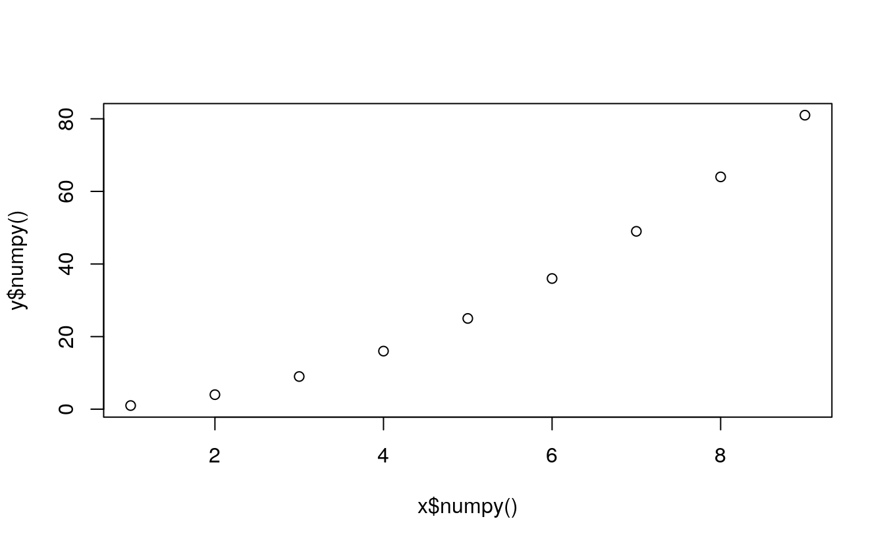

# Converting tensors

_Last update: Sun Oct 25 13:00:09 2020 -0500 (f5e8a1973)_


```r
library(rTorch)
```


## Tensor to `numpy` array
This is a frequent operation. I have found that this is necessary when:

* a `numpy` function is not implemented in PyTorch
* We need to convert a tensor to R
* Perform a boolean operation that is not directly available in PyTorch


```r
x <- torch$arange(1, 10)
y <- x^2
```

If we attempt to plot these two tensors we get an error:


```r
plot(x, y)
```

```
#> Error in as.double(x): cannot coerce type 'environment' to vector of type 'double'
```
They need to be converted to `numpy`, and then to R (which happens in the background):


```r
plot(x$numpy(), y$numpy())
```



## `numpy` array to tensor
* Explain how transform a tensor back and forth to `numpy`.
* Why is this important?
* In what cases in this necessary?


```r
p <- np$arange(1, 10)
class(p)
```

```
#> [1] "array"
```

```r
(pt <- torch$as_tensor(p))
```

```
#> tensor([1., 2., 3., 4., 5., 6., 7., 8., 9.], dtype=torch.float64)
```

```r
class(pt)
```

```
#> [1] "torch.Tensor"          "torch._C._TensorBase"  "python.builtin.object"
```


### `numpy` array to `R`
This is mainly required for these reasons:

1. Create a data structure in R
2. Plot using `r-base` or `ggplot2`
3. Perform an analysis on parts of a tensor
4. Use R statistical functions that are not available in PyTorch


## R objects to `numpy` objects

Given the R matrix $m$:


```r
m <- matrix(seq(1,10), nrow = 2)
m
```

```
#>      [,1] [,2] [,3] [,4] [,5]
#> [1,]    1    3    5    7    9
#> [2,]    2    4    6    8   10
```
We explicitly convert it to a `numpy` object with the function `r_to_py()`:


```r
(mp <- r_to_py(m))
```

```
#> [[ 1  3  5  7  9]
#>  [ 2  4  6  8 10]]
```


```r
class(mp)
```

```
#> [1] "numpy.ndarray"         "python.builtin.object"
```


```r
class(mp)
```

```
#> [1] "numpy.ndarray"         "python.builtin.object"
```

